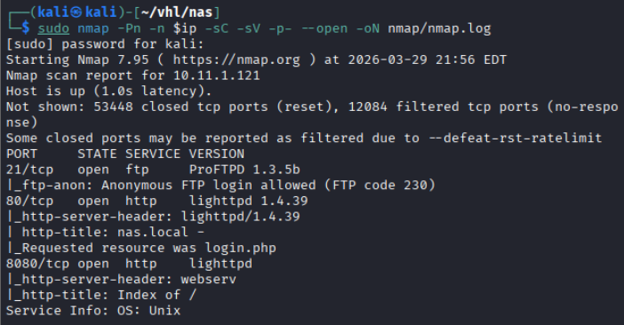
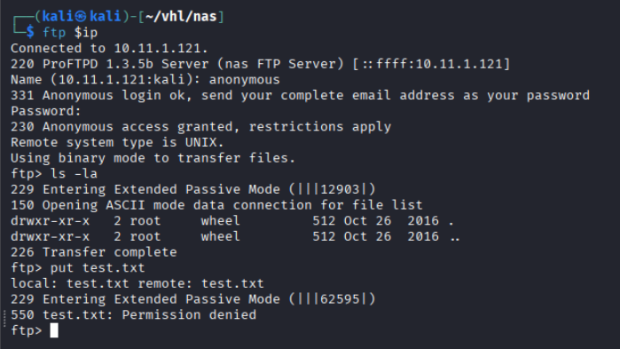
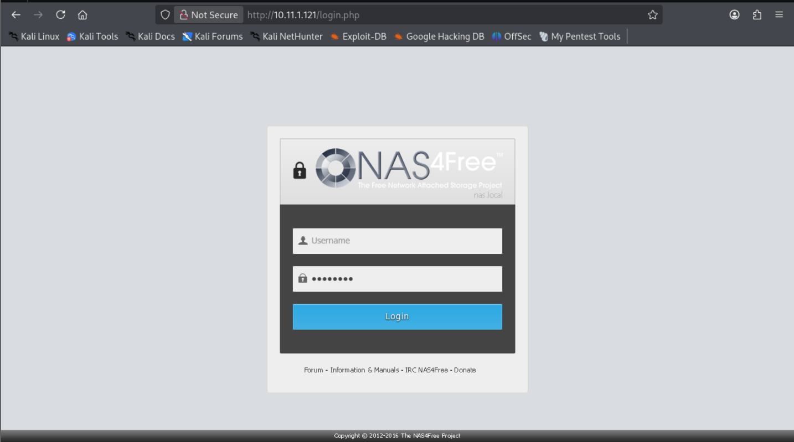
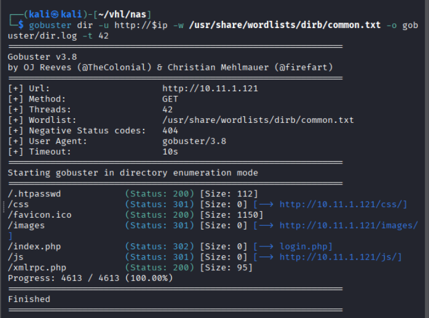
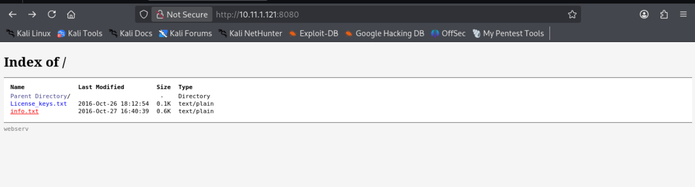
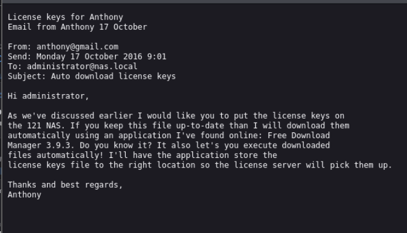
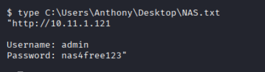
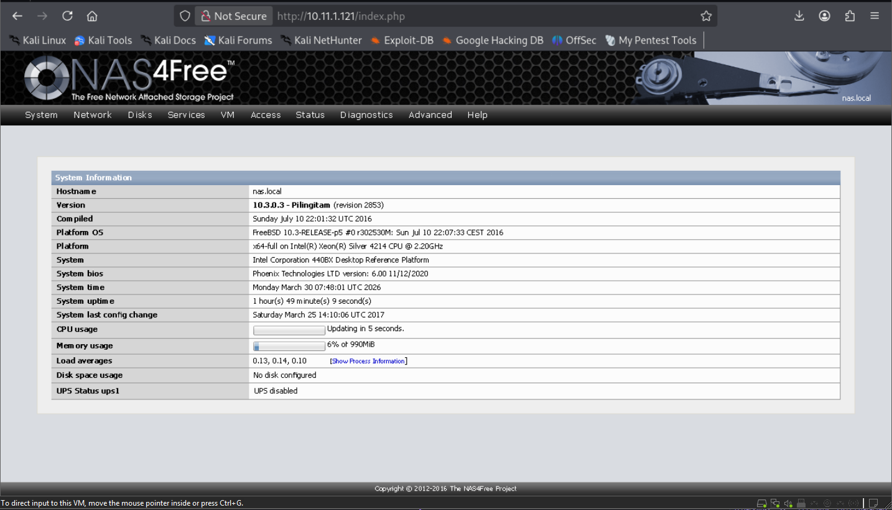
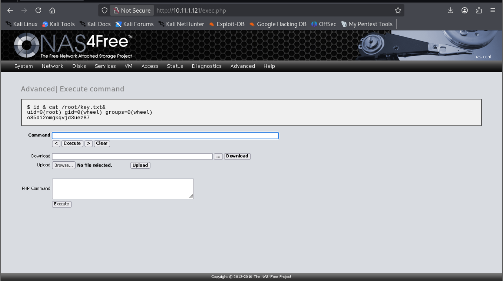

#  NAS - Virtual Hacking Lab

| Info          | Details               |
| ------------- | --------------------- |
| Platform      | Virtual Hacking Lab   |
| Difficulty    | Advanced              |
| Target IP     | 10.11.1.121           |
| OS            | Linux                 |
| Vulnerability | NAS4Free              |
| Tools Used    | nmap, gobuster, hydra |

## Attack Path

1. Nmap identified FTP (ProFTPD 1.3.5b), HTTP on port 80 (NAS4Free), and HTTP on port 81 (lighttpd 1.4.39).
2. Anonymous FTP login succeeded; directory was empty and file upload was denied.
3. Gobuster against port 80 yielded no significant content.
4. Manual browsing of port 81 revealed a file listing including info.txt.
5. info.txt disclosed usernames (administrator, Anthony) and the auto-execute FTP download configuration.
6. Hydra brute-force against FTP with rockyou.txt was unsuccessful.
7. Credentials recovered from a prior VHL engagement were tested and confirmed valid for FTP and the NAS4Free web interface.
8. Authenticated login to NAS4Free (port 80) revealed the exec.php command execution interface.
9. Commands 'id' and 'cat /root/key.txt' executed via exec.php confirmed root access and retrieved the flag.

## Environment Setup

A structured working directory was created prior to enumeration to organize output logs and artefacts throughout the engagement.

```bash
mkdir nas
cd nas
mkdir nmap gobuster exploit
touch users.txt creds.txt
echo 'Testing....1...2...3...' > test.txt
```
## Network Scanning

A full TCP port scan was conducted with service version detection and default Nmap scripts enabled. The -Pn flag skipped host discovery to ensure all ports were scanned regardless of ICMP response. Results were saved for reference.

```bash
ip='10.11.1.121'
## Regular Scan + Version
sudo nmap -Pn -n $ip -sC -sV -p- --open -oN nmap/nmap.log
```

Reminder:
1. Check all the version
2. Check all the open ports



**Results:** 
- Port 21 - FTP with version ProFTPD 1.3.5b
- Port 80 - First Web Application 
- Port 81 - lighttpd 1.4.39

## FTP Enumeration

Anonymous FTP authentication was attempted against ProFTPD 1.3.5b to determine whether the service permitted unauthenticated access and file upload capability.

```bash
ftp $ip
# Anonymous login success, anonymous::anonymous

ls -la

put test.txt
```



**Results:** Anonymous login was permitted; however, the FTP directory appeared empty and file upload failed with a permission error. The service was noted as a potential attack vector pending credential discovery.
## Web Enumeration

Web App page: identified as NAS4Free — an open-source network-attached storage platform
built on FreeBSD. 



Web directory brute-forcing was conducted using Gobuster to identify hidden content and administrative interfaces..

``` bash
# Gobuster
gobuster dir -u http://$ip -w /usr/share/wordlists/dirb/common.txt -o gobuster/dir.log -t 42
```



**Results**: Gobuster returned no high-value directories beyond the default NAS4Free interface. The login panel was noted.

Enumeration was escalated to the secondary web service on port 81.

Web Application 2: service appeared to expose a raw file listing or directory index, revealing files available for direct download — including a text file of interest.



There's some text file seems interesting here.



Contents of info.txt
The file disclosed the following actionable intelligence:
- Usernames: administrator and Anthony
- The system is configured to use Free Download Manager 3.9.3 with automatic execution of downloaded files enabled
- Files uploaded to the FTP directory are automatically downloaded and executed by the Download Manager

## FTP Credentials Attack

Based on the usernames discovered in info.txt, an initial Hydra brute-force attack was launched against the FTP service using the rockyou.txt wordlist.

```bash
hydra -L users.txt -P /usr/share/wordlists/rockyou.txt ftp://$ip
```

Results: The dictionary attack did not yield valid credentials within the tested wordlist. Alternative credential sources were considered.


From the hint shows, I could get the credentials from previous lab - Beginner (Axxxxxx)



**Results:** Successfully found the password.

Using the recovered administrator credentials, authentication was performed against the NAS4Free web interface on port 80. Post-login enumeration of the administration panel revealed a critical  functionality: exec.php



The exec.php interface accepted and executed arbitrary system commands with root-level privileges. No privilege escalation was required

```bash
id & cat /root/key.txt
```



**Results:** Full root-level access was confirmed. The flag was successfully retrieved from /root/key.txt without requiring a shell or privilege escalation chain.


# Remediation
## 1. Authenticated Remote Code Execution via exec.php

- Remove or disable exec.php and any equivalent command execution interfaces from the web administration panel.
- If a diagnostic command interface is operationally required, restrict access to specific trusted IP addresses using firewall rules or web server access controls (e.g. .htaccess, lighttpd conditionals).
- Enforce multi-factor authentication (MFA) on the NAS4Free administrative interface to prevent credential-based access.
- Run the NAS4Free web service under a dedicated low-privilege account rather than root.
- Implement network segmentation to ensure the NAS administration interface is only accessible from trusted management VLANs — not the general network.
- Enable audit logging on all administrative actions including command execution.

