#  React - Virtual Hacking Lab

| Info          | Details                                          |
| ------------- | ------------------------------------------------ |
| Platform      | Virtual Hacking Lab                              |
| Difficulty    | Advanced                                         |
| Target IP     | 10.11.1.188                                      |
| OS            | Windows (VNC)                                    |
| Vulnerability | Weak Password, Insecure Web Server Configuration |
| Tools Used    | Nmap, Gobuster, Searchsploit                     |

## Attack Path

1. Reconnaissance
2. Enumeration
3. Vulnerability Identification
4. Exploitation
5. Post-Exploitation
6. Privilege Escalation

## Environment Setup

A structured working directory was created prior to enumeration to organize output logs and artefacts throughout the engagement.

```bash
mkdir react
cd react
mkdir nmap gobuster exploit
touch users.txt creds.txt
echo 'Testing....1...2...3...' > test.txt
```

## Network Scanning

A full TCP port scan was conducted with service version detection and default Nmap scripts enabled. The -Pn flag skipped host discovery to ensure all ports were scanned regardless of ICMP response. Results were saved for reference.

```bash
ip='10.11.1.188'
## Regular Scan + Version
sudo nmap -Pn -n $ip -sC -sV -p- --open -oN nmap/nmap.log
```

Reminder:
1. Check all the version
2. Check all the open ports

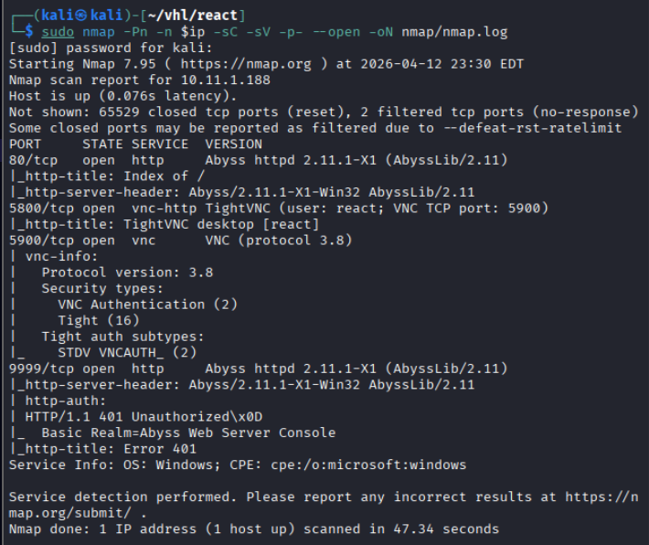

**Results:**

| Port | Service  | Version    |
| ---- | -------- | ---------- |
| 80   | http     | Abyss 2.11 |
| 5800 | ncv-http | TightVNC   |
| 5900 | vnc      | VNC 3.8    |
| 9999 | http     | Abyss 2.11 |
## Web Enumeration

Web App Enumeration 1:

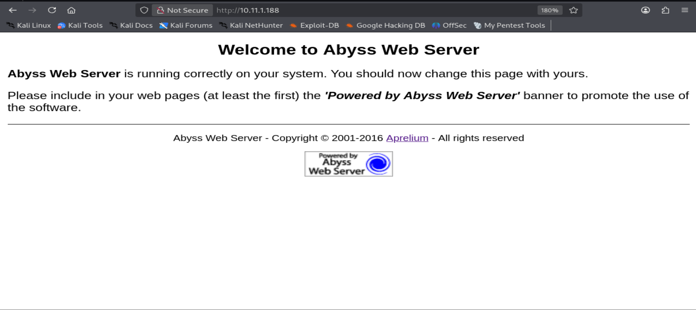

**Results:** Shown the web service is running Abyss Web Server.

Directory brute forcing with Gobuster and dirsearch.

``` bash
# Gobuster
gobuster dir -u http://$ip -w /usr/share/wordlists/dirb/common.txt -o gobuster/dir.log -t 42

# dirsearch
dirsearch -u $ip
```

**Results:** Both method fail. Couldn't find any interesting directory.

Web App Enumeration 2: Port 5800

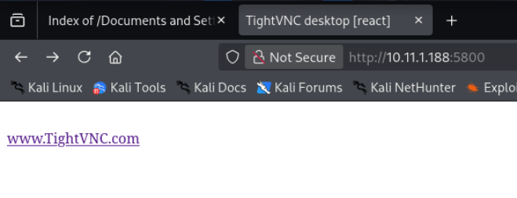

**Results:** found `www.TightVNC.com`. Identified as **TightVNC Web Interface**

Web Application Enumeration 4: Port 9999

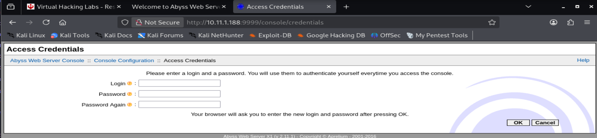

**Results:** Shown a login page. 

Try weak password access with admin::admin

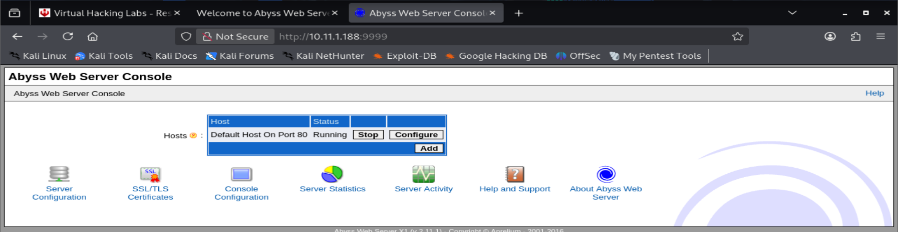

**Results:** Successful login to the administrative interface.

From the information we can see the default host is running on Port 80.

After that configured the port 80 host, on changing document path in **General** to C:\

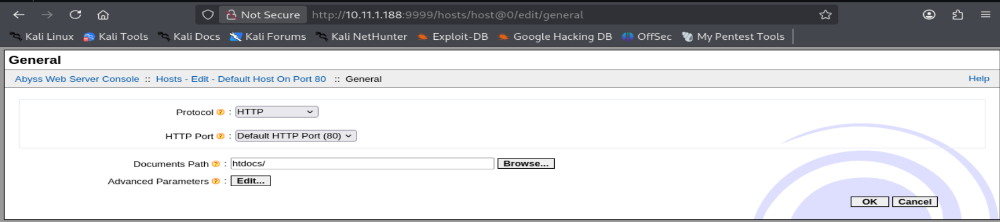

After changing the path to `C:\` then restart the Abyss Web Server. Navigate back to port 80

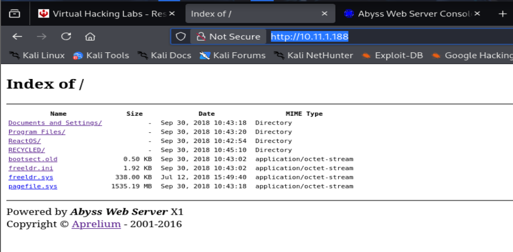

**Results:** While navigate back to Port 80, the web application changed to listing all the files in host.

In `/Documents and Settings/Administrator/Desktop/key.txt` found vnc passwords.

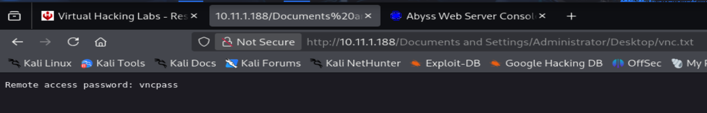

Now since i got the passwords, try to login with vncviewer.

```bash
vncviewer 10.11.1.188:5900
vncpass
```

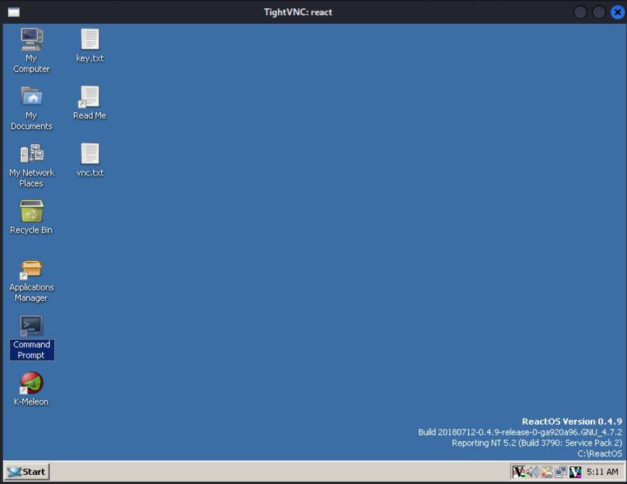

Results: pop up a tightnvc desktop interface.

# Windows Privilege Escalation

Click on the command prompt and verify the users. 
```powershell
whoami
net user administrator
```

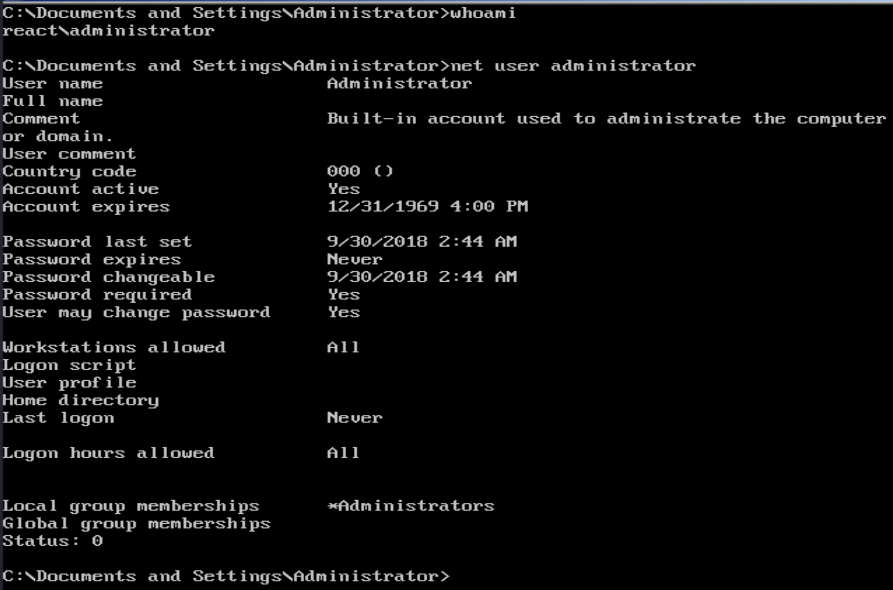

**Results:** The VNC session was running with Administrator privileges, eliminating the need for further escalation.

```cmd.exe
type Desktop/key.txt
```

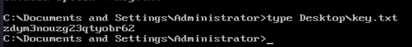

**Results:** Retrieved flags

## **Remediation**

### **1. Authentication Security**

- Remove default credentials immediately
- Enforce strong password policies
- Implement multi-factor authentication for admin interfaces

---

### **2. Web Server Hardening**

- Restrict access to administrative interfaces (port 9999)
- Prevent modification of document root by non-trusted users
- Disable directory listing

---

### **3. Sensitive Data Protection**

- Avoid storing credentials in plaintext files
- Restrict access to system directories
- Apply proper file permissions

---

### **4. VNC Security**

- Restrict VNC access via firewall or VPN
- Use strong authentication and encryption
- Disable VNC if not required

---

### **5. Network Security**

- Limit exposure of management services
- Segment internal services from external access


